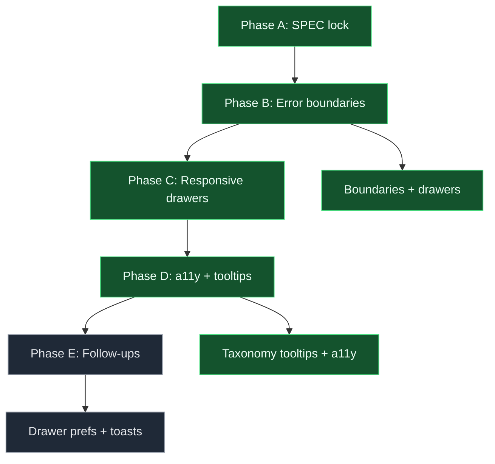

# App shell resilience - change plan

> **Status:** Locked (2026-09-08; S5 answered + S6 defaults approved)  
> **Artifact:** `docs/planning/features/app-shell-resilience-plan.md`  
> **Linear:** none (POC planning slice)

Grounded in the current codebase: [`frontend/src/App.tsx`](../../../frontend/src/App.tsx) lays out a fixed three-rail shell — left library/palette at **220px**, center React Flow canvas, and a **340px** [`RunPanel`](../../../frontend/src/components/RunPanel.tsx) on the right, with [`NodeInspector`](../../../frontend/src/components/NodeInspector.tsx) / `EdgeInspector` overlays at **300px** when a selection exists. There are **no React error boundaries**; a thrown render error in any panel can blank the entire app and lose in-memory canvas state. Chrome controls lack contextual help beyond inline copy; validation uses a single `aria-live` chip in the header but there is no taxonomy tooltip layer. The layout never collapses below desktop widths, so the flow pane cannot go portrait on narrower viewports. Backend validation in [`compiler.py`](../../../backend/app/compiler.py) and blank templates in [`graph_templates.py`](../../../backend/app/graph_templates.py) are unaffected by shell work but depend on a stable editor surface.

---

## Locked decisions (S5 + approval)

| Topic | Decision |
| ----- | -------- |
| Error boundaries | Root, canvas, Run panel, and node/edge inspector each get a boundary; **recover in place** with retry; **do not wipe graph state** on child failure. |
| Tooltips | **Basic** labels on chrome controls; **detailed cards** only on taxonomy surfaces (node types, edge kinds, router rules, provider/model). **Keyboard + click** to open; not hover-only. No detailed cards on every canvas node. |
| Responsive | Drawer/stack rails under **~1100px** so the flow pane can go portrait. **Phone:** inspect + run supported; **no touch-draw authoring**. |
| a11y | Logical focus order across rails/drawers; `aria-live` for validation and orientation announcements; **44px** minimum targets; honor `prefers-reduced-motion`. |
| Implement order | **First** in the next-set trilogy — orientation and authoring depend on a pane that can resize tall. |

---

## 1. User story

### Primary story

**As a graph author using the POC on a laptop or tablet, I want the app shell to survive panel errors and adapt to narrower viewports without losing my in-progress graph, so that I can inspect, validate, and run workflows reliably.**

### Acceptance criteria (MVP)

| # | Criterion |
| - | --------- |
| AC1 | A render error in Run panel, canvas, or an inspector shows a localized fallback with **Retry**; graph nodes/edges remain in React state after retry. |
| AC2 | A root-level boundary catches uncaught errors outside child boundaries and offers reload without silently discarding unsaved edits (warn if dirty). |
| AC3 | Viewports **&lt; ~1100px** collapse left and right rails into drawers/tabs; canvas receives remaining width and **can be taller than wide**. |
| AC4 | Viewports below phone breakpoint expose **Run** + inspection flows; palette drag/connect authoring is disabled or hidden with clear copy. |
| AC5 | Taxonomy tooltips (node types, edge kinds, router rules, provider/model) open via **focus/click** and expose title + short description; basic `title` or `aria-describedby` on chrome buttons. |
| AC6 | Focus order visits header → active rail/drawer trigger → canvas → open drawer content → Run actions; live region announces validation summary changes. |
| AC7 | Interactive targets meet **44×44px** minimum; motion respects `prefers-reduced-motion`. |

### Non-goals (v1)

- Full mobile graph authoring (touch connect, palette drag)
- Tooltip detailed cards on every canvas node
- Theming pass beyond existing [`theme.ts`](../../../frontend/src/theme.ts) tokens
- Backend or compiler changes

### Alignment

- POC proves visual authoring — shell must not be the failure mode
- Web UX best practices: WCAG 2.1 AA targets, drawer patterns for narrow viewports
- Prerequisite for [`canvas-orientation-plan.md`](canvas-orientation-plan.md) (pane must resize)

---

## 2. UI/UX design

### Problem today

| Element | Current behavior | User expectation |
| ------- | ---------------- | ---------------- |
| Error handling | Uncaught render error whites out entire SPA | Isolated panel error with recovery |
| Left rail (220px) | Always visible | Collapses to drawer when space is tight |
| Inspector (300px) | Replaces flow when node/edge selected; fixed desktop layout | Drawer or bottom sheet on narrow screens |
| Run panel (340px) | Always visible right rail | Accessible via tab/drawer on tablet |
| Help | Router prose in inspector only | Discoverable taxonomy help on palette and Run provider controls |
| Validation chip | `aria-live="polite"` on header button | Consistent live feedback across drawers |

### State model

```text
SHELL_DESKTOP     -> left rail + canvas + (inspector?) + run rail visible
SHELL_COMPACT     -> canvas primary; library/run/inspector in drawers
SHELL_PHONE       -> canvas + run/inspect; authoring chrome hidden
PANEL_ERROR       -> boundary fallback in affected region only
DRAWER_OPEN       -> one primary drawer (library | inspector | run); others closed
```

Rules: At most one **primary** drawer open on compact; selecting a node opens inspector drawer and closes library if needed.

### Wireframe (compact)

```text
+-- Header (graph name, validation, dirty) ---------------------+
| [= Library]  [Inspector]  [Run]              Validation: OK  |
+--------------------------------------------------------------+
|                                                              |
|                    React Flow canvas                         |
|                    (portrait-friendly)                       |
|                                                              |
+--------------------------------------------------------------+
| [Run question........................]  [Run]              |
+--------------------------------------------------------------+
```

### Entry points

- Primary: app load (`App.tsx` layout)
- Secondary: viewport resize crossing 1100px breakpoint
- Error: automatic boundary fallback per region

### Conflicts and edge cases

- Inspector + Run both needed on phone → tab between them; canvas stays mounted
- Dirty graph + root reload → confirm dialog (reuse `isCanvasDirty` pattern)
- SSE stream active when Run panel errors → boundary retry must not duplicate subscriptions (cleanup in `closeStream`)

### Accessibility

- Labels: drawer triggers name the panel (`aria-expanded`, `aria-controls`)
- Keyboard: Escape closes top drawer; focus trap inside open drawer
- Live regions: validation chip + shared polite region for orientation handoff (owned by orientation spec)

### Mobile

- **&lt; ~1100px:** drawer shell (AC3)
- **Phone:** run + inspect only (AC4); 44px touch targets on Run and drawer toggles

---

## 3. Engineering spec

### State model

| Field / hook | Role |
| ------------ | ---- |
| `shellBreakpoint` | `'desktop' \| 'compact' \| 'phone'` from `matchMedia` + width |
| `openDrawer` | `'library' \| 'inspector' \| 'run' \| null` |
| `ErrorBoundary` wrappers | Per-region with `onReset` callback |

### Components / modules

| Module | Role |
| ------ | ---- |
| `frontend/src/App.tsx` | Responsive layout; drawer orchestration; root boundary |
| `frontend/src/components/RunPanel.tsx` | Run boundary child; compact layout props |
| `frontend/src/components/NodeInspector.tsx` | Inspector boundary; tooltip slots for taxonomy |
| `frontend/src/components/GraphLibrary.tsx` | Library drawer content |
| `frontend/src/components/ErrorFallback.tsx` (new) | Shared retry UI |
| `frontend/src/components/Tooltip.tsx` (new) | Basic + detailed card modes |
| `frontend/src/hooks/useShellLayout.ts` (new) | Breakpoint + drawer state |
| `frontend/src/theme.ts` | Drawer z-index, motion tokens, 44px hit slop |

### Interaction rules

- Boundaries log to `console.error` in dev only; no graph mutation on error
- Drawers use CSS `transform` slide; disable transition when `prefers-reduced-motion`
- Tooltip detailed cards: `role="dialog"` or `role="tooltip"` with focus management on open

### Tests

- RTL: boundary shows fallback when child throws; retry re-renders child
- Hook: breakpoint transitions at 1100px / phone threshold
- a11y: focus order smoke test (optional manual checklist for POC)

### Observability

- No new backend telemetry; optional `console` in dev for boundary catches

---

## 4. Feedback

| Strength | Notes |
| -------- | ----- |
| Reuses existing dirty fingerprint | `isCanvasDirty` / `savedGraphFingerprint` already in `App.tsx` |
| Run panel already isolated component | Natural boundary seam |

| Risk | Mitigation |
| ---- | ---------- |
| Drawer + React Flow pointer capture | Close drawer on pane drag start; test on tablet |
| Duplicate SSE on Run retry | `closeStreamRef` cleanup in boundary reset |
| Inspector unmount loses selection | Keep selection id in parent state; remount inspector from id |
| Tooltip proliferation | Restrict detailed cards to taxonomy list in locked table |

---

## 5. Clarifying questions (resolved)

1. Hover-only tooltips acceptable for taxonomy? → **No** (keyboard + click required)
2. Should phone support graph editing? → **No** (inspect + run only)
3. Error boundary should clear graph? → **No** (recover in place)

---

## 6. Default stance (approved)

| Question | Default (approved 2026-09-08) |
| -------- | ----------------------------- |
| Breakpoint for drawer shell | **1100px** max-width |
| Phone authoring | **Disabled** with explanatory empty state in library drawer |
| Tooltip trigger | **Click/focus** primary; hover may show basic label only |
| Root error on dirty canvas | **Confirm** before full reload |

---

## 7. Implementation and rollout

### Phase A — Design freeze

- [x] S5 answered; S6 defaults approved
- [x] Locked SPEC in repo

### Phase B — Core

- [ ] `ErrorBoundary` + `ErrorFallback` wired in `App.tsx`, `RunPanel`, inspectors, canvas wrapper
- [ ] `useShellLayout` breakpoint + drawer state

### Phase C — Polish

- [ ] Taxonomy tooltips on palette, edge kinds, router copy, provider/model
- [ ] Focus order audit; 44px targets; reduced-motion

### Phase D — Rollout

| Stage | Audience | Success metric |
| ----- | -------- | -------------- |
| Dev | Local/docker | Compact width shows drawers; injected error recovers |
| CI | GitHub Actions | Existing pytest unchanged; optional frontend unit tests |
| Demo | Stakeholders | Laptop + tablet walkthrough without layout break |

### Phase E — Follow-ups

- [ ] Persist drawer preference per user (localStorage)
- [ ] Toast stack for non-blocking API errors (replace `console.error` only)

### Progress diagram



---

## 8. Existing tooling

- `feature-change-plan` / `feature-change-implement` skills (workspace)
- `frontend`: Vite + React 18; manual verification at http://localhost:5173
- `backend`: `uv run pytest` (unchanged for shell-only work)
- Docker Compose for integrated dev

---

## 9. New artifacts

| Artifact | When |
| -------- | ---- |
| `frontend/src/components/ErrorFallback.tsx` | Phase B |
| `frontend/src/components/Tooltip.tsx` | Phase C |
| `frontend/src/hooks/useShellLayout.ts` | Phase B |
| Optional `docs/planning/features/app-shell-a11y-checklist.md` | Phase D if manual QA needed |

---

## 10. Key code paths

| Area | Path |
| ---- | ---- |
| App shell layout | `frontend/src/App.tsx` |
| Run rail | `frontend/src/components/RunPanel.tsx` |
| Node / edge inspectors | `frontend/src/components/NodeInspector.tsx` |
| Graph library | `frontend/src/components/GraphLibrary.tsx` |
| Canvas nodes | `frontend/src/components/nodes/GraphNodeView.tsx` |
| Theme tokens | `frontend/src/theme.ts` |
| Graph validation (unchanged) | `backend/app/compiler.py` |
| Blank graph template | `backend/app/graph_templates.py` |

---

## 11. Next step

Implement Phase B–D on a feature branch after this SPEC lock: add boundaries and `useShellLayout`, then drawer responsive chrome, then taxonomy tooltips and a11y pass. Unblock [`canvas-orientation-plan.md`](canvas-orientation-plan.md) once the canvas pane can resize to portrait in compact mode.

---

## Revision log

| Date | Change |
| ---- | ------ |
| 2026-09-08 | Initial lock from next-set planning thread (S5 + S6) |
