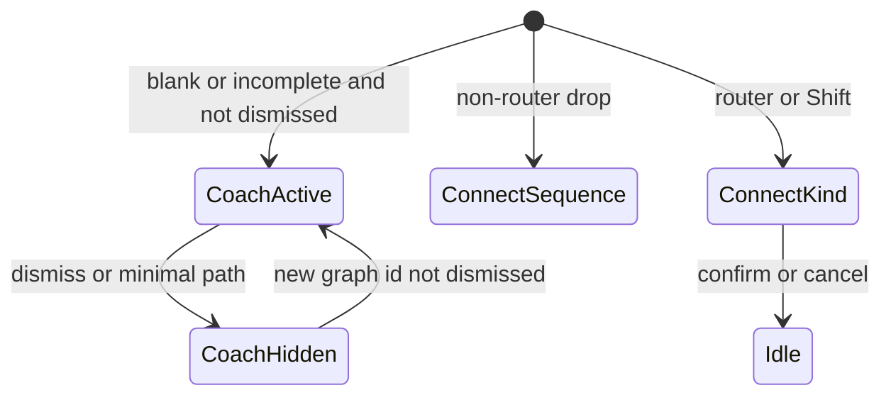
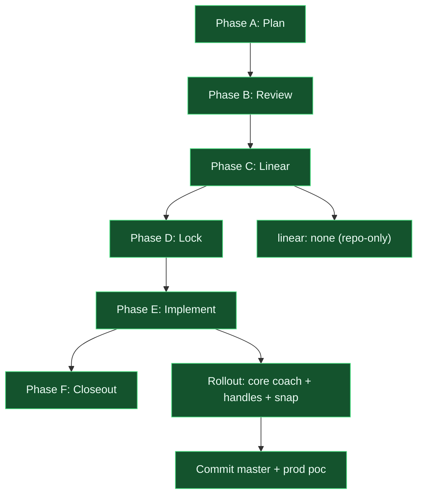

# Canvas authoring literacy - change plan

> **Status:** Locked (2026-09-11; S6 defaults accepted; Phase F closed)  
> **Artifact:** `docs/planning/features/canvas-authoring-literacy-plan.md`  
> **Branch:** `master`  
> **Ship:** `212b0cb` — `feat(ui): canvas authoring literacy coach, handles, and snap`  
> **Prod:** https://agent-graph-builder-app.vercel.app (legacy alias: `agent-graph-builder-poc.vercel.app`)  
> **Linear:** none (repo-only)

## Locked decisions (S5 resolved via S6 acceptance 2026-09-11)

| Topic | Decision |
| ----- | -------- |
| Alignment | **NA** — snap to 24px on drag; dagre only when `effectiveRankDir` changes (not on node/edge count) |
| Coach home | **NA** — canvas overlay (`EmptyGraphCoach`) |
| Execute in header | **NA** — defer; copy-only in Execute + LLM inspector |
| Non-router connect | **NA** — silent `sequence`; glossary in coach + kind menu |
| Relayout | **NB** — **Relayout** control next to Auto/H/V |
| Tracking | **NA** — `linear_issue: none` |

Grounded in the current codebase: [from-scratch-authoring-plan.md](from-scratch-authoring-plan.md) already shipped Save, dirty chip, undo, keyboard Delete, router outgoing-edge rows, and a **dismissible four-bullet coach** that only shows when the canvas matches Input → Output (`isBlankGraphPattern`). Taxonomy copy for nodes and edge kinds lives in [`taxonomy.ts`](../../../apps/playground/src/content/taxonomy.ts) but is reachable mainly from palette info icons, not during connect or on selected nodes. [`FlowCanvas.tsx`](../../../apps/playground/src/components/FlowCanvas.tsx) paints a 24px grid with **no** `snapToGrid`; [`layoutNodesWithDagre`](../../../apps/playground/src/layout/dagreLayout.ts) **re-lays out on every node/edge count change**, so manual alignment cannot stick. [`GraphNodeView.tsx`](../../../apps/playground/src/components/nodes/GraphNodeView.tsx) wraps painted shapes (including Router `clip-path`) in a rectangular React Flow box with default ~8px Handles. Edges are selectable (`onEdgeClick` → [`EdgeInspector`](../../../apps/playground/src/components/NodeInspector.tsx)) but 1.5px strokes. [`onConnect`](../../../apps/playground/src/App.tsx) auto-creates `sequence` unless the source is a Router (or Shift+connect). Tool nodes only run local `lookup_topic` ([`nodes.py`](../../../backend/app/nodes.py)); the inspector does not say so. Execute panel provider is a **run override** that Compile/Run copies onto LLM nodes (`applyRunSelectionToLlmNodes`) while each LLM still has its own picker. Operator feedback 2026-09-11 after a successful Groq `blob-smoke` run: building from blank or Input→Output was confusing; nodes/edges/tools/prompt/router conditions were unclear; handles were hard to hit; snapping missing; Execute vs LLM config duplicated; they still succeeded quickly as an expert.

**UI_DESIGN_WORKFLOW PH (compressed):** Discover / Define / Structure / Wireframe locked with S6. Visual stays on existing `theme.ts` tokens. Prototype/Test/Handoff proceed in Phase E.

---

## CTX & Goals (UI workflow)

**IN (filled)**

| Slot | Value |
| ---- | ----- |
| `product` | Agent Graph Builder playground (Vite / React Flow + FastAPI compile/run) |
| `platform` | Desktop-first SPA; authoring disabled on compact (`NodePalette`); drawers under 1100px |
| `users` | First-time graph author who can already **run** a demo |
| `primary_goal` | Build or extend a graph (blank or Input→Output) without memorizing compiler edge rules |
| `constraints (tech)` | Inline styles + `theme.ts`; no new layout library unless Ask First |
| `constraints (prior specs)` | Do not reopen locked shell-panels Execute-vs-Observe rail; do not add loops (compiler rejects cycles); do not invent new node types |
| `feedback` | 2026-09-11 operator notes: coach missing in-process; shape bounding boxes; unlabeled edge kinds; Prompt vs Router `complex`; no snap; dual provider; opaque Tool; tiny handles; edges hard to select; branching/looping unclear |

**IN (missing)** — resolved 2026-09-11 via S6 (see Locked decisions).

**OUT:** personas, IA, wireframes, interaction states (S2), engineering (S3).

---

## 1. User story

### Primary story

**As a first-time graph author on a laptop, I want in-flow explanations, hittable connections, honest node/tool copy, and layout that stays where I put it, so that I can assemble a Prompt → LLM → (optional Router) → Output graph without guessing what sequence/default/conditional, Prompt templates, or Tools actually do.**

### Acceptance criteria (MVP)

| # | Criterion |
| - | --------- |
| AC1 | On a **blank** graph (Input → Output only) **and** after the author adds the first extra node, a **step-aware coach** remains visible until dismissed or until a minimal runnable path exists (Input → Prompt → LLM → Output, or compiler-ready equivalent). Steps name what to add next and **one sentence** on Prompt vs Router. |
| AC2 | Coach (or a canvas **legend**) defines **sequence**, **conditional**, and **default** in plain language: always follow; substring match on **upstream LLM text**; Router fallback. Copy matches compiler behavior, not a fictional “complex” flag. |
| AC3 | **ConnectKindMenu** (Router / Shift+connect) labels each kind with the same one-line glossary; conditional field helper text says the match is against **LLM/router input text**, not the Prompt template. |
| AC4 | Selected **Prompt**, **LLM**, **Tool**, **Router** inspectors show an **intent blurb** (from taxonomy, tightened): Prompt placeholders `{question}` / `{upstream}`; LLM vs Execute override; Tool = **local keyword table, not the web**; Router = one default + conditionals; cycles **not supported**. |
| AC5 | Source/target **handles** meet `shell.touchTarget.min` (44px) hit area (visual may stay smaller). First-click connect from Input/Prompt/LLM succeeds without hunting a ~8px dot. |
| AC6 | **Edges** have a hover/focus affordance (wider hit stroke or label highlight). Clicking the edge (not only the label) opens existing **Configure edge**. No new free-text edge description field in v1. |
| AC7 | **Snap-to-grid** on node drag uses the existing 24px blueprint gap **unless** S5 picks dagre-only. Dagre **does not** re-layout solely because `nodes.length` / `edges.length` changed (that is the current wipe). Dagre still runs when **Orientation** Auto/H/V actually changes rank direction (and optional Relayout control if S6 includes it). |
| AC8 | Painted node **shape** is the hit/layout silhouette: Router diamond is not a leftover rectangle; Input/Output handles sit on the visible card edge, not a larger empty box. |
| AC9 | **Branching** copy: “Add a Router, then one **default** edge and one or more **conditional** edges.” **Looping:** coach + compile diagnostic already say acyclic-only; surface once in coach/inspector so authors do not hunt for a loop tool. |
| AC10 | Keyboard: handles remain in tab order / existing React Flow keyboard connect if present; coach is dismissible (`Esc` or Got it); `prefers-reduced-motion` respected (no new layout animation beyond existing dagre duration). |

### Non-goals (v1)

- Moving Execute (question / provider / Run) into the header (Ask First; locked shell-panels SPEC)
- Custom tools, MCP, or web fetch for Tool nodes
- Cycle / loop runtime (compiler stays acyclic)
- Custom edge labels/descriptions beyond kind + condition
- New node types
- Observe result markdown rendering (separate small slice; see Phase E)
- elk dual layout ([canvas-orientation-plan.md](canvas-orientation-plan.md) Phase E)
- Compact/phone authoring (already disabled)
- Auth, SDK publish

### Alignment

- Extends, does not replace, [from-scratch-authoring-plan.md](from-scratch-authoring-plan.md) (mechanics shipped; **literacy** did not)
- Compiler remains source of truth: [`compiler.py`](../../../backend/app/compiler.py) router default/conditional rules + cycle reject
- POC thesis: visual assembly without orchestration code — authors must still see **what** they assembled
- Do not reopen [playground-shell-panels-plan.md](playground-shell-panels-plan.md) Execute vs Observe (S6 defers header Run)

---

## 2. UI/UX design

### Problem today

| Element | Current behavior | User expectation |
| ------- | ---------------- | ---------------- |
| `EmptyGraphCoach` | Four bullets; only when `isBlankGraphPattern`; dismiss persists per graph id | Help **while** building, not only on the empty template |
| Edge kinds | Taxonomy in palette `?` and EdgeInspector; connect menu is Router-only with radio labels | Glossary at connect time and on the canvas |
| Prompt vs Router | Prompt `{question}`; Router substring on **upstream LLM output** | “If complex” is not a product concept — need the real pipeline |
| Handles / shapes | Default RF handle on rectangular wrapper; Router `clip-path` inside box | Click the **shape**; no ghost rectangle |
| Grid | Visual 24 / 120 lines; no snap; dagre on count change | Snap to grid **or** stable manual positions |
| Tool inspector | `lookup_topic` + input variable | Description + “not the web / in-process table” |
| LLM vs Execute | Two pickers; run copies onto all LLM nodes on Compile/Run | One sentence: node default vs this-run override |
| Edge select | `onEdgeClick` exists; 1.5px stroke | Discoverable select to change kind |
| Loops | Compiler error after compile | Up-front “no loops in this POC” |

### Overloaded terms (rename in UI copy, not schema)

| Word | Meaning A (keep in JSON) | Meaning B (confuses authors) | UI copy |
| ---- | ------------------------ | ---------------------------- | ------- |
| `sequence` | Edge kind: always follow | Event log `sequence` index | Canvas/coach: **Always** (keep schema `sequence`) |
| `default` | Router fallback edge | Default model / default provider | Coach: **Fallback** if no condition matches |
| `condition` | Substring of upstream text | Prompt “if complex” | “Match this text in the previous LLM output” |
| Provider | Execute run override | LLM node `config.provider` | Inspector: “Node default”; Execute: “This run (applies to LLM nodes on Compile/Run)” |

### State model

```text
COACH_HIDDEN     -> dismissed for this graph id, or graph has minimal runnable path
COACH_ACTIVE     -> step-aware panel visible (blank or incomplete)
CONNECT_SEQUENCE -> non-router connect; silent sequence (unchanged) + optional toast/legend pulse
CONNECT_KIND     -> Router or Shift+connect; ConnectKindMenu with glossary
NODE_INSPECT     -> selected node; intent blurb + existing fields
EDGE_INSPECT     -> selected edge; kind + condition
DRAG_SNAP        -> node position quantized to 24px while dragging (if S6 snap)
LAYOUT_DAGRE     -> orientation rank-dir change or explicit Relayout — not add-node
```

Rules: one selected node **or** edge (existing). Coach does not block canvas pointer events except its own controls. `CONNECT_KIND` is modal as today.

### Wireframe

```text
+-- Header: name | Unsaved | Save | Validation | Auto H V ----------------+
| Library | Palette                                                      |
|         |  +-- Coach (step 2 of 4) --------------------------------+   |
|         |  | Next: add an LLM after the Prompt.                    |   |
|         |  | Router (optional): branches on LLM text, not Prompt.  |   |
|         |  | Always / Match text / Fallback. Loops not supported.  |   |
|         |  +-------------------------------------------------------+   |
|         |     (input)====(prompt)     [handle 44px]                    |
|         |                      \\                                      |
|         |                   (llm)---- diamond router ----(output)      |
|         |  legend: Always | Match | Fallback                           |
+------------------------------------------------------------------------+
| Configure: tool                                                        |
| lookup_topic — local keyword table (not the web). Input: question.     |
+------------------------------------------------------------------------+
```

Execute rail **unchanged** (locked SPEC) unless S5 says otherwise.

### Entry points

- Primary: create **Blank (input → output)** or empty-ish graph
- Secondary: select a node/edge → inspector blurb
- Tertiary: palette info tooltips (keep); connect kind menu
- Not primary: README / AGENTS.md

### Conflicts and edge cases

- Coach vs dagre/fitView overlay position (reuse top-left of current coach)
- Dismiss forever vs “show again if graph regresses to blank” — S6: dismiss sticky per graph id (keep `agb-coach-dismissed:`) **but** incomplete graphs that were never dismissed still show
- Shift+connect on non-router still opens kind menu (power user)
- Multiple defaults: existing compiler diagnostics on router rows
- Snap + dagre: if both fire, last writer wins — S6 forbids dagre on add so snap can persist
- Selected edge during run inspection dimming: keep current inspection styles

### Accessibility

- Labels: coach `role="region"` `aria-label="Authoring guide"`; legend not color-only (text Always / Match / Fallback)
- Keyboard: existing Delete/undo; Esc closes kind menu and coach; handle hit target 44px for pointer; do not shrink keyboard connect
- Live regions: optional polite “Next step: add LLM” when coach step changes; do not stack with Diagnostics `aria-live` spam — only on step change
- Motion: snap is instant; dagre duration already gated

### Mobile

- Authoring already disabled on compact. Coach still readable if they open a blank graph in inspect-only mode; no new phone draw-edges. Drawers unchanged.

---

## 3. Engineering spec

### State model

| Current | Proposed |
| ------- | -------- |
| `isBlankGraphPattern` + `isCoachDismissed` | `coachVisible` = !dismissed && !hasMinimalRunnablePath (Prompt+LLM on path from input to output) **or** blank pattern |
| Dagre `useEffect` deps `[..., nodes.length, edges.length]` | Dagre when `effectiveRankDir` changes; **not** on count alone. Optional `relayoutNonce` |
| No `snapGrid` | `snapToGrid` + `snapGrid={[24,24]}` if S6 snap |
| Default `Handle` | Custom size + `style` / class; wrapper `width`/`height` hug content |
| Taxonomy only in tooltips | Shared `intentBlurb(nodeType)` in inspector + coach steps derived from graph |



### Components / modules

| Artifact | Change |
| -------- | ------ |
| `EmptyGraphCoach.tsx` | Step list from graph shape; glossary; no-loops line; persist dismiss |
| `lib/graphAuthoring.ts` | `hasMinimalRunnablePath`, `coachStep(nodes, edges)` — keep `isBlankGraphPattern` |
| `ConnectKindMenu.tsx` | Per-kind summary from `EDGE_KIND_TAXONOMY`; condition helper |
| `NodeInspector.tsx` | Intent blurb per type; Tool destination copy |
| `GraphNodeView.tsx` | Handle size; box hug; Router clip vs layout |
| `FlowCanvas.tsx` | snapGrid; dagre trigger; optional edge `interactionWidth` |
| `App.tsx` | Coach visibility; stop count-driven dagre (move effect) |
| `taxonomy.ts` | Tighten Tool/LLM/Execute sentences; no schema change |
| `RunPanel.tsx` | One-line “this run overrides LLM nodes on Compile/Run” if cheap (Execute copy only) |

### Data / API / flags

- Schema: **none** (edge kinds and toolName unchanged)
- Actions/routes: none
- Feature flag: **none** (POC single operator)
- Storage: existing `localStorage` coach dismiss key

### Interaction rules

| Event | Behavior |
| ----- | -------- |
| Add Prompt on blank graph | Coach advances to “add LLM”; dagre does **not** re-scatter if S6 |
| Connect Prompt → LLM | Auto `sequence`; legend can pulse Always |
| Connect from Router | Kind menu with glossary; require condition if conditional |
| Drag node | Snap to 24px if S6 snap |
| Change Orientation | Dagre + fitView (existing) |
| Click edge stroke | `EDGE_INSPECT` |
| Compile cycle | Existing diagnostic; coach already warned |

### Tests

| Layer | Cases |
| ----- | ----- |
| Unit | `coachStep` / `hasMinimalRunnablePath`; blank vs prompt-only vs prompt+llm; cycle not in coach path helper |
| Component | ConnectKindMenu shows three glossary lines; Tool inspector contains “not the web” / local table |
| Component | GraphNodeView handle min size (style assertion) |
| Unit | Dagre effect: mock — layout **not** called when only adding a node if extracted helper `shouldRunDagre({ rankDirChanged, countChanged })` |
| E2e | Out of v1 (Playwright non-goal) |

### Observability

- Events: none new
- Logs: none (client-only)

---

## 4. Feedback on design / engineering

### Strengths

- Reuses shipped connect menu, EdgeInspector, taxonomy, coach storage key — no new node types
- Separates **literacy** from **Execute chrome** so shell-panels stay locked
- Snap vs dagre conflict is named and gated by S6

### Risks / open tensions

| Risk | Mitigation |
| ---- | ---------- |
| Stopping dagre-on-add leaves messy positions vs Auto | Keep dagre on orientation change; optional Relayout; fitView still on pane resize |
| 44px handles overlap adjacent nodes | Cap visual to ~16px circle with 44px transparent hit; test on diamond Router |
| Coach overlay covers first nodes | Same top-left as today; max-width 420; dismiss |
| Dual provider still confusing after one sentence | AC4 + Execute caption; full header Run is non-goal |
| Authors still want loops | AC9 + compile; do not fake loop UI |

---

## 5. Clarifying questions

1. **Alignment:** snap-to-grid on drag **and** stop dagre-on-add (NA); snap only (NB); dagre-only-on-orientation, no snap (NC)?
2. **Coach home:** canvas overlay (NA, today’s placement); left rail under palette (NB); header stepper (NC)?
3. **Execute in header:** defer (NA, keep right rail); include compact question+Run in header in **this** CAP (NB)?
4. **Non-router connect:** keep silent `sequence` (NA); always open kind menu (NB)?
5. **Relayout control:** Orientation change is enough (NA); add explicit **Relayout** next to Auto/H/V (NB)?
6. **Tracking:** repo-only (NA) vs Linear after review (NB)?

---

## 6. Default stance (if unanswered)

| Question | Default |
| -------- | ------- |
| 1 Alignment | **NA** — snap to 24px on drag **and** dagre only when `effectiveRankDir` changes (not on node/edge count) |
| 2 Coach home | **NA** — canvas overlay (extend `EmptyGraphCoach`) |
| 3 Execute header | **NA** — defer; copy-only in Execute + LLM inspector |
| 4 Non-router connect | **NA** — silent sequence; glossary in coach + legend + kind menu |
| 5 Relayout | **NB** — small **Relayout** next to orientation (authors need a way to tidy after snap) |
| 6 Tracking | **NA** — `linear_issue: none` |

If no answer by lock, implement per section 6.

**Copy / behavior patches from defaults:**

- Coach title: “Build this graph” not “Start from the blank template” once a node is added
- Legend: Always / Match text / Fallback mapped to sequence / conditional / default
- Tool blurb: “Local keyword lookup (`lookup_topic`). Does not call the web.”
- LLM blurb: “Node default provider/model. Execute panel overrides all LLM nodes when you Compile or Run.”
- Loops: “This playground only allows acyclic graphs (no loops).”

---

## 7. Implementation and rollout

### Phase A - Design freeze

- [x] S5 answered or S6 accepted (2026-09-11)
- [x] This SPEC patched (S2/S3/S7) and `status: locked`
- [x] Design review: authoring critic = operator eyeball of coach copy (local dev 2026-09-11)

### Phase B - Core

- [x] Coach steps + glossary + no-loops (AC1, AC2, AC9)
- [x] ConnectKindMenu + inspector intent blurbs (AC3, AC4)
- [x] Handle hit targets + edge `interactionWidth` (AC5, AC6)
- [x] Dagre trigger fix + snapGrid + optional Relayout (AC7)
- [x] Shape/handle box hug (AC8)
- [x] Unit/component tests in table above

### Phase C - Polish

- [x] Canvas edge-kind legend (compact)
- [x] Execute one-line override caption
- [x] Coach live-region on step change
- [x] Tooltip QA over coach + handles (coach pass-through clicks; handle labels; tooltip z-index)

### Phase D - Rollout

| Stage | Audience | Success metric |
| ----- | -------- | -------------- |
| Dev | Operator local | Blank graph: add Prompt+LLM without reading README; first-click edges |
| Preview | Vercel preview | Coach visible after first node; snap holds after add |
| Prod | poc URL | Same; existing `blob-smoke` / demo graphs unchanged |

### Phase E - Follow-ups

- ~~Observe **result readability** (`String(runSummary.result)` dump)~~ — **done 2026-09-11** (`formatRunResult` + `RunResultDisplay`)
- ~~Compact/phone QA~~ — **done 2026-09-11** (drawer width, header wrap, touch targets)
- Observe first-run auto-switch (`lastFocusedRunIdRef`)
- Header Execute if S5 later flips to NB
- elk orientation Phase E

### Progress diagram

## Progress diagram



---

## 8. Tooling to leverage (this repo)

| Layer | Asset | Use for this CAP |
| ----- | ----- | ---------------- |
| Docs | `AGENTS.md` | Commands; no new agent router required |
| Docs | [from-scratch-authoring-plan.md](from-scratch-authoring-plan.md) | Shipped mechanics; do not regress Save/undo/Delete |
| Docs | [canvas-orientation-plan.md](canvas-orientation-plan.md) | Dagre / rankDir contract |
| Docs | [playground-shell-panels-plan.md](playground-shell-panels-plan.md) | Leave Execute rail unless S5 NB |
| Tests | `apps/playground` Vitest | New `graphAuthoring` / coach / handle tests |
| Theme | `apps/playground/src/theme.ts` | `shell.touchTarget.min`, canvas grid 24 |

No project `.cursor/` skills in this repo.

---

## 9. New artifacts to consider (after sign-off)

| Type | Proposed ID | Purpose |
| ---- | ----------- | ------- |
| Tracker issue | none unless S5 Linear | Repo-only default |
| Skill / rule | none | Do not add agent entities for this CAP |
| SPEC sibling | observe-result-readability | Phase E dump fix |

---

## 10. Key code paths

| Area | Path |
| ---- | ---- |
| Coach UI | `apps/playground/src/components/EmptyGraphCoach.tsx` |
| Coach predicates | `apps/playground/src/lib/graphAuthoring.ts` |
| Connect + coach wiring | `apps/playground/src/App.tsx` |
| Kind menu | `apps/playground/src/components/ConnectKindMenu.tsx` |
| Inspectors | `apps/playground/src/components/NodeInspector.tsx` |
| Node silhouette / handles | `apps/playground/src/components/nodes/GraphNodeView.tsx` |
| Canvas / dagre / grid | `apps/playground/src/components/FlowCanvas.tsx` |
| Dagre | `apps/playground/src/layout/dagreLayout.ts` |
| Orientation | `apps/playground/src/hooks/useCanvasOrientation.ts` |
| Copy source | `apps/playground/src/content/taxonomy.ts` |
| Palette tooltips | `apps/playground/src/components/NodePalette.tsx` |
| Execute caption | `apps/playground/src/components/RunPanel.tsx` |
| Tool runtime | `backend/app/nodes.py` (`lookup_topic`) |
| Router / cycle rules | `backend/app/compiler.py` |
| Blank template | `backend/app/graph_templates.py` |

---

## 11. Next step

Phase F closed 2026-09-11. MVP AC1–AC10 met on `master` @ `212b0cb`; prod https://agent-graph-builder-poc.vercel.app. Linear skipped (repo-only). Phase E deferred slices (Observe result readability, compact/phone QA) shipped 2026-09-11. Remaining deferred: first-run auto-switch, header Execute, elk. Do not unlock this SPEC.

---

## Revision log

| Date | Change |
| ---- | ------ |
| 2026-09-11 | Initial draft from operator authoring feedback + code CTX |
| 2026-09-11 | Locked: S6 accepted; Phase E active; Linear none |
| 2026-09-11 | Phase B implemented (coach, glossary, handles, snap, Relayout); rollout step active |
| 2026-09-11 | Phase C: legend, edge hover stroke, inspector tests, coach live region |
| 2026-09-11 | Phase F closeout. Ship `212b0cb` on `master`; prod https://agent-graph-builder-poc.vercel.app. `npm test` + `npm run build` green. Progress diagram E–F `done`. Deferred: Observe result dump, compact QA. |
| 2026-09-11 | Phase C tooltip QA: coach `pointer-events: none` (Got it only captures); handle `title`/`aria-label`; tooltip z-index test |
| 2026-09-11 | Phase E deferred: `formatRunResult` / `RunResultDisplay`; compact drawer width + header/orientation wrap + history touch targets |
