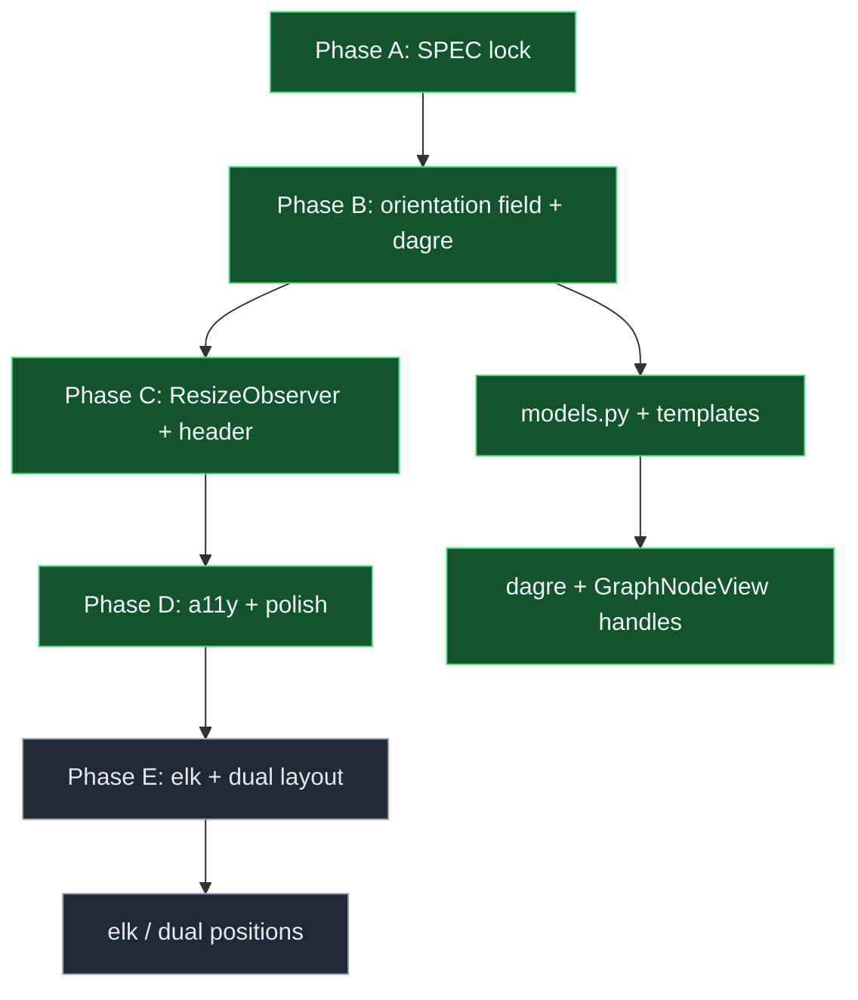

# Canvas orientation (rank-1) - change plan

> **Status:** Locked (2026-09-08; S5 answered + S6 defaults approved)  
> **Artifact:** `docs/planning/features/canvas-orientation-plan.md`  
> **Linear:** none (POC planning slice)

Grounded in the current codebase: [`frontend/src/App.tsx`](../../../frontend/src/App.tsx) mounts React Flow in a flex center column with `fitView` on load but **no auto-layout** and **no orientation field** on graph JSON. [`GraphNodeView.tsx`](../../../frontend/src/components/nodes/GraphNodeView.tsx) pins handles to `Position.Left` (target) and `Position.Right` (source) for all node types — a horizontal-only convention. [`backend/app/models.py`](../../../backend/app/models.py) `GraphDefinition` stores node positions but has no `orientation` property. [`graph_templates.py`](../../../backend/app/graph_templates.py) seeds blank graphs with fixed LR coordinates (`input_1` at x=120, `output_1` at x=420). [`compiler.py`](../../../backend/app/compiler.py) validates topology (router fallback, cycles, reachability) independent of layout. Rank-1 orientation adds pane-aspect **Auto** layout via dagre, persisted pin override, and handle swapping — not CSS rotation.

---

## Locked decisions (S5 + approval)

| Topic | Decision |
| ----- | -------- |
| Primary signal | `ResizeObserver` on the **React Flow pane** (not `window.matchMedia` as primary). |
| Effective rankdir | **TB** if pane is portrait **or** width **&lt; ~420px**; else **LR**. Debounce **~150ms**. |
| Persistence | `orientation: auto \| horizontal \| vertical` on graph JSON; Auto follows pane; pin overrides. |
| Layout engine | Relayout with **dagre** (elk acceptable fallback); swap handle `Position`; `fitView` with padding. |
| Polish | Header **Auto / H / V** segmented control; **~200ms** ease unless `prefers-reduced-motion`; **one** `aria-live` announcement per breakpoint cross. |
| Non-goals | **CSS rotate** of canvas; handle-only flip without layout; dual stored layouts per graph. |
| Implement order | **Second** — after [`app-shell-resilience-plan.md`](app-shell-resilience-plan.md) (pane must go tall). |

---

## Ranked options (evaluated)

| Rank | Option | Signal | Layout | Handles | Verdict |
| ---- | ------ | ------ | ------ | ------- | ------- |
| **1** | Pane-aspect Auto + dagre + pin | `ResizeObserver` on flow pane | dagre TB/LR from aspect | Swap Left/Right ↔ Top/Bottom | **Selected** |
| 2 | Window breakpoint only | `matchMedia('(max-width: …)')` | dagre on breakpoint | Swap on breakpoint | Rejected — ignores drawer shell shrinking pane without viewport change |
| 3 | CSS `transform: rotate(90deg)` on canvas | Media query | None (visual only) | Unchanged | **Non-goal** — breaks interaction coords |
| 4 | Manual drag only | User positions | None | Fixed LR | Status quo; fails portrait readability |
| 5 | Dual stored layouts (H + V positions) | User toggle | Load alternate coords | Per-layout | **Follow-on** — complexity; defer |

---

## 1. User story

### Primary story

**As a graph author on a tall or narrow canvas pane, I want the workflow to automatically layout top-to-bottom (or stay horizontal when pinned), so that I can read the graph without manual repositioning every time the shell resizes.**

### Acceptance criteria (MVP)

| # | Criterion |
| - | --------- |
| AC1 | `ResizeObserver` on the React Flow wrapper debounces (~150ms) and computes effective rankdir: **TB** when pane `height > width` or `width < 420px`, else **LR**. |
| AC2 | Graph JSON persists `orientation: 'auto' \| 'horizontal' \| 'vertical'`; default **`auto`** for new graphs from [`graph_templates.py`](../../../backend/app/graph_templates.py). |
| AC3 | **Auto** uses pane signal; **horizontal** / **vertical** pins force LR / TB regardless of pane (until user selects Auto again). |
| AC4 | On orientation change, dagre recomputes node positions, updates React Flow nodes, swaps handles in [`GraphNodeView.tsx`](../../../frontend/src/components/nodes/GraphNodeView.tsx), and calls `fitView({ padding })`. |
| AC5 | Header segmented control shows active mode (Auto / H / V); selection persists on save (`PUT /api/graphs/{id}`). |
| AC6 | One polite `aria-live` announcement when effective orientation crosses (e.g. "Graph layout: vertical"). |
| AC7 | With `prefers-reduced-motion`, layout updates are instant (no 200ms ease). |

### Non-goals (v1)

- CSS rotate of the canvas layer
- Separate x/y position sets per orientation (dual layouts)
- elk vs dagre benchmarking (pick dagre unless blocked)
- Compiler / runtime topology changes

### Alignment

- Depends on shell spec for portrait-capable pane
- Matches EDD direction: graph-native authoring, not hard-coded demo coordinates

---

## 2. UI/UX design

### Problem today

| Element | Current behavior | User expectation |
| ------- | ---------------- | ---------------- |
| Blank template | Fixed LR coordinates | Readable in portrait pane |
| Handles | Always Left/Right | Top/Bottom when vertical |
| Resize | Nodes clip or overlap in tall pane | Auto relayout |
| User override | None | Pin H or V when presenting |

### State model

```text
ORIENT_AUTO       -> effective rankdir from pane aspect
ORIENT_PIN_H      -> force LR (dagre rankdir LR)
ORIENT_PIN_V      -> force TB (dagre rankdir TB)
LAYOUT_PENDING    -> debounce window after resize
LAYOUT_APPLYING   -> dagre running; nodes updating
```

### Wireframe (header control)

```text
+-- Graph name -----------------------------------------------+
| Orientation:  ( Auto ) ( H ) ( V )     Validation: Ready   |
+--------------------------------------------------------------+
```

### Entry points

- Primary: pane resize under Auto mode
- Secondary: user selects H or V in header
- Tertiary: load graph with saved `orientation` field

### Conflicts and edge cases

- User manually dragged nodes then switches to Auto → **relayout overwrites** positions (document in tooltip)
- dagre on single-node or two-node graph → minimal shift; still fitView
- Inspector open reduces pane width → may cross 420px threshold; debounce prevents thrash

### Accessibility

- Segmented control: `role="tablist"` or radio group with visible focus
- Live region: single announcement per effective orientation change (not per resize tick)

### Mobile

- Phone portrait pane → TB layout by default under Auto
- Pin controls remain available in header (44px targets per shell spec)

---

## 3. Engineering spec

### State model

| Current | Proposed |
| ------- | -------- |
| No `orientation` on `GraphDefinition` | Optional `orientation: 'auto' \| 'horizontal' \| 'vertical'` |
| Fixed handle positions | `targetPosition` / `sourcePosition` derived from effective rankdir |
| Manual positions only | dagre `layout()` on orientation or graph load |

### Components / modules

| Module | Role |
| ------ | ---- |
| `frontend/src/layout/dagreLayout.ts` (new) | dagre graph build + position map |
| `frontend/src/hooks/useCanvasOrientation.ts` (new) | ResizeObserver, debounce, effective rankdir |
| `frontend/src/App.tsx` | Header segmented control; orchestrate relayout |
| `frontend/src/components/nodes/GraphNodeView.tsx` | Dynamic `Position` for handles |
| `backend/app/models.py` | `GraphDefinition.orientation` optional field |
| `backend/app/graph_templates.py` | Default `orientation: "auto"` on new graphs |
| `frontend/src/types.ts` | `GraphDefinition` TS mirror |

### Data / API

- `PUT` / `GET` graph endpoints pass through `orientation` unchanged
- Migration: absent field treated as `auto` in frontend and backend

### Interaction rules

- Do not use `window.matchMedia` as **primary** signal; pane `ResizeObserver` only
- Debounce 150ms; cancel in-flight layout if superseded
- Save orientation with graph on Compile/Run (existing save path)

### Tests

- Unit: effective rankdir from width/height pairs
- Unit: dagre produces finite positions for demo graph
- Backend: model accepts `orientation` field; template default `auto`

### Observability

- No runtime changes; optional dev log when layout applies

---

## 4. Feedback

| Strength | Notes |
| -------- | ----- |
| dagre is standard for React Flow | Small dependency footprint |
| Pin override | Simple escape hatch for demos |

| Risk | Mitigation |
| ---- | ---------- |
| Layout jitter on resize | 150ms debounce + ignore sub-threshold deltas |
| Overwriting user drag | Copy in Auto tooltip; pin H/V to freeze |
| Backend/frontend drift on new field | Optional pydantic field + TS type together |

---

## 5. Clarifying questions (resolved)

1. Primary resize signal? → **ResizeObserver on pane**
2. CSS rotate acceptable? → **No** (non-goal)
3. Store two position sets? → **No** (follow-on)
4. dagre vs elk? → **dagre** unless integration issues

---

## 6. Default stance (approved)

| Question | Default (approved 2026-09-08) |
| -------- | ----------------------------- |
| Narrow width threshold | **420px** pane width forces TB |
| Debounce | **150ms** |
| Animation | **200ms** ease on node position; **0ms** if reduced-motion |
| Default for new graphs | **`auto`** |
| Announcement | **One** live region message per effective orientation change |

---

## 7. Implementation and rollout

### Phase A — Design freeze

- [x] Ranked options table; rank-1 selected
- [x] Locked SPEC in repo

### Phase B — Core

- [ ] `orientation` field on model + types + templates
- [ ] dagre layout module + handle swap

### Phase C — Polish

- [ ] Header Auto/H/V control; fitView padding
- [ ] `aria-live` + reduced-motion

### Phase D — Rollout

| Stage | Audience | Success metric |
| ----- | -------- | -------------- |
| Dev | Local | Resize pane TB/LR; pin persists across reload |
| CI | pytest + optional layout unit tests | Model round-trip |
| Demo | Stakeholders | Blank graph readable in portrait drawer shell |

### Phase E — Follow-ups

- [ ] elk option for large graphs
- [ ] "Preserve manual positions" mode (dual layout storage)

### Progress diagram



---

## 8. Existing tooling

- `feature-change-plan` skill (workspace)
- `@xyflow/react` `fitView`, `useReactFlow`
- `uv run pytest` for backend model tests
- Shell spec [`app-shell-resilience-plan.md`](app-shell-resilience-plan.md) for portrait pane

---

## 9. New artifacts

| Artifact | When |
| -------- | ---- |
| `frontend/src/layout/dagreLayout.ts` | Phase B |
| `frontend/src/hooks/useCanvasOrientation.ts` | Phase B |
| npm dependency `@dagrejs/dagre` (or equivalent) | Phase B |

---

## 10. Key code paths

| Area | Path |
| ---- | ---- |
| App shell + React Flow mount | `frontend/src/App.tsx` |
| Node handles | `frontend/src/components/nodes/GraphNodeView.tsx` |
| Graph types | `frontend/src/types.ts` |
| Graph model | `backend/app/models.py` (`GraphDefinition`) |
| Blank / demo templates | `backend/app/graph_templates.py` |
| Validation (topology only) | `backend/app/compiler.py` |
| Theme / motion tokens | `frontend/src/theme.ts` |

---

## 11. Next step

After shell resilience lands, implement `orientation` persistence and dagre relayout with ResizeObserver-driven Auto mode. Then proceed to [`from-scratch-authoring-plan.md`](from-scratch-authoring-plan.md) for edge-kind-at-connect and router inspector improvements.

---

## Revision log

| Date | Change |
| ---- | ------ |
| 2026-09-08 | Initial lock; rank-1 pane-aspect Auto + dagre + pin |
