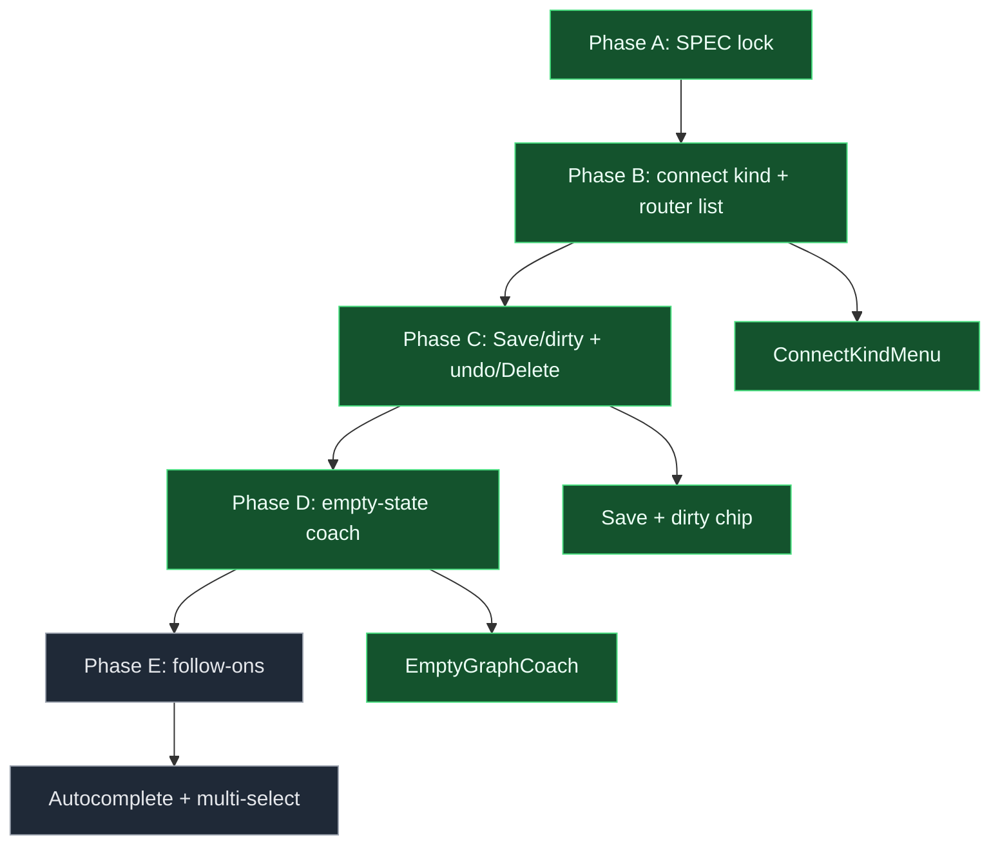

# From-scratch authoring - change plan

> **Status:** Locked (2026-09-08; S5 answered + S6 defaults approved)  
> **Artifact:** `docs/planning/features/from-scratch-authoring-plan.md`  
> **Linear:** none (POC planning slice)

Grounded in the current codebase: [`frontend/src/App.tsx`](../../../frontend/src/App.tsx) `onConnect` always creates edges with `kind: "sequence"` (lines ~395–407) — authors must select the edge and open [`EdgeInspector`](../../../frontend/src/components/NodeInspector.tsx) to set **conditional** or **default**, which is especially painful for router nodes. The router [`NodeInspector`](../../../frontend/src/components/NodeInspector.tsx) block is **read-only prose** directing users to the canvas rather than listing outgoing edges and conditions. Dirty state exists (`isCanvasDirty` / `savedGraphFingerprint`) but there is **no visible dirty chip**, **no explicit Save** action separate from Compile/Run, **no undo stack**, and **no keyboard Delete** for selection. [`graph_templates.py`](../../../backend/app/graph_templates.py) `build_blank_graph` seeds input→output with no coaching UI. [`compiler.py`](../../../backend/app/compiler.py) already enforces router fallback, conditional conditions, and cycle checks — authoring UX should surface those rules earlier.

---

## Locked decisions (S5 + approval)

| Topic | Decision |
| ----- | -------- |
| New connections | Choose or default **edge kind** (sequence / conditional / default) at connect time — no second inspector trip for routers. |
| Router inspector | **List outgoing edges + conditions** (editable), not read-only prose only. |
| Save / dirty | **Explicit Save**, visible **dirty chip**, **undo** stack, **keyboard Delete** for selected node/edge. |
| Empty state | **Coaching** on blank input→output graphs (next steps, router hint). |
| Non-goals v1 | New node types, extra run variables, custom tools, loops. |
| Implement order | **Third** — can overlap after shell chrome exists; benefits from orientation but not blocked on dagre. |

---

## 1. User story

### Primary story

**As a first-time author building a graph from the blank template, I want to connect nodes, configure router branches, and save my work with clear feedback, so that I can create a valid workflow without memorizing edge-kind rules or losing edits.**

### Acceptance criteria (MVP)

| # | Criterion |
| - | --------- |
| AC1 | On connect, a **compact picker** (or smart default) sets edge kind: sequence, conditional (with condition prompt), or default; router sources default intelligently (e.g. first edge sequence, subsequent conditional/default per context). |
| AC2 | Router **NodeInspector** lists all outgoing edges with kind + condition fields inline; edits sync to canvas edges. |
| AC3 | Header shows **dirty chip** when `fingerprintGraph(current) !== savedGraphFingerprint`; **Save** persists via `PUT` without requiring compile. |
| AC4 | **Undo** (Ctrl/Cmd+Z) reverts last canvas mutation (nodes, edges, positions, config); redo optional. |
| AC5 | **Delete** / Backspace removes selected node or edge when focus is not in a text field. |
| AC6 | Blank graph (`input_1` → `output_1` only) shows **empty-state coaching** overlay or panel (add prompt, LLM, router steps). |
| AC7 | Save/Compile/Run respect dirty state; switching graphs warns if dirty (existing confirm retained). |

### Non-goals (v1)

- New node types beyond the six POC types
- Custom tools or MCP integrations
- Loop / cycle support (compiler still rejects cycles)
- Extra run input variables beyond `question`
- Touch-draw authoring on phone (shell spec)

### Alignment

- POC thesis: visual assembly without orchestration code
- Compiler rules in [`compiler.py`](../../../backend/app/compiler.py) remain source of truth for validation

---

## 2. UI/UX design

### Problem today

| Element | Current behavior | User expectation |
| ------- | ---------------- | ---------------- |
| `onConnect` | Always `sequence` | Pick kind when wiring router |
| Router inspector | Static instructions | Editable edge list |
| Persistence | Save only via Compile/Run | Explicit Save |
| Dirty state | Internal fingerprint only | Visible unsaved indicator |
| Undo | None | Standard undo |
| Delete | Button in inspector only | Keyboard Delete |
| Blank template | Silent canvas | Guided next steps |

### State model

```text
CANVAS_CLEAN      -> fingerprint matches saved
CANVAS_DIRTY      -> mutations since last save
UNDO_STACK        -> past graph snapshots (bounded)
CONNECT_KIND      -> modal/popover picking edge kind on new connection
ROUTER_INSPECT    -> selected router node; edge list sub-panel
EMPTY_COACH       -> visible when graph matches blank template pattern
```

### Wireframe (connect + header)

```text
+-- Graph name · Unsaved -------------------------------------+
| [Save]  Validation: 1 warning    Orientation: Auto          |
+--------------------------------------------------------------+
|  [Empty state: Add a Prompt node between Input and Output]  |
|                                                              |
|     (input) ----?---- (output)   <- connect shows kind menu |
+--------------------------------------------------------------+

Router inspector:
+-- Configure: router ----------------------------------------+
| Outgoing edges:                                              |
|  -> llm_1     [conditional] [technical________]             |
|  -> tool_1    [default    ]                                  |
+--------------------------------------------------------------+
```

### Entry points

- Primary: connect gesture on canvas
- Secondary: select router node → inspector edge list
- Tertiary: create blank graph from [`GraphLibrary`](../../../frontend/src/components/GraphLibrary.tsx)

### Conflicts and edge cases

- Multiple defaults from router → validation error (existing compiler); show inline on edge row
- Undo after Save → marks dirty again
- Delete entry node → warn or block if last input

### Accessibility

- Connect kind menu: focus trap, arrow keys, Enter to confirm
- Dirty chip: `aria-live="polite"` when transitioning clean ↔ dirty
- Delete: confirm for nodes with many edges (optional S6 default: no confirm for POC)

### Mobile

- Per shell spec: authoring hidden on phone; empty-state copy still visible if graph opened read-only

---

## 3. Engineering spec

### State model

| Field | Role |
| ----- | ---- |
| `undoStack` / `redoStack` | Serialized `{ nodes, edges, graphName }` snapshots |
| `showConnectKind` | Pending connection + anchor position for kind UI |
| `isDirty` | Derived from fingerprint vs saved (expose to header) |

### Components / modules

| Module | Role |
| ------ | ---- |
| `frontend/src/App.tsx` | `onConnect` kind flow; undo/redo; Save handler; keyboard listeners |
| `frontend/src/components/ConnectKindMenu.tsx` (new) | Edge kind picker at connect |
| `frontend/src/components/NodeInspector.tsx` | Router outgoing-edge editor |
| `frontend/src/components/EmptyGraphCoach.tsx` (new) | Blank template coaching |
| `frontend/src/components/GraphLibrary.tsx` | Create blank entry |
| `frontend/src/hooks/useUndoStack.ts` (new) | Push/pop canvas snapshots |
| `backend/app/graph_templates.py` | Unchanged topology; optional metadata flag for coach dismissal |

### Interaction rules

- Save calls `api.saveGraph(buildGraphDefinition())` and updates `savedGraphFingerprint`
- Compile/Run continue to save (no regression) but header Save allows persist without compile
- Undo depth cap (e.g. 50) to bound memory
- `onConnect`: if source is `router`, show kind menu; else default `sequence` with optional long-press/shift for menu

### Tests

- Unit: undo restores prior edge kind
- Unit: router inspector patch updates edge data
- Integration: blank graph detection matches `build_blank_graph` topology
- Backend: unchanged pytest suite passes

### Observability

- None required for POC

---

## 4. Feedback

| Strength | Notes |
| -------- | ----- |
| Fingerprint + dirty already implemented | Expose in UI only |
| EdgeInspector already edits kind | Reuse in router list rows |

| Risk | Mitigation |
| ---- | ---------- |
| Connect menu friction on every edge | Default sequence; menu on router sources or Shift-connect |
| Undo + React Flow internals | Snapshot nodes/edges arrays, not RF instance |
| Router list stale when edges deleted | Derive list from `edges.filter(e => e.source === node.id)` |

---

## 5. Clarifying questions (resolved)

1. Save separate from Compile? → **Yes** (explicit Save button)
2. Undo scope? → **Canvas mutations** (nodes, edges, configs, positions)
3. New node types in v1? → **No**
4. Empty-state dismiss? → **Per graph** local flag optional; default show until first extra node

---

## 6. Default stance (approved)

| Question | Default (approved 2026-09-08) |
| -------- | ----------------------------- |
| Connect kind UI | **Popover** at drop point; router sources always prompt |
| Non-router connect | Default **sequence**; hold **Shift** to open kind menu |
| Undo depth | **50** snapshots |
| Delete confirm | **No** confirm for POC (compiler validates after) |
| Empty-state | Show until graph has **>2 nodes** or user dismisses |

---

## 7. Implementation and rollout

### Phase A — Design freeze

- [x] Locked SPEC in repo

### Phase B — Core

- [ ] Connect kind menu + router inspector edge list
- [ ] Save button + dirty chip

### Phase C — Polish

- [ ] Undo/redo + keyboard Delete
- [ ] Empty-graph coaching component

### Phase D — Rollout

| Stage | Audience | Success metric |
| ----- | -------- | -------------- |
| Dev | Local | Blank → router workflow without edge inspector detour |
| CI | pytest | No backend regressions |
| Demo | Stakeholders | Author classify-and-route from scratch in &lt;5 min |

### Phase E — Follow-ups

- [ ] Edge condition autocomplete from prior LLM outputs
- [ ] Multi-select delete
- [ ] Custom tools / new node types (out of v1)

### Progress diagram



---

## 8. Existing tooling

- `feature-change-plan` / `feature-change-implement` skills
- Live validation: `POST /api/graphs/validate` (already wired in `App.tsx`)
- `uv run pytest` including router/fork tests in `backend/tests/`

---

## 9. New artifacts

| Artifact | When |
| -------- | ---- |
| `frontend/src/components/ConnectKindMenu.tsx` | Phase B |
| `frontend/src/components/EmptyGraphCoach.tsx` | Phase C |
| `frontend/src/hooks/useUndoStack.ts` | Phase C |

---

## 10. Key code paths

| Area | Path |
| ---- | ---- |
| Connect handler | `frontend/src/App.tsx` (`onConnect`) |
| Dirty fingerprint | `frontend/src/App.tsx` (`fingerprintGraph`, `isCanvasDirty`) |
| Node / edge inspectors | `frontend/src/components/NodeInspector.tsx` |
| Run / compile actions | `frontend/src/components/RunPanel.tsx` |
| Graph library / blank create | `frontend/src/components/GraphLibrary.tsx` |
| Canvas node rendering | `frontend/src/components/nodes/GraphNodeView.tsx` |
| Theme | `frontend/src/theme.ts` |
| Graph model | `backend/app/models.py` |
| Blank template | `backend/app/graph_templates.py` |
| Router / cycle validation | `backend/app/compiler.py` |

---

## 11. Next step

Implement Phase B–D after shell chrome is available: connect-kind menu and router edge list first, then Save/dirty/undo/Delete, then empty-state coaching. Validate against existing compiler diagnostics for router fallback and conditional edges.

---

## Revision log

| Date | Change |
| ---- | ------ |
| 2026-09-08 | Initial lock from next-set planning thread |
