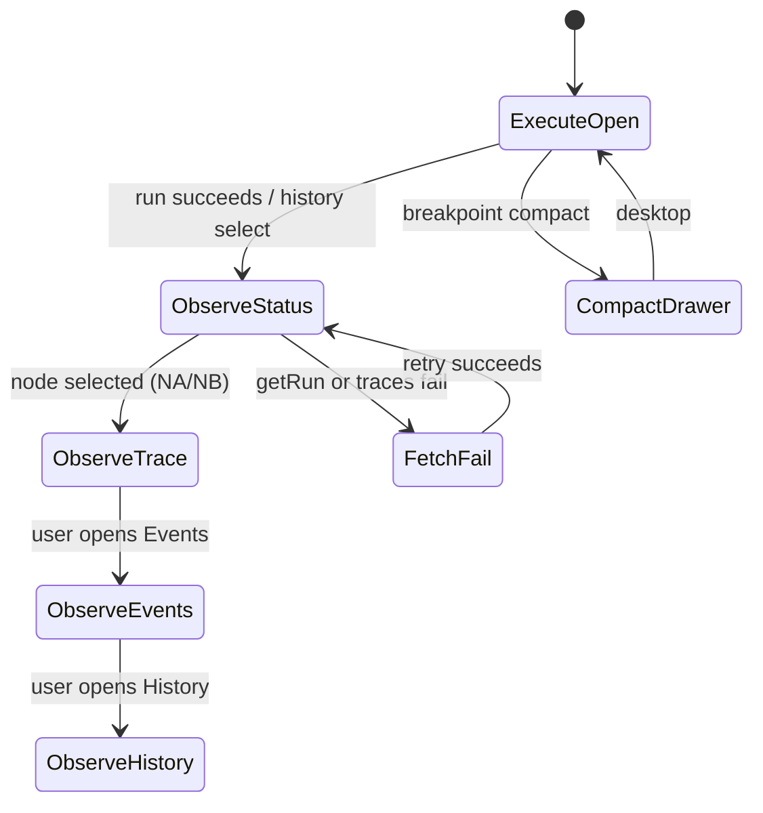
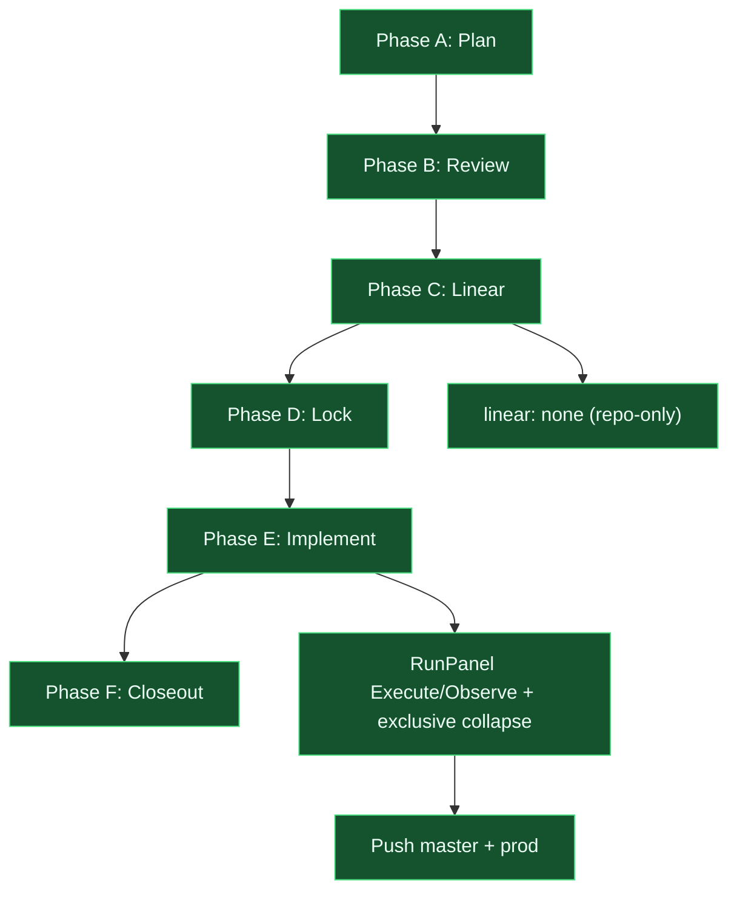

# Playground shell panels - change plan

> **Status:** Locked (2026-09-10; S6 defaults accepted; Phase F closed)  
> **Artifact:** `docs/planning/features/playground-shell-panels-plan.md`  
> **Branch:** `master`  
> **Ship:** `c6b5467` — `feat(ui): regroup run rail into Execute vs Observe panels`  
> **Prod:** https://agent-graph-builder-app.vercel.app (legacy alias: `agent-graph-builder-poc.vercel.app`)  
> **Linear:** none (repo-only)

## Locked decisions (S5 resolved via S6 acceptance 2026-09-10)

| Topic | Decision |
| ----- | -------- |
| Observe pattern | **NA** — accordion-one-open inside Observe; Execute remains a separate collapsible, default open |
| Inspector at wide | Keep the inspector **column** only if canvas stays ≥ `shell.canvasMinWidth` (420); otherwise existing drawer |
| Diagnostics | Stay in **Execute**; collapsed when the graph is ready (`diagnostics.length === 0`) |
| Historical events | **No new API**; distinct copy vs live empty; show `runSummary.events` when present |
| Rail width | **Keep 340px** |
| Tracking | **Repo-only** (`linear_issue: none`) |

Grounded in the current codebase: the playground shell already has three breakpoints (`compact` 1100 / `wide` 1280 / `phone` 640), fixed rails (`library` 220, `inspector` 300, `run` 340), drawers below desktop, and persisted `CollapsibleSection`s from the shipped empty-states slice. [shell-layout-polish-plan.md](shell-layout-polish-plan.md) fixed fitView timing, header/run collision, event-log empty copy, and `TaxonomyTooltip` layout modes — it explicitly **did not** change run-rail width or nested overflow. Today the right column still stacks Run inspection + Run + Diagnostics + Run history + Run status + Node trace + Event log as independent `flexShrink: 0` sections, each with its own `maxHeight` / `overflowY: auto`. At wide viewports a selected node also inserts the inspector rail between canvas and run, squeezing the graph. Palette help icons are already portaled (`TaxonomyTooltip` → `document.body`). This SPEC redesigns **panel IA and overflow**, not run execution or storage.

**UI_DESIGN_WORKFLOW PH (compressed):** Discover is complete (Step 0 CTX). Define + Structure + Wireframe are locked with S6. Visual stays on existing `theme.ts` tokens (no new type scale or color ramps). Prototype/Test/Handoff proceed in Phase E implementation.

---

## CTX & Goals (UI workflow)

**IN (filled)**

| Slot | Value |
| ---- | ----- |
| `product` | Agent Graph Builder playground (Vite/React Flow + FastAPI runs) |
| `platform` | Desktop-first SPA; drawers under 1100px; inspector rail only at 1280px+ |
| `users` | Graph author / demo operator on a laptop |
| `primary_goal` | Inspect a live or historical run without the right rail eating the canvas or trapping JSON/events in nested scrollboxes |
| `constraints (tech)` | Inline styles + `theme.ts` tokens; `usePersistedCollapse` (`agb-panel-sections`); no new layout library unless Ask First |
| `constraints (a11y)` | 44px targets, `prefers-reduced-motion`, existing `aria-live` on validation + event log |
| `constraints (prior specs)` | Do not reopen locked trilogy or shell-layout-polish decisions except where this SPEC explicitly supersedes overflow/collapse |
| `screenshot` | 2026-09-10: inspecting router after Groq success; all right collapsibles open; event log empty placeholder; canvas squeezed |

**IN (missing at draft)** — resolved 2026-09-10 via S6 acceptance (see Locked decisions)

| Slot | Why it matters |
| ---- | -------------- |
| Exclusive accordion vs tabs vs split panes | Chooses the Observe-region pattern |
| Inspector column vs overlay at wide | Canvas squeeze vs extra chrome |
| Historical event replay | Empty log during inspection may be layout or data |
| Deadline / Linear | Tracking only |
| Visual refresh appetite | Out of scope unless requested |

**OUT:** personas, IA, wireframes, interaction states (below and S2). Visual token set deferred.

S5 questions were answered by S6 defaults on 2026-09-10; do not reopen without a SPEC revision.

---

## 1. User story

### Primary story

**As a graph author on a laptop, I want the right-hand run/observe chrome to adapt to viewport height and width without nested competing scrollbars, so that I can configure a run, read the result, and inspect a node trace while still seeing the canvas.**

### Acceptance criteria (MVP)

| # | Criterion |
| - | --------- |
| AC1 | At a **900px-tall** desktop viewport with a succeeded run and a node selected, the user can reach **Run** controls, **Run status** result, and **Node trace** without a second inner scrollbar on those JSON/result blocks (one shared scroll region for Observe content, or content grows and the rail/drawer body is the only scroller). |
| AC2 | **Event log** and **Node trace** do not each clip to a fixed `maxHeight` (today 160px on traces/status; event log is `flex: 1` + `overflowY: auto` while siblings are `flexShrink: 0`). |
| AC3 | Observe surfaces (**Run status**, **Node trace**, **Event log**, **Run history**) cannot all sit fully expanded at once in a way that starves each other: either **accordion-one-open** within the Observe group, or **tabs**, or a **single stacked document** in one scroller. |
| AC4 | Empty event-log placeholder does not create a vacant scrollable pane; it is compact until events exist. |
| AC5 | Wide layout (`>= 1280px`) with inspector open keeps the canvas at least `shell.canvasMinWidth` (420). If that cannot be met, inspector stays in the existing drawer (`inspectorInDrawer`) rather than inserting a fourth column. |
| AC6 | Compact (`< 1100px`) and phone Run **drawer** reuse the same Execute / Observe IA; drawer body is the single scroller (`ShellDrawer` already `overflowY: auto`). |
| AC7 | Collapsible / tab headers meet **44×44px**; keyboard can expand/collapse or switch tabs; `aria-expanded` / `aria-selected` stay accurate. |
| AC8 | New motion honors `prefers-reduced-motion` (`useShellLayout().reducedMotion`). |
| AC9 | Existing empty copy is preserved: “No events yet. Run the graph to stream node lifecycle events here.” |
| AC10 | `localStorage` persistence does not restore **every** former section as open after grouping changes (new section IDs or an exclusive-open writer). |
| AC11 | Focus order in the run rail/drawer: Execute (question, provider, Compile/Run) before Observe (history, status, trace, events). |

### Non-goals (v1)

- Fixing concurrent RCA: `GET /api/runs/{id}` **404** after Groq “success”, empty event log from failed SSE/poll, or stale production bundle `index-BmJ0fxtP.js` vs Turso storage. Layout must **degrade** if inspection fetches fail (S4), not own the backend fix.
- Reconstructing historical SSE event lists (unless a cheap `RunSummary.events` payload already exists on `getRun` — then display it; do not add a new events API in this CAP).
- Changing compiler, providers, Turso, or run-queue behavior.
- Resizable split panes / drag-to-resize rails (optional follow-up; S6 default is no).
- Full design-system / light theme / new color ramps.
- Reopening shell-layout-polish locked copy (orientation row, palette `?` corner, load-failure banner).
- Tooltip portal work (already in `Tooltip.tsx`); only touch if a new overflow parent re-clips them.
- Frontend e2e harness bootstrap (Vitest/RTL for the new grouping is in scope; Playwright is not).

### Alignment

- Supersedes the **overflow and independent-collapse** leftover from [shell-layout-polish-plan.md](shell-layout-polish-plan.md) (that SPEC’s non-goal: “Changing run rail width (340px)”). This CAP may keep 340px (S6) but **must** change how height is shared.
- Extends [app-shell-resilience-plan.md](app-shell-resilience-plan.md) AC3/AC4 drawers and 44px targets; does not reopen error-boundary decisions.
- Respects ultra-wide tokens already shipped: `shell.breakpoint.wide` (1280), `shell.canvasMinWidth` (420), inspector rail only when `isWide` ([roadmap.md](../roadmap.md)).
- Roadmap “Empty states, loading shimmers, collapsible panels” is **shipped** — this CAP is the follow-up that collapsibles created (all-open stacking).

### Term hygiene (overloaded words)

| Word in UI today | Meaning A | Meaning B | Plan |
| ---------------- | --------- | --------- | ---- |
| Inspect / inspection | Node/edge **Configure** inspector rail | **Run inspection** of a historical/live `run_id` | Keep both labels; group A as **Configure**, B as **Observe** |
| Event log | SSE `PlatformEvent` list | User phrasing “Event Details” | Keep **Event log** in UI |
| Trace | `NodeTrace` JSON in the rail | Canvas executed-path highlight (`runInspection.ts`) | Rail copy stays **Node trace**; canvas path is not this CAP |
| Diagnostics | Run-rail validation list | Header **Validation:** chip | Unchanged; not merged in v1 |

---

## 2. UI/UX design

### Users & scenarios (Define)

**Persona:** `graph-author` — builds or demos classify/route graphs, runs Groq or stub, clicks nodes to see traces.

| Task | Success metric |
| ---- | -------------- |
| Start a run | Compile/Run visible without scrolling past four open Observe blocks |
| Read Groq answer | Result readable at full width of rail; no 160px clip |
| Inspect `router_1` after success | Trace JSON visible; canvas still shows the path highlight |
| Skim event log after a live run | Events in the same Observe scroller; empty state is one short line |
| Review an older run from history | History list does not steal half the rail; selecting a run updates Observe |

```text
PP: Given [persona] graph-author and [goal] inspect a run without fighting panels,
list 3–5 key tasks the UI must support, with measurable success indicators for each.
```

### IA & flows (Structure)

**Proposed IA (right chrome)**

1. **Execute** — question, provider/model/key, Compile + Run, provider block message, in-progress skeleton. Diagnostics stay here (graph validity is a pre-run concern) **or** a compact chip that expands (S6: stay in Execute, default collapsed when `diagnostics.length === 0`).
2. **Observe** — Run inspection banner (when `inspectionRunId`), Run history, Run status, Node trace, Event log.

**Navigation models (locked: NA)**

| ID | Model | When it wins |
| -- | ----- | ------------ |
| **NA** | Accordion-one-open inside Observe; Execute always visible (may collapse) | Least new chrome; matches current chevrons |
| **NB** | Tabs: Execute \| Observe (Observe is one scroller) | Clearest mode switch; extra click to run vs read |
| **NC** | Vertical split pane (Execute top / Observe bottom, user-draggable) | Power-user; **out of v1** unless S5 chooses it |

**Primary flow (`inspect-after-run`)**

1. Author fills question + provider in **Execute** (always reachable).
2. Author clicks Run; Execute shows busy skeleton; Observe auto-opens **Run status**.
3. On success, result appears in Observe scroller (grows with content).
4. Author clicks a canvas node; **Node trace** becomes the Observe heading/tab; JSON is in the same scroller.
5. Event log is a subsection or tab in Observe, not a competing `flex: 1` leftover.

```text
PP: Given [tasks], propose: (1) IA (top-level sections), (2) 1–2 navigation models,
(3) step-by-step user flow for inspect-after-run.
```

### Problem today

| Element | Current behavior | User expectation |
| ------- | ---------------- | ---------------- |
| Right rail (`RunPanel` `layout="rail"`) | `overflow: hidden` column; every section except Event log is `flexShrink: 0` | Adaptive stack; one height budget |
| Collapsibles | Independent `usePersistedCollapse`; most `defaultOpen`; all can be open | Related sections do not squash each other |
| Run status result | `scrollableBlockStyle` `maxHeight: 160` + `overflowY: auto` | Answer grows; rail/drawer scrolls if needed |
| Node trace Input/Output | Same 160px clip + inner `pre` `overflowX: auto` | Full JSON in shared scroller; horizontal scroll only for long lines |
| Event log | `flex: 1; minHeight: 0; overflowY: auto` even when empty | Compact empty state; no ghost scrollbar |
| Run history | `maxHeight: 200` inner list | List in shared scroller or a dedicated Observe tab |
| Run inspection + header chip | Duplicate “Inspecting run · succeeded · …” | One banner in Observe; header chip optional |
| Inspector + run at wide | 300 + 340 + 220 = 860px chrome; canvas `minWidth` 420 | Graph remains usable; inspector yields if not |
| Compact Run drawer | Same stacked `RunPanel` inside `ShellDrawer` scroller | Same Execute/Observe IA; one drawer scroll |
| Palette tooltips | Portaled to `document.body` (corner layout) | Unchanged; must not regress clip |

### State model

```text
RAIL_EXECUTE          -> Execute group visible (question/provider/actions)
RAIL_OBSERVE          -> Observe group visible (status/trace/events/history)
OBSERVE_STATUS        -> viewing run result / error
OBSERVE_TRACE         -> viewing selected node's NodeTrace (or empty “no trace for this node”)
OBSERVE_EVENTS        -> viewing PlatformEvent list or empty placeholder
OBSERVE_HISTORY       -> viewing run list
INSPECT_RUN           -> inspectionRunId set; banner + history highlight
INSPECT_NODE          -> selectedNodeId set; Configure rail/drawer (separate column)
LAYOUT_WIDE           -> inspector may be a column
LAYOUT_COMPACT        -> rails are drawers
LAYOUT_PHONE          -> authoring disabled; inspect + run only
FETCH_INSPECT_FAIL    -> getRun / traces 404 or error; Observe shows retry/error, does not blank Execute
```

Rules:

- `INSPECT_NODE` (Configure) and `INSPECT_RUN` (Observe) are **not** the same mode; both may be true (screenshot).
- Within Observe, **NA** allows only one of `OBSERVE_STATUS | OBSERVE_TRACE | OBSERVE_EVENTS | OBSERVE_HISTORY` expanded. **NB** uses one tab at a time.
- `FETCH_INSPECT_FAIL` must not be styled as “no events yet” if the run succeeded in-session (distinct copy).
- `RAIL_EXECUTE` remains reachable in NA (Execute not forced closed by Observe). In NB, switching to Observe hides Execute until tab change.

### Wireframe (desktop, wide, node selected — merged Wireframe PH)

```text
+-- Library 220 --+-- Canvas (flex, min 420) --+-- Configure 300 --+-- Run 340 ------+
| Graph Library   | Header: name, Save,        | Configure: router | EXECUTE         |
| New graph       | Unsaved, Validation,       | outgoing edges    | [question 4+]   |
| Node Palette    | Inspecting-run chip        | [Delete node]     | provider        |
|                 | Orientation                |                   | [Compile][Run]  |
|                 |                            |                   | Diagnostics ^   |
|                 +----------------------------+                   | OBSERVE         |
|                 | React Flow                 |                   | [Status|Trace|  |
|                 | (path highlight)           |                   |  Events|History]|
|                 |                            |                   | +-- one scroll -+|
|                 |                            |                   | | result / JSON ||
|                 |                            |                   | | or event list ||
|                 |                            |                   | +---------------+|
+-----------------+----------------------------+-------------------+-----------------+
```

**NA accordion variant (Observe):** chevron list; only one Observe child `open`; Execute is a separate collapsible default-open.

**NB tab variant:**

```text
[ Execute ] [ Observe ]
Observe toolbar: Status | Trace | Events | History
Body: single overflowY auto region
```

### Wireframe (compact / phone)

```text
+-- Header: Library | Inspector | Run toggles --+
| Graph name, Save, Validation, Orientation     |
+-----------------------------------------------+
| Canvas (flex 1)                               |
+-----------------------------------------------+
Drawer Run (right, min(340px, 92vw)):
  same Execute / Observe as desktop; drawer body = only scroller
Drawer Inspector: Configure form (already overflowY auto)
```

```text
PP: Given [flow] inspect-after-run, draft wireframe descriptions per screen:
layout regions, key elements, content hierarchy.
```

### Entry points

- Primary: desktop playground after a run (screenshot path).
- Secondary: compact Run drawer; phone inspect+run.
- Tertiary: Run history click (`handleSelectHistoricalRun`) — Observe should show status/traces even if events array is empty.

### Conflicts and edge cases

- All sections previously persisted open in `agb-panel-sections` — migrate by **new IDs** (`observe-status`, etc.) so AC10 holds.
- `selectedTrace` is null when no node is selected — Observe Trace tab/section shows “Select a node to see its trace.”
- `applyRunInspection` currently `setEvents([])` — empty log during history inspect is **data**, not only layout; UI must not imply the run never streamed.
- Live run: Execute busy vs Observe updating — do not lock Execute closed while `running`.
- Inspector column appearing/disappearing shifts canvas — AC5; avoid extra jump from this CAP beyond existing `isWide` behavior.
- Diagnostics `aria-live` on the whole section vs event log `aria-live` — keep both; do not nest live regions inside the shared scroller in a way that double-announces every event (events stay `aria-relevant="additions"` on the list, not the rail).
- `CollapsibleSection` `headerActions` render **inside** the header `<button>` — invalid if actions contain controls; v1 must put actions outside the toggle (even if unused today).

### Accessibility

- Labels: Observe tabs `role="tablist"` + `aria-controls`; accordion headers keep `aria-expanded` / `aria-controls`.
- Keyboard: Tab to Execute fields; Tab to Observe tabs/headers; Arrow keys for tablist; Enter/Space on accordion.
- Live regions: header Validation chip unchanged; event list polite additions; run failure `role="alert"` unchanged.
- Targets: accordion/tab ≥44px (`shell.touchTarget.min`). Today `CollapsibleSection` header is `padding: 0` — fails AC7 until fixed.
- Contrast: keep existing `text.primary` / `text.muted` on `surface.panel`.
- Reduced motion: chevron rotation already gated; tab indicator must not animate if `reducedMotion`.

### Mobile

- Phone: no authoring (`authoringEnabled`); Run + Inspector drawers only. Observe IA still applies.
- Palette in library drawer can stay; authoring-disabled copy already exists.
- Do not introduce a bottom sheet in v1 (S6) unless S5 asks.

### Interactions & states (component-level)

| Component | Default | Hover/focus | Active | Disabled | Empty | Error |
| --------- | ------- | ----------- | ------ | -------- | ----- | ----- |
| `Execute/Toggle` | Open | focus-visible ring | expanded | n/a | n/a | provider block message |
| `Observe/Tab` | Status after success | focus-visible | `aria-selected` | Trace disabled if no selection (or enabled with empty copy) | compact placeholder | `FETCH_INSPECT_FAIL` banner + Retry |
| `Observe/AccordionHeader` | One open | 44px, chevron | exclusive open | n/a | child empty copy | same |
| `NodeTrace/Pre` | In shared scroller | n/a | n/a | n/a | “No trace for this node” | trace.error in destructive text |
| `EventLog/List` | In shared scroller | n/a | n/a | n/a | AC9 copy, no inner scroll | Do not reuse empty copy on 404 |

Visual Design PH is **not** entered: no new type scale or color tokens. Reuse `SectionHeader` / `typeScale.small` weight 600 from shell-layout-polish.

---

## 3. Engineering spec

### State model

| Current | Proposed |
| ------- | -------- |
| Independent `usePersistedCollapse("run-controls" \| "run-diagnostics" \| "run-history" \| "run-status" \| "run-node-trace" \| "run-event-log" \| "run-inspection")` | Execute collapse key + Observe exclusive key **or** Observe tab id |
| `scrollableBlockStyle.maxHeight: 160` | Remove inner maxHeight; Observe body `flex: 1; minHeight: 0; overflowY: auto` |
| `historyListStyle.maxHeight: 200` | Remove; list lives in Observe scroller |
| `eventLogSectionStyle.flex: 1` + sibling `flexShrink: 0` | Event log is Observe child, not leftover flex sink |
| `containerStyle.overflow: hidden` | Keep on rail; **one** child (Observe body or whole panel) scrolls |
| Inspector `panelStyle.overflowY: auto` | Unchanged (Configure is a different column/drawer) |
| `applyRunInspection` → `setEvents([])` | Layout-safe empty Observe Events; optional: if `summary.events?.length`, show them (no new API). Do not treat 404 as this CAP’s fix |



S2 states mapping: `RAIL_EXECUTE` = ExecuteOpen; `OBSERVE_*` as named; `FETCH_INSPECT_FAIL` = FetchFail; `LAYOUT_*` from `useShellLayout` (N/A to change except AC5 guard).

### Components / modules

| Artifact | Change |
| -------- | ------ |
| `RunPanel.tsx` | Split Execute vs Observe; remove nested maxHeights; implement NA or NB per S6 |
| `CollapsibleSection.tsx` | 44px header; optional `exclusiveGroup` + `open`/`onOpenChange` controlled mode; `headerActions` **sibling** of toggle, not child |
| `usePersistedCollapse.ts` | Support exclusive group writer **or** new keys only; do not silently keep all-true map |
| `App.tsx` | AC5: if `isWide && (selectedNode \|\| selectedEdge)` would drop canvas below `shell.canvasMinWidth`, force `inspectorInDrawer` (compute from `window.innerWidth` minus known rail widths) |
| `theme.ts` | Optional `shell.rail.observeMin` — **Ask First** if adding tokens; otherwise reuse existing |
| `ShellDrawer.tsx` | No structural change if RunPanel stops nested scrolling |
| `NodeInspector.tsx` | Out of v1 except do not add another inner scroll; Configure remains one form scroller |
| `Tooltip.tsx` | Regression-only (portal must still escape Observe overflow) |

### Data / API / flags

- Schema: none
- Actions/routes: none required. If `getRun` already returns `events`, Observe may display them (SDK `RunSummary.events?` already exists).
- Feature flag: **none** (POC). Rollout is branch + preview URL.
- Ask First: no new npm layout libraries (no `react-resizable-panels` unless S5 chooses NC).

### Interaction rules

| Event | Behavior |
| ----- | -------- |
| User opens Observe section B while A is open (NA) | A closes; persist only B’s id |
| User switches Observe tab (NB) | Unmount or hide other panels; persist tab id |
| Run starts | Observe focuses Status (setOpen/setTab); do not close Execute |
| Node click with traces | Observe focuses Trace if a trace exists |
| History item click | Existing `onSelectRun`; Observe Status; Events empty unless `summary.events` |
| `getRun` / traces throw | Show FetchFail in Observe; keep last in-memory `runSummary` if any; do not wipe Execute |
| Viewport resize below wide | Inspector drawer as today; RunPanel IA unchanged |
| `prefers-reduced-motion` | Instant expand; no height animation |

### Tests

| Layer | Cases |
| ----- | ----- |
| Unit | Exclusive-open helper: opening B closes A; persist payload shape |
| Unit | Canvas-width guard: `innerWidth - library - run - inspector < canvasMinWidth` → inspector drawer |
| Component (RTL) | RunPanel: with fake long result + trace JSON, only one `overflow-y: auto` descendant in the rail container (or document the single scroller testid) |
| Component | Empty events: no inner scrollport with `max-height` clip; AC9 text present |
| Component | Accordion/tab keyboard: Enter toggles; tablist arrows if NB |
| Integration | Not required against live API in v1 |
| E2e | Out of v1 |

Existing Vitest: `apps/playground/src/watchRun.test.ts`, `diagnostics.test.ts` — do not overload them with layout.

### Observability

- Events: none new (no analytics in this repo).
- Logs: keep `console.error` on trace load failure; FetchFail UI must be visible without opening the console.
- Audit: n/a.

---

## 4. Feedback on design / engineering

### Strengths

- Reuses shipped collapsibles, tokens, drawers, and empty-state copy instead of a new shell.
- Execute vs Observe matches the screenshot job (author vs inspect) without inventing a fourth rail.
- AC5 makes ultra-wide inspector behavior **canvas-first**, which the 1280px token pass did not fully protect once all columns are open.
- FetchFail is specified so the 404 RCA cannot be mistaken for “empty event log UX.”

### Risks / open tensions

| Risk | Mitigation |
| ---- | ---------- |
| Accordion-one-open hides Diagnostics or History that users keep glancing at | S6: Diagnostics default **collapsed** when clean; History is an Observe tab/section, not Execute |
| Tabs add a click between Run and result | S6 NA (accordion) if silent — Execute stays on screen |
| `applyRunInspection` clearing events looks like a layout bug | S4 non-goal + distinct empty/error copy; optional display of `summary.events` |
| Concurrent `GET /api/runs/{id}` 404 after Groq success; empty SSE log; stale `index-BmJ0fxtP.js` vs Turso | **Non-goal.** Observe FetchFail + Retry calling existing `getRun` / `getRunNodeTraces`. Do not bundle storage work into this CAP |
| Exclusive collapse fights old `localStorage` | New section IDs (AC10) |
| Canvas-width JS on every resize | Mirror `useShellLayout` listener; derive `inspectorInDrawer` from width math, not a new breakpoint soup |
| Nested `<button>` if headerActions stay inside toggle | Fix in `CollapsibleSection` as part of AC7 |
| Scope creep into inspector Configure IA (also a tall collapsible) | Non-goal except overflow regression; screenshot Configure is acceptable for v1 |

---

## 5. Clarifying questions

Resolved 2026-09-10 by S6 acceptance (see Locked decisions). Original questions archived:

1. **Observe pattern:** Accordion-one-open (NA), Execute/Observe tabs (NB), or split panes (NC)?
2. **Inspector at wide:** Keep the third column whenever a node is selected, or prefer the drawer whenever canvas would drop below 420px (AC5 as written)?
3. **Diagnostics home:** Stay under Execute (possibly default-collapsed when ready) or move into Observe?
4. **Historical Event log:** Accept empty log when inspecting history (current `setEvents([])`), or require loading events if the API already has them?
5. **Rail width:** Keep 340px run rail, or allow a modest widen (e.g. 380) now that Observe is denser?
6. **Tracking:** Repo-only like prior playground SPECs (`linear_issue: none`), or create a Linear issue after review?

---

## 6. Default stance (if unanswered)

| Question | Default |
| -------- | ------- |
| 1 Observe pattern | **NA** — accordion-one-open inside Observe; Execute remains a separate collapsible, default open |
| 2 Inspector at wide | **AC5 as written** — keep column only if canvas ≥ 420px after library + run + inspector |
| 3 Diagnostics | Stay in **Execute**; `defaultOpen={diagnostics.length > 0}` |
| 4 Historical events | **Do not** add an events fetch; show AC9 or “Events were not recorded for this inspected run.” if `inspectionRunId` and `events.length === 0`; if `runSummary.events` is populated, show it |
| 5 Rail width | **Keep 340px** (honors shell-layout-polish non-goal) |
| 6 Tracking | **Repo-only** (`linear_issue: none`) |

Accepted 2026-09-10. Implement per this table; do not reopen without a SPEC revision.

**Copy / behavior patches from defaults:**

- Observe accordion IDs: `observe-status`, `observe-trace`, `observe-events`, `observe-history` (replace `run-status`, `run-node-trace`, `run-event-log`, `run-history`).
- Inspected run with empty events: “Events were not recorded for this inspected run.” Live idle remains AC9.
- FetchFail: “Could not load this run. Retry.” — not the empty-log sentence.
- Execute section id stays `run-controls`; diagnostics `run-diagnostics`.

---

## 7. Implementation and rollout

### Phase A - Design freeze

- [x] S5 answered or S6 accepted (2026-09-10)
- [x] This draft promoted (`status: locked`)
- [x] Design review against screenshot + AC1–AC11 (S6 NA + AC5)
- [x] Confirm NA vs NB before coding `RunPanel` (NA)

### Phase B - Core

- [x] `CollapsibleSection` 44px header + exclusive group or tabs primitive
- [x] `RunPanel` Execute / Observe split; remove `maxHeight` 160/200 nested scrollers
- [x] Empty vs inspected-empty vs FetchFail copy
- [x] `App.tsx` canvas-width inspector guard (AC5)
- [x] Persistence key migration

### Phase C - Polish

- [x] Compact/phone drawer IA (drawer body is the scroller; RTL `layout="drawer"`)
- [ ] Compact viewport browser QA (deferred; code+RTL only)
- [ ] Tooltip portal still visible over Observe overflow
- [x] Duplicate inspection chip: keep header chip; slim Run inspection block into Observe Status
- [x] RTL tests for exclusive open + single scrollport

### Phase D - Rollout

| Stage | Audience | Success metric |
| ----- | -------- | -------------- |
| Dev | Author on `feat/playground-shell-panels` | AC1 at 900px height; AC5 at 1280px with node selected |
| Preview | Vercel preview | Same AC; Groq run still shows result (layout only) |
| Prod | Public playground | No nested trace/event scrollboxes; canvas not narrower than 420 when inspector+run+library open |

### Phase E - Follow-ups

- Split-pane Observe (NC) if NA/NB still feels cramped
- Historical event replay API (only if 404 RCA is fixed and events persist)
- Inspector Configure IA (router edge list) as a separate CAP
- ~~Vitest shell flex regression (roadmap P3 leftover from shell-layout-polish)~~ — covered by `shellLayout.test.ts` (closed 2026-09-12)
- Observe first-run auto-switch (`lastFocusedRunIdRef` skips the first `run_id`)
- Compact viewport browser QA; tooltip portal over Observe overflow
- Operator: set `TURSO_DATABASE_URL` + `TURSO_AUTH_TOKEN` on Vercel (out of this CAP)

### Progress diagram



---

## 8. Tooling to leverage (this repo)

| Layer | Asset | Use for playground-shell-panels |
| ----- | ----- | -------------------------------- |
| Rules | none in-repo | — |
| Skills | none in-repo | Workspace `feature-change-plan` / `ui-design-workflow` used to draft this SPEC only |
| Hooks | none in-repo | — |
| Subagents | none in-repo | `change-plan-reviewer` is workspace-level; optional after S6 |
| Docs | `docs/planning/features/shell-layout-polish-plan.md` | Prior AC; do not regress empty-log copy or orientation row |
| Docs | `docs/planning/features/app-shell-resilience-plan.md` | Drawer breakpoints, 44px, reduced motion |
| Docs | `docs/planning/roadmap.md` | Ultra-wide tokens; collapsibles marked shipped |
| Docs | `AGENTS.md` | Playground paths; no Vercel secret setting from agents |
| Tests | `apps/playground/src/watchRun.test.ts` | Do not conflate with layout; 404/poll stays a separate CAP |
| CI | `.github/workflows/ci.yml` | `npm ci && npm run build`; add playground `npm test` only if already in workflow — currently root build, not vitest-gated |

---

## 9. New artifacts to consider (after sign-off)

| Type | Proposed ID | Purpose |
| ---- | ----------- | ------- |
| Skill | none | Shell IA is one-off; do not skill-ize yet |
| Rule | none | Token/overflow rules would duplicate `theme.ts` |
| Subagent | none | — |
| Tracker issue | optional Linear after S5.6 | Only if requester rejects repo-only default |
| Spec follow-up | `docs/planning/features/` inspect-fetch-404 | Separate CAP for `GET /api/runs/{id}` 404 + empty SSE |

---

## 10. Key code paths

| Area | Path |
| ---- | ---- |
| Shell layout | `apps/playground/src/App.tsx` |
| Breakpoints / drawers | `apps/playground/src/hooks/useShellLayout.ts` |
| Collapse persistence | `apps/playground/src/hooks/usePersistedCollapse.ts` |
| Run rail / event log / traces | `apps/playground/src/components/RunPanel.tsx` |
| Accordion primitive | `apps/playground/src/components/ui/CollapsibleSection.tsx` |
| Section titles | `apps/playground/src/components/ui/SectionHeader.tsx` |
| Configure inspector | `apps/playground/src/components/NodeInspector.tsx` |
| Drawers | `apps/playground/src/components/ShellDrawer.tsx` |
| Left rail | `apps/playground/src/components/GraphLibrary.tsx` |
| Palette + portaled help | `apps/playground/src/components/NodePalette.tsx` |
| Tooltip portal | `apps/playground/src/components/Tooltip.tsx` |
| Tokens / rail widths | `apps/playground/src/theme.ts` |
| Global overflow / hover filter | `apps/playground/src/index.css` |
| Executed-path highlight | `apps/playground/src/runInspection.ts` |
| SSE + poll | `apps/playground/src/watchRun.ts` |
| HTTP client | `apps/playground/src/api.ts` |
| Run GET / traces | `packages/agent-graph-sdk/src/client.ts` |
| Prior spec | `docs/planning/features/shell-layout-polish-plan.md` |
| Prior spec | `docs/planning/features/app-shell-resilience-plan.md` |
| Roadmap | `docs/planning/roadmap.md` |

Verified 2026-09-10; no placeholder paths.

---

## 11. Next step

Phase F closed 2026-09-10. MVP AC1–AC11 met on `master` @ `c6b5467`; prod QA at 1440×900 on https://agent-graph-builder-poc.vercel.app. Linear skipped (repo-only). Next owner action is deferred follow-ups only (Observe first-run auto-switch, compact browser QA, Phase F eyeball ~900px, operator Turso env). Do not unlock this SPEC.

## Revision log

| Date | Change |
| ---- | ------ |
| 2026-09-10 | Initial draft (Phase A) from playground CTX + 2026-09-10 screenshot |
| 2026-09-10 | Locked after S6 acceptance (NA accordion, AC5 inspector yield, diagnostics in Execute, no new event API, 340px rail, repo-only). S5 marked resolved. |
| 2026-09-10 | Implemented S7 core: Execute/Observe grouping, exclusive Observe accordion, shared scroller, canvas-width inspector guard, historical vs live event copy. |
| 2026-09-10 | Phase F closeout. Ship `c6b5467` on `master`; prod https://agent-graph-builder-poc.vercel.app. `npm test` + `npm run build` green. Progress diagram E–F `done`. Status remains locked. Deferred: Observe first-run auto-switch (`lastFocusedRunIdRef`), compact browser QA, tooltip-over-overflow eyeball, operator `TURSO_*` env. |
