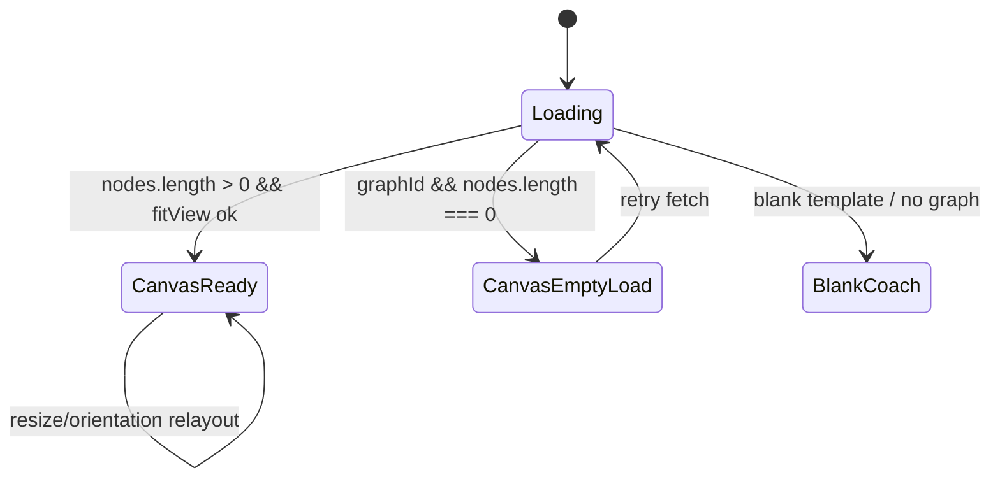
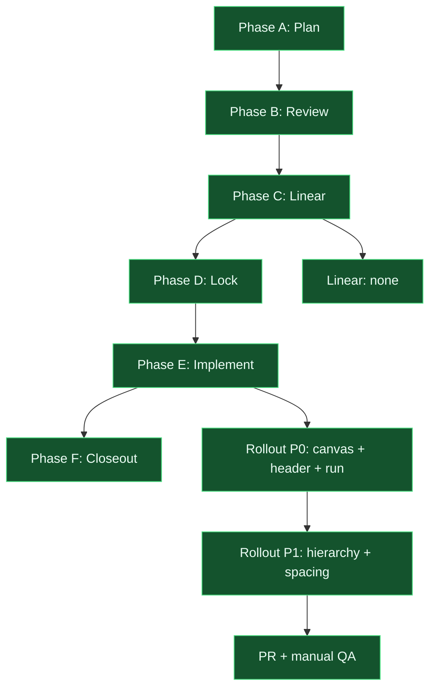

# Shell layout polish - change plan

> **Status:** Locked (2026-09-09; S6 defaults accepted)  
> **Artifact:** `docs/planning/features/shell-layout-polish-plan.md`  
> **Branch:** `feat/shell-layout-polish` (suggested)  
> **Linear:** none (POC planning slice)

Grounded in the current codebase: the next-set trilogy ([app-shell-resilience](app-shell-resilience-plan.md), [canvas-orientation](canvas-orientation-plan.md), [from-scratch-authoring](from-scratch-authoring-plan.md)) is implemented — error boundaries, drawer shell, dagre orientation, and authoring flows exist. A UI/UX screenshot review (2026-09-09) found **seven regressions/polish gaps** on desktop: demo graphs can appear as an empty black canvas (likely `fitView` running before the pane has non-zero size), the header **Orientation** control visually collides with the run rail **Model provider** band, the Run question field is vertically cramped (`height: 60`), panel section titles share one eyebrow style, palette taxonomy help icons misalign, the event log has no empty state, and spacing tokens are applied inconsistently. Backend and compiler behavior are out of scope.

---

## Locked decisions (S5 + approval)

| Topic | Decision |
| ----- | -------- |
| Orientation placement | **Second header row** under Save/Validation; orientation row uses `flexWrap: "nowrap"`. |
| Palette help | **`?` positioned top-right inside palette button** (`position: relative` on button). |
| Load failure UX | **Inline canvas banner** with Retry; distinct from blank-graph coach. |
| Implementation scope | **P0 first PR**, then **P1** hierarchy/spacing (same branch acceptable if small). |
| Linear tracking | **Repo-only** (`linear_issue: none`). |
| Copy | Event log: “No events yet. Run the graph to stream node lifecycle events here.” Load failure: “Graph failed to load.” + Retry. |
| Section titles | `SectionHeader`: `typeScale.small`, `fontWeight: 600`, `marginBottom: spacing[2]`. |

---

## 1. User story

### Primary story

**As a graph author on a laptop, I want the demo graph and run controls to be immediately readable on first load, so that I can orient, configure a provider, and execute a workflow without fighting layout bugs or blank canvas confusion.**

### Acceptance criteria (MVP)

| # | Criterion |
| - | --------- |
| AC1 | With the canonical demo graph selected on desktop (~1280px+), nodes are visible in the canvas within one second of load without manual zoom/pan ( `fitView` succeeds after pane has non-zero dimensions). |
| AC2 | At desktop width, **Orientation** (center header) and **Model provider** (run rail) do not overlap or obscure each other; both remain operable at 100% zoom. |
| AC3 | Run question `TextArea` shows at least **four visible text lines** by default and supports vertical resize without clipping descenders. |
| AC4 | **Event log** shows a muted placeholder when `events.length === 0` (before first run). |
| AC5 | Panel titles (**Graph Library**, **Node Palette**, **Run**, **Diagnostics**, **Event log**, inspector headings) are visually distinct from field labels (size/weight step above `localType.label`). |
| AC6 | Node palette taxonomy `?` controls sit **top-right inside** each palette button without misaligning multi-line button content. |
| AC7 | `TaxonomyTooltip` supports an **inline** layout mode used in header orientation and run provider rows without forcing `width: 100%` flex rows. |
| AC8 | If `graphId` is set but `nodes.length === 0` after load completes, canvas shows an inline **load failed / retry** message (distinct from blank-graph coaching). |
| AC9 | Interactive targets remain **≥44×44px**; motion honors `prefers-reduced-motion` for any new transitions. |

### Non-goals (v1)

- Changing run rail width (340px) or library width (220px)
- Full design-system / theming pass beyond shared section header + spacing tokens
- Frontend unit/e2e test harness bootstrap (manual QA + existing backend pytest only)
- Backend API, compiler, or provider adapter changes
- Tooltip detailed cards on every canvas node

### Alignment

- Closes polish gaps left after next-set implementation; does not reopen locked trilogy decisions
- Extends [app-shell-resilience-plan.md](app-shell-resilience-plan.md) AC6 focus order and taxonomy tooltip patterns
- Extends [canvas-orientation-plan.md](canvas-orientation-plan.md) AC4 (`fitView` after layout) with resize/load timing hardening

---

## 2. UI/UX design

### Problem today

| Element | Current behavior | User expectation |
| ------- | ---------------- | ---------------- |
| Canvas | Black pane; demo selected but nodes off-screen or invisible until resize | Graph visible on load |
| Header actions | Save, Unsaved, Orientation, Validation wrap in one row beside 340px run rail | Orientation readable; no cross-column collision |
| Run question field | Fixed `height: 60` (~2 lines) | Comfortable multiline input |
| Event log | Heading + empty scroll region | “No events yet…” guidance |
| Section titles | All use `localType.label` + 0.6 opacity | Clear hierarchy: page → panel → field |
| Palette help | 44×44 `?` top-aligned beside multi-line button | Icon aligned to label row or button corner |
| Spacing | Mixed `spacing[2]`/`spacing[3]`, hardcoded `borderRadius: 8` | Consistent shell panel rhythm |

### State model

```text
CANVAS_READY       -> graphId + nodes.length > 0 + fitView applied
CANVAS_EMPTY_LOAD  -> graphId set, nodes.length === 0 after fetch (error/retry UI)
CANVAS_BLANK_COACH -> no graph / blank template (existing EmptyGraphCoach — unchanged)
RUN_IDLE           -> no active SSE; event log shows placeholder
RUN_STREAMING      -> events append; log scrolls; aria-live polite
HEADER_COMPACT_WRAP-> flexWrap causes Orientation row to sit in run-rail visual band (bug)
TOOLTIP_INLINE     -> label + ? on one row; no full-width flex bleed
TOOLTIP_BLOCK      -> palette rows; help on button corner or title row
```

Rules: `CANVAS_EMPTY_LOAD` and `CANVAS_BLANK_COACH` are mutually exclusive. Inline tooltips must not expand to consume full header width.

### Wireframe (desktop header — locked)

```text
+-- Center header --------------------------------------+  +-- Run rail --+
| [Graph name input]                                    |  | Run          |
| graph-id caption                                      |  | [question    |
| [Save] [Unsaved] [Validation: Ready]                  |  |  textarea    |
| Orientation  (?) [Auto][H][V]   <- second row         |  |  4+ lines]   |
+-------------------------------------------------------+  | Model prov.. |
|                                                       |  | [select]     |
|              React Flow canvas                        |  | ...          |
+-------------------------------------------------------+  +--------------+
```

### Entry points

- Primary: app load with demo graph selected (`App.tsx` graph fetch)
- Secondary: viewport resize / drawer open-close (compact shell)
- Run panel: first visit before any run (empty event log)

### Conflicts and edge cases

- `fitView` during orientation debounce (150ms) — coalesce with layout effect; skip duplicate calls same frame
- Inspector open (300px) shrinks center column — refit canvas without losing selection
- Compact drawer: Orientation stays in header or moves with canvas toolbar — must not overlap drawer Run duplicate
- Load failure vs empty template — different copy and actions

### Accessibility

- Labels: event log placeholder uses `role="status"`; load-failure banner is focusable retry
- Keyboard: tab order header row 1 → orientation row → canvas → run fields (per shell AC6)
- Live regions: event log container `aria-live="polite"` when events append (not on every render)
- Touch: keep 44px targets; inline help may use visual 32px glyph with padding hit slop (S6)

### Mobile / compact

- Collision issue primarily desktop; compact already stacks run into drawer
- Verify Orientation second row does not push canvas below fold on ~1100px breakpoint
- Textarea min height applies in drawer layout mode (`RunPanel layout="drawer"`)

---

## 3. Engineering spec

### State model

| Current | Proposed |
| ------- | -------- |
| `fitView` deps: `[effectiveRankDir, graphId, reducedMotion, reactFlow, setNodes]` | Add pane size signal + `nodes.length` fingerprint; guard `fitView` when width/height === 0 |
| `TaxonomyTooltip` always `width: "100%"` | Prop `layout?: "block" \| "inline"` (default `"block"`) |
| `RunPanel` textarea `height: 60` | `minHeight: 96`, `rows={4}`, `resize: "vertical"` |
| Event log maps only | Empty branch with placeholder copy |
| Ad hoc `headingStyle` per panel | Shared `SectionHeader` component |
| No load-failure surface | `FlowCanvas` overlay or `App.tsx` guard when fetch returns empty nodes |



### Components / modules

| Artifact | Change |
| -------- | ------ |
| `frontend/src/components/FlowCanvas.tsx` | ResizeObserver or consume pane dimensions; defer `fitView` until non-zero; optional load-failure overlay prop |
| `frontend/src/hooks/useCanvasOrientation.ts` | Export pane dimensions or callback when size transitions 0 → N (optional refactor) |
| `frontend/src/components/Tooltip.tsx` | `layout` prop; inline mode drops full-width flex |
| `frontend/src/components/OrientationControl.tsx` | Use `layout="inline"`; tokenize `borderRadius` |
| `frontend/src/components/RunPanel.tsx` | Textarea sizing; event log empty state + `aria-live`; inline provider tooltip |
| `frontend/src/App.tsx` | Header row split (actions vs orientation); load-failure wiring |
| `frontend/src/components/ui/SectionHeader.tsx` | **New** — panel title typography |
| `frontend/src/components/NodePalette.tsx` | Help top-right inside button; adopt `SectionHeader` (P1) |
| `frontend/src/components/GraphLibrary.tsx` | Adopt `SectionHeader`; normalize margins |
| `frontend/src/components/NodeInspector.tsx` | Adopt `SectionHeader` |
| `frontend/src/theme.ts` | Optional `shell.panelPadding`, `shell.sectionGap` tokens |

### Data / API / flags

- Schema: none
- API: none
- Feature flag: none (POC always-on polish)

### Interaction rules

| Event | Behavior |
| ----- | -------- |
| Graph fetch completes with nodes | Trigger dagre layout + `fitView` (even if orientation unchanged) |
| Pane resize 0 → non-zero | `fitView` with same padding (0.18) |
| Pane resize with existing nodes | Debounced refit (respect `reducedMotion`) |
| User clicks retry on load failure | Re-invoke graph load for current `graphId` |
| First SSE event | Replace event log placeholder with stream |
| Orientation row wraps at narrow center width | Keep orientation on **second header row**; do not shrink touch targets below 44px |

### Tests

| Layer | Cases |
| ----- | ----- |
| Unit | Optional: `computeFitViewEligible(width,height)` helper; `TaxonomyTooltip` layout classNames |
| Component | Manual QA matrix (desktop 1280, 1100 compact, demo load, run idle) |
| Integration | `uv run pytest` — no regressions (unchanged backend) |
| E2e | N/A v1 |

### Observability

- Events: none required for POC
- Console: log single warning when load returns empty graph with valid id (dev only)

---

## 4. Feedback on design / engineering

### Strengths

- Fixes are mostly localized frontend/CSS; no backend migration risk
- `TaxonomyTooltip` inline variant resolves two issues (header collision + palette alignment) with one API
- Second header row reuses existing components without new routes
- Aligns with already-locked shell/orientation specs instead of inventing new UX patterns

### Risks / open tensions

| Risk | Mitigation |
| ---- | ---------- |
| `fitView` thrash on rapid resize | Debounce refit (reuse 150ms orientation debounce or separate 100ms coalescer); skip if requestId stale |
| Second header row eats vertical canvas space | Keep orientation row single-line; compact breakpoint moves run to drawer (more canvas height) |
| Shared `SectionHeader` drift vs inline styles | One component, adopt in all rails in same PR phase |
| False-positive load failure if user deletes all nodes | Only show load failure when fetch completes with empty, not after user edits |

---

## 5. Clarifying questions

1. **Orientation placement:** Prefer **second header row** under Save/Validation (wireframe above), or a **slim toolbar above the canvas** inside the flow region?
2. **Palette help alignment:** Prefer **`?` inside button top-right** (absolute), or **help on a single-line title row above** each palette button?
3. **Canvas load failure:** Show **inline banner in canvas** with Retry, or **toast + keep EmptyGraphCoach** when demo fetch fails?
4. **Scope for this slice:** Implement **P0 only** (AC1–AC4, AC7–AC8) in first PR, or **P0 + P1** (include section hierarchy + spacing tokens AC5–AC6) in one pass?
5. **Linear tracking:** Publish this SPEC to Linear (Phase C), or stay **repo-only** like the other next-set plans?

**Resolution (2026-09-09):** User accepted **S6 defaults** for all questions. See **Locked decisions** above.

---

## 6. Default stance (if unanswered)

| Question | Default |
| -------- | ------- |
| Q1 Orientation placement | **Second header row** under primary actions; `flexWrap: "nowrap"` on orientation row |
| Q2 Palette help | **`?` positioned top-right inside palette button** (`position: relative` on button) |
| Q3 Load failure UX | **Inline canvas banner** with Retry; do not conflate with blank-graph coach |
| Q4 Scope | **P0 first PR**, then P1 hierarchy/spacing follow-up PR (same branch ok if small) |
| Q5 Linear | **Repo-only** (`linear_issue: none`) unless user requests Phase C |

**Applied:** All defaults locked 2026-09-09.

**Copy / behavior patches from defaults:**

- Event log placeholder: “No events yet. Run the graph to stream node lifecycle events here.”
- Load failure: “Graph failed to load.” + **Retry** button
- `SectionHeader`: `typeScale.small`, `fontWeight: 600`, `marginBottom: spacing[2]`

---

## 7. Implementation and rollout

### Phase A — Design freeze

- [x] S5 answered or S6 accepted (2026-09-09)
- [x] Reviewer pass skipped (repo-only POC)
- [x] No backend changes

### Phase B — P0 core (layout bugs)

- [x] `FlowCanvas` fitView on load + pane resize + nodes fingerprint
- [x] `TaxonomyTooltip` `layout` prop + inline usages
- [x] Header row split in `App.tsx`
- [x] Run textarea + event log placeholder
- [x] Canvas load-failure banner

### Phase C — P1 polish

- [x] `SectionHeader` + adopt across rails
- [x] Palette help placement
- [x] `theme.ts` shell spacing tokens; replace hardcoded `borderRadius: 8` in touched files

### Phase D — P2 accessibility

- [x] Event log `aria-live`
- [x] Focus order smoke on desktop + compact (header row split preserves tab order)
- [x] Reduced motion on tooltip/card if animated (existing `reducedMotion` on canvas transitions)

### Phase E — Rollout

| Stage | Audience | Success metric |
| ----- | -------- | -------------- |
| Dev | Local Docker / `dev up graph` | Demo graph visible on first load; manual QA checklist pass |
| CI | GitHub Actions | `uv run pytest` green; `npm run build` in frontend |
| Prod | N/A (POC) | — |

### Phase F — Follow-ups

- Optional Vitest + RTL tests for `FlowCanvas` fit gating
- Consider slightly wider center column min-width token if 1280px still tight after polish

### Progress diagram



---

## 8. Tooling to leverage (this repo)

| Layer | Asset | Use for shell layout polish |
| ----- | ----- | --------------------------- |
| Docs | `docs/planning/README.md` | Planning index; add fourth spec row after lock |
| Docs | Locked trilogy SPECs | AC cross-reference; do not violate locked decisions |
| CI | `.github/workflows/ci.yml` | Backend pytest on PR |
| Dev CLI | `scripts/dev-registry.entry.json` | `dev check graph --tier fast` before PR |
| Frontend | `npm run build` in `frontend/` | Typecheck + Vite build gate |
| Workspace skill | `feature-change-implement` | Phase E implementation discipline |
| Workspace skill | `ui-design-workflow` | PH gates if wireframe disputes |
| Workspace agent | `change-plan-reviewer` | Phase B optional review |

---

## 9. New artifacts to consider (after sign-off)

| Type | Proposed ID | Purpose |
| ---- | ----------- | ------- |
| Component | `SectionHeader` | Shared panel title typography |
| Rule | — | None v1 |
| Skill | — | None v1 |
| Tracker issue | — | Only if user chooses Linear Phase C |

---

## 10. Key code paths

| Area | Path |
| ---- | ---- |
| Shell layout | `frontend/src/App.tsx` |
| Canvas + fitView | `frontend/src/components/FlowCanvas.tsx` |
| Pane orientation | `frontend/src/hooks/useCanvasOrientation.ts` |
| Dagre layout | `frontend/src/layout/dagreLayout.ts` |
| Tooltips | `frontend/src/components/Tooltip.tsx` |
| Orientation UI | `frontend/src/components/OrientationControl.tsx` |
| Run rail | `frontend/src/components/RunPanel.tsx` |
| Palette | `frontend/src/components/NodePalette.tsx` |
| Library rail | `frontend/src/components/GraphLibrary.tsx` |
| Inspector | `frontend/src/components/NodeInspector.tsx` |
| Theme tokens | `frontend/src/theme.ts` |
| Shell hook | `frontend/src/hooks/useShellLayout.ts` |
| Graph load | `frontend/src/App.tsx` (fetch handlers ~434+) |
| Backend tests | `backend/tests/` |

---

## 11. Next step

**Phase E (active):** Implement on branch `feat/shell-layout-polish` in order **P0 → P1 → P2** per locked decisions. Gates before PR: `dev check graph --tier fast`, `npm run build` in `frontend/`, manual QA (demo load visible, orientation vs provider no collision, event log placeholder). Close with `change-plan-closeout` when AC evidence is attached.

---

## Quality checklist (Phase A)

- [x] S1: Primary story + 9 AC + non-goals
- [x] S2: State model without term collision
- [x] S3: Engineering counterpart for each UI state
- [x] S4: 4 risks with mitigations
- [x] S5: 5 clarifying questions
- [x] S6: Defaults cover every S5 question
- [x] S7: Phases A–F + rollout table + progress diagram
- [x] S8: Verified repo assets only
- [x] S10: Paths verified in workspace
- [x] User accepted S6 defaults (2026-09-09)

---

## Revision log

| Date | Change |
| ---- | ------ |
| 2026-09-09 | Initial draft (Phase A; UI/UX review findings) |
| 2026-09-09 | Locked with S6 defaults accepted; progress diagram → Phase E active |
| 2026-09-09 | Phase E implemented (P0–P2); `npm run build` + `uv run pytest` green |
| 2026-09-09 | Phase F closeout; branch `feat/shell-layout-polish` ready for merge |
| 2026-09-09 | Hotfix: flex-shrink-0 rail asides — ErrorBoundary width 100% was collapsing canvas at wide viewports |
