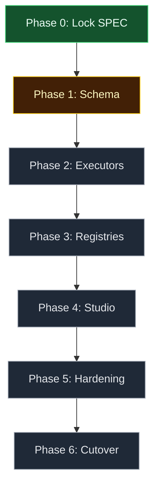

# Studio consolidation (micro-ui-agent-builder → agent-graph-builder) - change plan

> **Status:** Locked (2026-09-15; runtime/schema/scope/sequencing decisions approved)
> **Artifact:** `docs/planning/features/studio-consolidation-plan.md`
> **Linear:** none (cross-repo planning slice)

Grounded in a full comparison of this repo against the sibling `bstockwelldev/micro-ui-agent-builder`. This repo (**AGB**) has the only real execution engine of the two: [`backend/app/compiler.py`](../../../backend/app/compiler.py) validates a stored graph, [`backend/app/runtime.py`](../../../backend/app/runtime.py) compiles it into a LangGraph `StateGraph`, [`backend/app/nodes.py`](../../../backend/app/nodes.py) holds one executor per node type, and every node emits `node.started`/`node.completed`/`node.failed`/`edge.selected` over SSE with durable run snapshots in [`backend/app/storage.py`](../../../backend/app/storage.py). Its presentation layer is the weak half — [`apps/playground/src/App.tsx`](../../../apps/playground/src/App.tsx) is 1451 lines with ~28 `useState` hooks, 167 inline `style={{…}}` objects against 4 `className`s, one screen, and exactly one hard-coded tool (`lookup_topic`).

**micro-ui-agent-builder (MUI)** is the inverse: a Next.js 15 / React 19 studio with a Tailwind 4 + shadcn design system, 11 routed screens, Supabase auth, a Langfuse telemetry stack, prompt guardrails, and per-flow RAG — but no graph execution. `apps/web/lib/server/flow-prompt.ts` sorts `flow.steps` by `order` and flattens every step into one system-prompt string handed to a single `streamText` call; canvas edges are decorative. MUI's own PRD names its target as "Next.js + AI SDK v6 + **LangGraph orchestration** + Langfuse observability" — the LangGraph executor (`langgraph-executor.ts`) does not exist and `@langchain/langgraph` is a dependency imported nowhere in its source. AGB has had that runtime since day one.

This plan absorbs MUI's studio, resource model, and runtime hardening into AGB, replacing AGB's presentation layer, then sunsets MUI.

---

## Locked decisions

| Topic | Decision |
| ----- | -------- |
| Execution runtime | **Keep the Python/FastAPI/LangGraph engine.** Do not port MUI's prompt-flattening executor or attempt a JS rewrite of the graph engine. |
| Presentation layer | **Replace** `apps/playground` (Vite/React 18) with a ported **Next.js 15** studio (`apps/studio`), calling the FastAPI engine through `@bstockwelldev/agent-graph-sdk`. |
| Domain schema | **`GraphDefinition` (AGB) is the single source of truth.** Absorb MUI's 11-node vocabulary as new `NodeType` values with typed configs; do not adopt MUI's flat `FlowDocument`/`steps[]` model. |
| Capability scope | Full scope: design system + studio shell, resource CRUD screens (agents/prompts/tools/MCP/LLM profiles), telemetry + guardrails + RAG, Supabase auth + persistence. |
| Sequencing | **Phased on `master`, engine-first.** Schema and node executors land in the Python engine before any UI risk; the studio stands up alongside the playground and only replaces it once at parity; MUI is archived last. |
| Branch | All work lands on `claude/sharp-shannon-9sq1ss` in `bstockwelldev/agent-graph-builder`. Each phase is independently mergeable and leaves `master` shippable. |

---

## 1. User story

### Primary story

**As the maintainer of two overlapping agent-builder repos, I want one consolidated app that keeps the only working graph-execution engine and gains the more developed studio UX, so that I can stop maintaining two products and sunset the weaker one.**

### Acceptance criteria (program-level)

| # | Criterion |
| - | --------- |
| AC1 | `GraphDefinition`/`NodeType` in `backend/app/models.py` and `packages/agent-graph-sdk/src/types.ts` support all 11 node kinds (6 original + `guardrail`, `rubric`, `human_gate`, `tool_loop`, `code_exec`, `branch`), with typed per-type configs, kept in sync across both definition sites. |
| AC2 | Each new node type has a real executor in `backend/app/nodes.py`'s `EXECUTORS` dict — not a prompt-text stand-in. `branch` in particular becomes a real conditional node, which is a genuine upgrade over MUI's whole-run precondition. |
| AC3 | AGB gains stored, CRUD-able resources — prompts, tools, MCP servers, agents, LLM profiles — that MUI has and AGB does not. |
| AC4 | A Next.js studio (`apps/studio`) reaches feature parity with `apps/playground` (author, validate, compile, run, observe SSE events and node traces, run history) before the playground is deleted. |
| AC5 | Telemetry (Langfuse), guardrails/rubric preflight, per-flow RAG, and Supabase auth are available in the consolidated app, gated by env flags that fail closed (matching AGB's existing `DurableStorageMiddleware` posture). |
| AC6 | CI stays green throughout (98 pytest + 75 Vitest today), and gains lint/typecheck coverage for the ported studio code, which MUI never had in CI. |
| AC7 | `micro-ui-agent-builder` is archived with a README pointer to this repo, after any docs referenced by sibling repos (`tabletop-studio`, `board-game-sim-ai`) are copied into `agent-graph-builder/docs/`. |

### Non-goals (this program)

- Rewriting the graph engine in TypeScript.
- Multi-tenancy / org hierarchy beyond what Supabase auth provides out of the box.
- MCP JSON-Schema→Zod/Pydantic full parameter validation (MUI's `z.record(z.unknown())` passthrough may be improved but a full JSON-Schema compiler is out of scope).
- Sandboxed `code_exec` execution (validate and pass through only, this phase).
- Renaming the shared `agent_builder` Supabase schema (coupled to two sibling repos).

---

## 2. Comparison (informs UI/UX and engineering choices below)

### Common to both

| Concern | AGB | MUI |
|---|---|---|
| Canvas library | `@xyflow/react` 12.3 | `@xyflow/react` 12.10 |
| Node/edge canvas model | `GraphNode` / `GraphEdge` + positions | `FlowStep` / `FlowEdge` + positions |
| Monorepo | npm workspaces (`apps/*`, `packages/*`) | pnpm workspaces (`apps/*`, `packages/*`) |
| Shared contract package | `@bstockwelldev/agent-graph-sdk` (TS interfaces, no runtime validation) | `@repo/shared` (Zod schemas) |
| Multi-provider LLM | Stub, Groq, Google, Azure, Ollama, OpenAI-compat | Groq, Google, OpenAI, Gateway, Ollama, Mistral/Together/OpenRouter |
| Step-level validation | `compiler.py` → `Diagnostic[]` | `flow-validation.ts` → `FlowValidationIssue[]` |
| Live validate-as-you-edit | `POST /api/graphs/validate` (debounced) | `validateFlowSteps` in editor |
| Deploy target | Vercel (Python functions + static SPA) | Vercel (Next.js) |
| Health endpoint | `GET /api/health` (storage readiness) | `GET /api/runtime/health` (config readiness) |
| Fail-closed posture | `DurableStorageMiddleware` → 503 | `runtime-config.ts` → 503 |

### Distinct to AGB — keep all of this

- Graph → LangGraph `StateGraph` compilation (`runtime.py`)
- Static graph validation: entry node, dangling edges, unreachable nodes, cycles, router fallback, tool binding (`compiler.py`)
- Per-node-type executors, no hard-coded workflow (`nodes.py` `EXECUTORS`)
- Real conditional routing with eligible/excluded edge rationale (`compute_router`)
- SSE event stream + node-level traces (`events.py`, `GET /api/runs/{id}/events`)
- Durable run history surviving restart (`storage.py`)
- Pluggable durable storage: SQLite / Vercel Blob / S3-compatible / Turso
- Provider-neutral `ChatModel` protocol + 6 adapters
- Live model catalog with 60s cache
- Graph fingerprinting (dirty detection), dagre auto-layout + orientation, undo stack
- CI (pytest + Vitest + build), the locked feature-spec + incident-log convention this document follows

### Distinct to MUI — port these

| Capability | Where |
|---|---|
| Tailwind 4 + shadcn/Base UI primitives (21 components) | `apps/web/components/ui/` |
| "Synthesis Dark" token system | `apps/web/app/globals.css` |
| Routed multi-screen studio shell + grouped sidebar nav | `components/studio/studio-shell.tsx`, `studio-nav.tsx` |
| Agents, Prompts, Tools, MCP, LLM-profile CRUD screens | `app/(studio)/{agents,prompts,tools,mcp,evaluations}/page.tsx` |
| Flow editor: top HUD, canvas rail, quick-add, node/edge config panels | `components/flow/` |
| Configurable canvas interaction (pan vs marquee, wheel zoom vs pan) | `lib/flow-canvas-interaction.ts` |
| AI Elements chat components | `components/ai-elements/` |
| GenUI — LLM-generated UI trees from a Zod schema | `schemas.ts:genuiNodeSchema`, `components/genui-renderer.tsx` |
| Langfuse telemetry adapter, noop fallback, env-gated | `lib/server/telemetry/` |
| Prompt guardrails + static rubric preflight | `lib/server/flow-preflight.ts` |
| Per-flow knowledge base: chunking, embeddings, cosine top-K | `lib/server/flow-knowledge-rag.ts` |
| MCP: HTTP JSON-RPC bridge, namespaced tool identity, proxy route | `lib/server/mcp-bridge.ts`, `mcp-jsonrpc-http.ts` |
| Supabase auth + Postgres persistence + Storage backups | `lib/supabase/`, `app/(auth)/`, `lib/server/studio-store.ts` |
| Run analytics + spend estimation + dashboard | `lib/server/run-analytics-store.ts`, `analytics-dashboard.ts` |
| Tool approval (`requiresApproval` → AI SDK `needsApproval`) | `schemas.ts:toolDefinitionSchema` |
| Stitch design reference (tokens, screenshots, Figma hints) | `docs/stitch-reference/` |

**Do not port:** `packages/micro-ui/` (a 117-byte README for a package never written); `app/(studio)/history/page.tsx`, `runs/[runId]/page.tsx`, `deployments/page.tsx`, and the Guardrails tab of `evaluations` (hard-coded placeholder rows — AGB's real run history supersedes them); `api/agent/approve/route.ts` (documented stub); `lib/ai-config.ts` (a second, conflicting provider registry); the whole-document `PUT /api/studio` persistence pattern.

**Port with a fix, not as-is:** MUI's whole-store read-modify-write persistence (replace with per-entity routes, Phase 3); GenUI action dispatch (renders but `onClick` is `console.info` only — wiring is new work); MCP tool schemas (`z.record(z.unknown())` passthrough — improve during the Python port); the phantom Anthropic provider option in `studio-llm-providers.ts` (no server-side branch exists — drop it); unused MUI dependencies (`@langchain/langgraph`, `@rive-app/react-webgl2`, `media-chrome`, `embla-carousel-react`, `tokenlens`, `react-jsx-parser`, `ansi-to-react`, `mermaid` — do not carry these into the port).

### The decisive asymmetry

| | AGB | MUI |
|---|---|---|
| Execution model | Graph-driven: compile → traverse edges → per-node executor | Prompt-flattening: sort by `order` → concat → one `streamText` |
| Branching | Real; router picks an edge, emits rationale | None; `branch` is a substring precondition on the whole run |
| Observability | Per-node input/output traces, durable | Per-run JSONL + Langfuse spans; no node granularity |
| Node types | 6, all executable | 11, of which 3 enforced (as preflight) and 8 are prompt text |
| Tools | 1 hard-coded | Real registry: builtins + per-flow allowlist + MCP |
| Screens | 1 | 11 (9 real, 2 placeholder) |
| Auth / tenancy | None | Supabase |
| Tests | 173 cases, CI green | 38 cases, no CI |

MUI's node taxonomy is the better product vocabulary; AGB's engine is the only thing that can actually run it. This program makes MUI's vocabulary executable.

### Pre-existing AGB defects addressed alongside this program

| Issue | Where | Disposition |
|---|---|---|
| `app.frontend("/", …)` is not a stable FastAPI API, and `requirements.txt` is unpinned | `backend/app/main.py` | Fixed by Phase 6 (Next.js serves its own frontend); pin `requirements.txt` regardless. |
| `route_decisions` casing varies by storage backend (`by_alias` on SQLite/Turso, snake_case on Blob/object-store) | `storage.py` vs `object_store.py`/`vercel_blob.py` | Fix in Phase 1 while the schema is open. |
| No `DELETE /api/graphs/{id}`, no run cancel | `main.py` | Add in Phase 3. |
| `list_runs_for_graph` / `list_graphs` are N+1 against object storage | `object_store.py`, `vercel_blob.py` | Fix in Phase 5 once real history screens depend on it. |
| No linting anywhere in the repo | repo-wide | Phase 4 brings MUI's ESLint config; add `ruff` for `backend/`. |
| Three different Python floors declared (3.11/3.12/3.13) | `pyproject.toml`, `uv.lock`, Dockerfile | Reconcile in Phase 4. |
| `env_config.py` hard-codes a sibling-repo path (`tabletop-studio/.env.local`) | `backend/app/env_config.py` | Decouple in Phase 5 when Supabase config lands. |
| `@app.on_event("startup")` is the deprecated Starlette hook | `main.py` | Move to `lifespan` in Phase 1. |

---

## 3. Engineering spec — phased implementation

### Phase 0 — Lock the spec (this document)

Locked here. Add rows to `docs/planning/README.md` and `docs/planning/roadmap.md`.

### Phase 1 — Extend the schema (engine-only, no UI risk)

| File | Change |
|---|---|
| `backend/app/models.py` | Extend `NodeType` with `guardrail`, `rubric`, `human_gate`, `tool_loop`, `code_exec`, `branch`. |
| `packages/agent-graph-sdk/src/types.ts` | Mirror into the `NodeType` union. |
| `packages/agent-graph-sdk/src/schema.ts` | Extend `NODE_TYPES`. |

Typed node configs replace today's untyped `config: dict[str, Any]`, porting the field set from `packages/shared/src/schemas.ts:flowStepSchema` (`model`, `modelProvider`, `temperature`, `maxTokens`, `topP`, `toolChoice`, `maxToolIterations`, `codeExecLanguage`, `allowUrls`, `rubricFailOnFindings`, `genuiCheckpointSurfaceJson`, `displayLabel`) as a discriminated Pydantic union keyed on `type`.

Extend `backend/app/compiler.py` with per-type diagnostics ported from `flow-validation.ts` (model required on `llm`; `maxToolIterations` required and 1–64 on `tool_loop`; `refId` required on `tool`; content required on `code_exec`/`human_gate`/`output`; `genuiCheckpointSurfaceJson` must parse). Relax `UNSUPPORTED_TOOL_BINDING` from the hard-coded `lookup_topic` check to a registry lookup (Phase 3).

Fix the `route_decisions` casing split and move `@app.on_event("startup")` to `lifespan` while these files are open.

**Tests:** extend `test_validate.py` and `test_routes.py`; add SDK schema tests. Existing 173 must stay green.

### Phase 2 — New node executors

Add one `compute_*` per new type to `backend/app/nodes.py`'s `EXECUTORS` dict:

| Node | Behavior |
|---|---|
| `guardrail` | Port `flow-preflight.ts:policyFromStep`; fail the node on a guardrail violation. |
| `rubric` | Static findings on the compiled prompt; block when `rubricFailOnFindings`. |
| `branch` | Substring gate as a **real node** with conditional out-edges (upgrade over MUI's whole-run precondition). |
| `tool_loop` | Multi-step tool loop bounded by `maxToolIterations`; extend `ChatModel` protocol with an optional tool-calling method. |
| `code_exec` | Declares language + contract; validate and pass through (no sandbox this phase). |
| `human_gate` | Pause the run, persist state, emit `run.paused`; resume via `POST /api/runs/{id}/resume`. Extends `RunSummary.status` with `paused`. |

`human_gate` may be deferred to its own sub-phase without blocking the rest — it is the first thing that makes a run non-atomic.

Add a one-shot `FlowDocument → GraphDefinition` migration script under `scripts/` with a fixture test: map `steps[]` (ordered by `order`) into nodes, synthesize sequence edges where `flow.edges` is absent, set `entry_node_id` to the first step.

**Implementation notes (as built):**

- `tool_loop` does **not** extend the `ChatModel` protocol. Instead it uses a provider-agnostic, text-based tool-call marker (`nodes.py:_tool_loop_system_prompt`/`_parse_tool_call`) that every existing adapter already satisfies via plain `generate()` — avoiding a native function-calling implementation across all 6 providers for a node type that (until Phase 3's tool registry lands) can only call the one existing `lookup_topic` tool anyway. The Stub adapter follows the convention deterministically (`providers/stub.py`) so the loop is fully testable offline; real providers may or may not follow it faithfully.
- `human_gate` pause state is **process-local only** (`runtime.py:RUN_PAUSES`), the same accepted simplification `COMPILED_WORKFLOWS` already makes in this file. A paused run's `RunSummary` still persists durably (`status="paused"`), but resuming it after a process restart is not possible until this gets a real `storage.py` backend — a deferred follow-up, not done in this phase, consistent with the plan's own allowance to scope `human_gate` down.
- `branch` and `router` share LangGraph conditional-edge wiring and a `route_decisions`-replay path function in `runtime.py` (renamed `_make_route_decision_path_fn`); `compiler.py`'s router-only fallback/outgoing-edge diagnostics were generalized to both types under a shared `ROUTER_*`/`BRANCH_*` code prefix.
- Resume replays every node whose output was already computed before the pause (from the persisted snapshot) instead of re-invoking real executors — see `ExecContext.state_snapshot` and `_merge_into_snapshot` in `runtime.py`/`nodes.py`. This is what keeps resume from re-running LLM/tool calls upstream of the gate. A `POST /api/runs/{id}/resume` body of `{"approve": false}` fails the run instead of resuming it (`reject_run`).

### Phase 3 — Real tool + resource registries

Add stored resources to `storage.py` beside graphs and runs: `prompts`, `tools` (incl. `requiresApproval`), `mcp_servers`, `agents`, `llm_profiles` — modeled on `packages/shared/src/schemas.ts`. Add CRUD routes (`/api/prompts`, `/api/tools`, `/api/mcp-servers`, `/api/agents`, `/api/llm-profiles`) and matching SDK client methods.

Port builtin tools (`web_search`, `calculator` — keep `safe-calculator.ts`'s no-`eval` restriction), the flow-scoped tool allowlist, and the MCP JSON-RPC HTTP client (`mcp-jsonrpc-http.ts` → `backend/app/mcp/`) with `serverId.toolName` identity and degrade-don't-throw error handling. Improve on MUI by converting remote JSON Schema into real parameter validation rather than a passthrough. Add `DELETE /api/graphs/{id}` and run cancel here. This retires `LOOKUP_TABLE` in `nodes.py`.

**Implementation notes (as built):**

- `storage.py` gains **one generic resource table/key convention** (`resource(kind, id, payload_json)` for SQLite/Turso; `resources/{kind}/{id}.json` for object-store/Blob) shared by all five kinds, rather than five bespoke schemas — these are opaque, non-relational JSON documents with no query needs beyond list-by-kind, the same shape `graphs` already has. `object_store.py`/`vercel_blob.py` each gain a `delete_json`, and `storage.py` a `delete_graph` — graphs, and now resources, are deletable for the first time.
- CRUD routes for all five kinds are registered by **one generic loop** in `main.py` (`_register_resource_routes`), not five hand-written copies — request/response bodies are typed `dict` in the FastAPI signatures (validated against the resource's actual Pydantic model inside the function body) specifically to work under this file's `from __future__ import annotations`, since a closure-local `model` variable used as a live type annotation is not resolvable through `typing.get_type_hints()`'s `__globals__`-only lookup.
- `tool_loop`'s builtin tool-call convention (Phase 2) and `compute_tool`'s new resolution order now share the same `lookup_topic` fallback — **`LOOKUP_TABLE` was not retired** as the plan originally called for: removing it would break the existing demo graph and its tests, and nothing in this phase requires deleting it. It is simply no longer the *only* option — builtins, a stored `ToolDefinition`, and MCP dispatch are tried first for anything else.
- The **flow-scoped tool allowlist** (`flow-tool-allowlist.ts`) was **not ported**. MUI's allowlist scopes a *flow's* available tools; AGB's `tool` node binds a tool id directly per-node, so there is no per-graph allowlist concept to port until Phase 4 introduces a flow-like grouping in the studio. Revisit then.
- **Remote MCP JSON Schema is still a passthrough**, not converted to real parameter validation — the plan's suggested improvement over MUI's `z.record(z.unknown())` is deferred; `call_mcp_tool` forwards whatever arguments the `tool` node's config produces.
- **Run cancel was not implemented** — no cancellation token is threaded through the `asyncio.create_task`-based execution path. `DELETE /api/graphs/{id}` was added as explicitly named.
- Tool-binding validation (`compiler.py`'s `UNSUPPORTED_TOOL_BINDING`) now calls `storage.get_resource(...)`, a new I/O dependency for what was previously a pure function — exercised by the debounced `POST /api/graphs/validate` live-validation path too. Acceptable at this scale; noted as a trade-off, not a defect.

### Phase 4 — Stand up the Next.js studio alongside the playground

Create `apps/studio` (Next.js 15). Do not delete `apps/playground` yet.

Migrate the repo to **pnpm** (add `pnpm-workspace.yaml`, drop `package-lock.json`, update CI and `vercel.json`) — cheaper than converting MUI's app and lockfile to npm.

Port in order: (1) `globals.css` + `components/ui/*` — design system; (2) `studio-shell.tsx` + `studio-nav.tsx` — shell, reworked nav groups (**Build**: Graphs/Agents/Prompts/Tools/MCP/GenUI; **Operate**: Runs/Analytics — dropping MUI's placeholder Deployments/History since AGB's real run history becomes Runs); (3) `components/flow/*` — flow editor rebound from `FlowStep` to `GraphNode`, keeping AGB's `dagreLayout.ts`/`useUndoStack.ts`/`canvasFit.ts`/orientation control; (4) `components/ai-elements/*` + GenUI renderer; (5) data access via `@bstockwelldev/agent-graph-sdk` replacing `/api/studio`.

Keep AGB's `theme.ts` semantic roles re-pointed at MUI's CSS custom properties, and keep `apps/playground/src/content/taxonomy.ts` wholesale (no MUI equivalent for its plain-language edge-kind copy). Add MUI's ESLint config; add `ruff` for `backend/`. Add Zod parsing at the SDK client boundary (`client.ts` currently does an unchecked cast) and real client tests — the SDK has exactly one test today.

Phase 4 lands in six independently-committable sub-phases (4a–4f), each gated on both `apps/playground` and `apps/studio` staying green: 4a tooling/pnpm migration + scaffold, 4b design system, 4c shell/IA/resource CRUD, 4d graph editor, 4e run surface + GenUI, 4f SDK hardening + parity checkpoint. The full sub-phase plan is in the locked plan-mode record; as-built notes below are added per sub-phase as each lands.

**Implementation notes (as built) — 4a, tooling:**

- Migrated the repo from npm workspaces to pnpm workspaces: added root `pnpm-workspace.yaml`, deleted `package-lock.json`, changed `apps/playground`'s `@bstockwelldev/agent-graph-sdk` dependency from a bare `"*"` range (which only resolved under npm's implicit workspace linking) to pnpm's explicit `workspace:*` protocol. Root `package.json` gained `engines`/`packageManager` fields and pnpm-`--filter`-based scripts (`build:studio`, `dev:studio`, `test:studio` added alongside, not replacing, the playground scripts).
- `.github/workflows/ci.yml` gained a `studio` job (lint, typecheck, test, build) and both JS jobs now use `pnpm/action-setup` + `pnpm install --frozen-lockfile`. `vercel.json`'s `installCommand` swapped `npm ci` for `pnpm install --frozen-lockfile`; `buildCommand` still only builds the SDK + playground — `apps/studio` isn't the Vercel deploy target until Phase 6.
- `apps/playground/Dockerfile` was rewritten for pnpm (`corepack enable`, `pnpm install --frozen-lockfile --filter @bstockwelldev/agent-graph-playground...`, `pnpm run dev`) rather than left as the pre-existing defect noted in Part 1 — it now also copies `apps/studio/package.json` (manifest only, not source) because pnpm's frozen-lockfile install validates every workspace member declared in `pnpm-lock.yaml` is present on disk, even under a scoped `--filter`.
- Scaffolded `apps/studio` as a genuinely minimal Next.js 15.5.14 / React 19.1.2 shell (one placeholder route, one RTL test) — no Tailwind/shadcn yet, deliberately, since the design system is 4b's scope, not 4a's. Config files (`next.config.ts`, `tsconfig.json`, `eslint.config.mjs`, `vitest.config.ts`) mirror MUI's `apps/web` almost verbatim, with the same jsdom+RTL Vitest setup AGB's playground already uses (MUI's own Vitest config is node-only and ships zero component tests — not carried forward).
- Added `[tool.ruff]` to `backend/pyproject.toml` (line-length 100, `E`/`F`/`I`/`UP`/`B` rules) and a `ruff` dev dependency. Ran `ruff format` + `ruff check --fix` once across `app/`, `scripts/`, `tests/`, and `smoke_test.py`, then hand-wrapped the ~16 remaining long string literals ruff's formatter can't reflow on its own (error messages, the demo graph's prompt text, `nodes.py`'s `LOOKUP_TABLE` topic strings). `ruff check .` is clean repo-wide; all 169 pytest cases and the stub-provider smoke test still pass unchanged after the formatting pass — this was a pure style pass, no behavior changed.
- `scripts/dev.sh`/`dev.ps1` and `docker-compose.yml` needed no changes — they invoke `docker compose`, not `npm`/`pnpm` directly.

### Phase 5 — Runtime hardening

- **Telemetry:** port `lib/server/telemetry/` into `backend/app/telemetry/`, implementing the event contract from MUI's PRD §3 against AGB's existing `RunEventBus`.
- **RAG:** port `flow-knowledge-rag.ts` + `flow-knowledge-store.ts` as a `knowledge` node type or graph-level flag, keeping the tuned constants (chunk 900/overlap 100, top-K 5, threshold 0.15), replacing MUI's raw-JSON vector store with `object_store.py`.
- **Auth + Supabase:** add Supabase as a `storage.py` backend; port `lib/supabase/` + `app/(auth)/` into `apps/studio`; gate with middleware.
- **Runtime config:** fold `runtime-config.ts` validation into `env_config.py`; extend `/api/health` with MUI's config-readiness fields.
- **Analytics:** port `run-analytics-store.ts` + `estimate-llm-spend.ts` + `analytics-dashboard.ts`, reading from `storage.list_runs_for_graph` instead of MUI's JSONL.

### Phase 6 — Cut over and sunset

1. Point `vercel.json` at `apps/studio`.
2. Delete `apps/playground`; migrate any still-unique tests to `apps/studio`.
3. Update `README.md`, `AGENTS.md`, `docs/planning/roadmap.md`, `scripts/dev*`, `docker-compose.yml`.
4. Port `docs/stitch-reference/` and MUI's issue/PR templates.
5. Extend CI with the studio's lint/typecheck jobs.
6. Archive `micro-ui-agent-builder` with a README pointer here, after moving any docs referenced by `tabletop-studio`/`board-game-sim-ai` into this repo's `docs/`. Keep the shared `agent_builder` Supabase schema name — renaming it breaks two sibling repos.

---

## 4. Feedback

| Strength | Notes |
| -------- | ----- |
| Engine-first sequencing | Schema and executors are fully testable in Python before any UI is touched — lowest-risk order. |
| SDK as the single studio contract | Forces the TS/Python schema drift (already present today) to be resolved rather than compounded. |
| Both apps build during Phase 4–5 | The playground stays the deployed surface until parity is proven, so there is no window where the product regresses. |

| Risk | Mitigation |
| ---- | ---------- |
| `flow-node-config-panel.tsx` (792 lines) is tightly bound to `FlowStep` | Phase 1's typed node configs land first, so the rebind in Phase 4 is mechanical. |
| npm → pnpm migration breaks the Vercel Python build | Validate on a preview deploy before Phase 6's cutover. |
| `human_gate` makes runs non-atomic | Split into its own sub-phase; Phase 2 can ship without it if needed. |
| Guardrails/rubric are npm packages, engine is Python | Reimplement in Python, or keep those two node types executing in the studio's route layer as a preflight seam — decide at Phase 2 start. |
| MUI docs referenced by two sibling repos | Move into `agent-graph-builder/docs/` before archiving (Phase 6 step 6). |

---

## 5. Clarifying questions (resolved)

1. Keep the Python engine or rewrite in TS? → **Keep Python**; MUI's own unused `@langchain/langgraph` dependency confirms the JS path was never begun.
2. Which schema wins? → **AGB's `GraphDefinition`**; MUI's flat step list has no execution semantics to preserve.
3. Full capability scope or a subset? → **Full scope** — design system, resource screens, telemetry/guardrails/RAG, and Supabase auth all port.
4. Big-bang or phased? → **Phased on `master`, engine-first**, each phase independently mergeable.

---

## 6. Default stance (approved)

| Question | Default |
| -------- | ------- |
| Package manager after consolidation | **pnpm** (MUI's app and lockfile assume it; cheaper to convert AGB's 3 workspace scripts than the other way) |
| `human_gate` timing | Its own sub-phase inside Phase 2; not a blocker for the rest |
| MCP schema fidelity | Improve past MUI's `z.record(z.unknown())`, but a full JSON-Schema compiler is out of scope this program |
| Sibling-repo docs | Copied into `agent-graph-builder/docs/` before MUI is archived, never left orphaned |

---

## 7. Implementation and rollout

### Phase 0 — Lock

- [x] This SPEC locked in repo

### Phase 1 — Schema

- [x] `NodeType` extended in `models.py` + SDK `types.ts`/`schema.ts`
- [x] Typed per-node Pydantic configs (`backend/app/node_configs.py`)
- [x] `compiler.py` per-type diagnostics
- [x] `route_decisions` casing fix; `lifespan` migration

### Phase 2 — Executors

- [x] `guardrail`, `rubric`, `branch`, `tool_loop`, `code_exec` executors
- [x] `human_gate` pause/resume — `POST /api/runs/{id}/resume`, in-memory `RUN_PAUSES` (durable storage.py backend deferred; see Phase 2 notes below)
- [x] `FlowDocument → GraphDefinition` migration script (`backend/scripts/migrate_flow_to_graph.py`) + fixture tests

### Phase 3 — Registries

- [x] Stored prompts/tools/mcp_servers/agents/llm_profiles + generic CRUD routes
- [x] Builtin tools (`web_search`, `calculator`) + MCP JSON-RPC client (`backend/app/mcp/client.py`)
- [x] `DELETE /api/graphs/{id}` — run cancel not implemented (see Phase 3 notes above)
- [ ] Flow-scoped tool allowlist — no AGB equivalent yet; revisit in Phase 4
- [ ] Remote MCP JSON Schema → real parameter validation — still a passthrough

### Phase 4 — Studio

- [x] 4a — `apps/studio` scaffolded; pnpm migration (CI, Vercel, Dockerfile updated; `ruff` added to backend)
- [ ] 4b — Design system port
- [ ] 4c — Shell, IA, resource CRUD screens (incl. new LLM Profiles nav item)
- [ ] 4d — Graph editor
- [ ] 4e — Run surface + GenUI
- [ ] 4f — SDK client Zod-validated + tested; playground parity checkpoint

### Phase 5 — Hardening

- [ ] Telemetry, RAG, Supabase auth, runtime config, analytics ported

### Phase 6 — Cutover

- [ ] Vercel repointed; playground deleted; docs updated; CI extended
- [ ] MUI archived

### Progress diagram

---

## 8. Existing tooling

- `feature-change-plan` skill / template (this repo's `docs/planning/` convention)
- `uv run pytest` for backend; `npm test` (→ pnpm after Phase 4) for frontend
- `@bstockwelldev/agent-graph-sdk` as the cross-app contract
- MUI's `docs/agents.md`, PRD, and LangGraph/Langfuse next-changes doc as source material for Phase 5

---

## 9. New artifacts

| Artifact | When |
| -------- | ---- |
| `backend/app/mcp/` (JSON-RPC client) | Phase 3 |
| `apps/studio` (Next.js app) | Phase 4 |
| `pnpm-workspace.yaml` | Phase 4 |
| `backend/app/telemetry/` | Phase 5 |
| `scripts/migrate_flow_to_graph.py` (or similar) | Phase 2 |

---

## 10. Key code paths

| Area | Path |
| ---- | ---- |
| Graph model | `backend/app/models.py` |
| Compiler / diagnostics | `backend/app/compiler.py` |
| Node executors | `backend/app/nodes.py` |
| Runtime / LangGraph compilation | `backend/app/runtime.py` |
| Storage | `backend/app/storage.py` |
| SDK types/client | `packages/agent-graph-sdk/src/` |
| Playground (to be replaced) | `apps/playground/src/` |
| MUI source (port reference, other repo) | `micro-ui-agent-builder/apps/web/`, `packages/shared/` |

---

## 11. Next step

Proceed to Phase 1 — extend `NodeType` and add typed per-node configs in `backend/app/models.py`, mirrored into the SDK, with compiler diagnostics for each new type.

---

## Revision log

| Date | Change |
| ---- | ------ |
| 2026-09-15 | Initial lock; full comparison + 6-phase consolidation plan |
