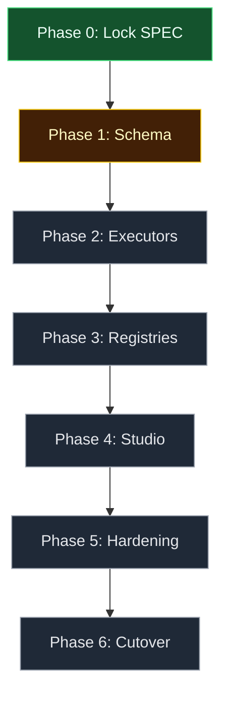

# Studio consolidation (micro-ui-agent-builder → agent-graph-builder) - change plan

> **Status:** Locked (2026-09-15; runtime/schema/scope/sequencing decisions approved)
> **Artifact:** `docs/planning/features/studio-consolidation-plan.md`
> **Linear:** none (cross-repo planning slice)

Grounded in a full comparison of this repo against the sibling `bstockwelldev/micro-ui-agent-builder`. This repo (**AGB**) has the only real execution engine of the two: [`backend/app/compiler.py`](../../../backend/app/compiler.py) validates a stored graph, [`backend/app/runtime.py`](../../../backend/app/runtime.py) compiles it into a LangGraph `StateGraph`, [`backend/app/nodes.py`](../../../backend/app/nodes.py) holds one executor per node type, and every node emits `node.started`/`node.completed`/`node.failed`/`edge.selected` over SSE with durable run snapshots in [`backend/app/storage.py`](../../../backend/app/storage.py). Its presentation layer is the weak half — [`apps/playground/src/App.tsx`](../../../apps/playground/src/App.tsx) is 1451 lines with ~28 `useState` hooks, 167 inline `style={{…}}` objects against 4 `className`s, one screen, and exactly one hard-coded tool (`lookup_topic`).

**micro-ui-agent-builder (MUI)** is the inverse: a Next.js 15 / React 19 studio with a Tailwind 4 + shadcn design system, 11 routed screens, Supabase auth, a Langfuse telemetry stack, prompt guardrails, and per-flow RAG — but no graph execution. `apps/web/lib/server/flow-prompt.ts` sorts `flow.steps` by `order` and flattens every step into one system-prompt string handed to a single `streamText` call; canvas edges are decorative. MUI's own PRD names its target as "Next.js + AI SDK v6 + **LangGraph orchestration** + Langfuse observability" — the LangGraph executor (`langgraph-executor.ts`) does not exist and `@langchain/langgraph` is a dependency imported nowhere in its source. AGB has had that runtime since day one.

This plan absorbs MUI's studio, resource model, and runtime hardening into AGB, replacing AGB's presentation layer, then sunsets MUI.

---

## Locked decisions

| Topic | Decision |
| ----- | -------- |
| Execution runtime | **Keep the Python/FastAPI/LangGraph engine.** Do not port MUI's prompt-flattening executor or attempt a JS rewrite of the graph engine. |
| Presentation layer | **Replace** `apps/playground` (Vite/React 18) with a ported **Next.js 15** studio (`apps/studio`), calling the FastAPI engine through `@bstockwelldev/agent-graph-sdk`. |
| Domain schema | **`GraphDefinition` (AGB) is the single source of truth.** Absorb MUI's 11-node vocabulary as new `NodeType` values with typed configs; do not adopt MUI's flat `FlowDocument`/`steps[]` model. |
| Capability scope | Full scope: design system + studio shell, resource CRUD screens (agents/prompts/tools/MCP/LLM profiles), telemetry + guardrails + RAG, Supabase auth + persistence. |
| Sequencing | **Phased on `master`, engine-first.** Schema and node executors land in the Python engine before any UI risk; the studio stands up alongside the playground and only replaces it once at parity; MUI is archived last. |
| Branch | All work lands on `claude/sharp-shannon-9sq1ss` in `bstockwelldev/agent-graph-builder`. Each phase is independently mergeable and leaves `master` shippable. |

---

## 1. User story

### Primary story

**As the maintainer of two overlapping agent-builder repos, I want one consolidated app that keeps the only working graph-execution engine and gains the more developed studio UX, so that I can stop maintaining two products and sunset the weaker one.**

### Acceptance criteria (program-level)

| # | Criterion |
| - | --------- |
| AC1 | `GraphDefinition`/`NodeType` in `backend/app/models.py` and `packages/agent-graph-sdk/src/types.ts` support all 11 node kinds (6 original + `guardrail`, `rubric`, `human_gate`, `tool_loop`, `code_exec`, `branch`), with typed per-type configs, kept in sync across both definition sites. |
| AC2 | Each new node type has a real executor in `backend/app/nodes.py`'s `EXECUTORS` dict — not a prompt-text stand-in. `branch` in particular becomes a real conditional node, which is a genuine upgrade over MUI's whole-run precondition. |
| AC3 | AGB gains stored, CRUD-able resources — prompts, tools, MCP servers, agents, LLM profiles — that MUI has and AGB does not. |
| AC4 | A Next.js studio (`apps/studio`) reaches feature parity with `apps/playground` (author, validate, compile, run, observe SSE events and node traces, run history) before the playground is deleted. |
| AC5 | Telemetry (Langfuse), guardrails/rubric preflight, per-flow RAG, and Supabase auth are available in the consolidated app, gated by env flags that fail closed (matching AGB's existing `DurableStorageMiddleware` posture). |
| AC6 | CI stays green throughout (98 pytest + 75 Vitest today), and gains lint/typecheck coverage for the ported studio code, which MUI never had in CI. |
| AC7 | `micro-ui-agent-builder` is archived with a README pointer to this repo, after any docs referenced by sibling repos (`tabletop-studio`, `board-game-sim-ai`) are copied into `agent-graph-builder/docs/`. |

### Non-goals (this program)

- Rewriting the graph engine in TypeScript.
- Multi-tenancy / org hierarchy beyond what Supabase auth provides out of the box.
- MCP JSON-Schema→Zod/Pydantic full parameter validation (MUI's `z.record(z.unknown())` passthrough may be improved but a full JSON-Schema compiler is out of scope).
- Sandboxed `code_exec` execution (validate and pass through only, this phase).
- Renaming the shared `agent_builder` Supabase schema (coupled to two sibling repos).

---

## 2. Comparison (informs UI/UX and engineering choices below)

### Common to both

| Concern | AGB | MUI |
|---|---|---|
| Canvas library | `@xyflow/react` 12.3 | `@xyflow/react` 12.10 |
| Node/edge canvas model | `GraphNode` / `GraphEdge` + positions | `FlowStep` / `FlowEdge` + positions |
| Monorepo | npm workspaces (`apps/*`, `packages/*`) | pnpm workspaces (`apps/*`, `packages/*`) |
| Shared contract package | `@bstockwelldev/agent-graph-sdk` (TS interfaces, no runtime validation) | `@repo/shared` (Zod schemas) |
| Multi-provider LLM | Stub, Groq, Google, Azure, Ollama, OpenAI-compat | Groq, Google, OpenAI, Gateway, Ollama, Mistral/Together/OpenRouter |
| Step-level validation | `compiler.py` → `Diagnostic[]` | `flow-validation.ts` → `FlowValidationIssue[]` |
| Live validate-as-you-edit | `POST /api/graphs/validate` (debounced) | `validateFlowSteps` in editor |
| Deploy target | Vercel (Python functions + static SPA) | Vercel (Next.js) |
| Health endpoint | `GET /api/health` (storage readiness) | `GET /api/runtime/health` (config readiness) |
| Fail-closed posture | `DurableStorageMiddleware` → 503 | `runtime-config.ts` → 503 |

### Distinct to AGB — keep all of this

- Graph → LangGraph `StateGraph` compilation (`runtime.py`)
- Static graph validation: entry node, dangling edges, unreachable nodes, cycles, router fallback, tool binding (`compiler.py`)
- Per-node-type executors, no hard-coded workflow (`nodes.py` `EXECUTORS`)
- Real conditional routing with eligible/excluded edge rationale (`compute_router`)
- SSE event stream + node-level traces (`events.py`, `GET /api/runs/{id}/events`)
- Durable run history surviving restart (`storage.py`)
- Pluggable durable storage: SQLite / Vercel Blob / S3-compatible / Turso
- Provider-neutral `ChatModel` protocol + 6 adapters
- Live model catalog with 60s cache
- Graph fingerprinting (dirty detection), dagre auto-layout + orientation, undo stack
- CI (pytest + Vitest + build), the locked feature-spec + incident-log convention this document follows

### Distinct to MUI — port these

| Capability | Where |
|---|---|
| Tailwind 4 + shadcn/Base UI primitives (21 components) | `apps/web/components/ui/` |
| "Synthesis Dark" token system | `apps/web/app/globals.css` |
| Routed multi-screen studio shell + grouped sidebar nav | `components/studio/studio-shell.tsx`, `studio-nav.tsx` |
| Agents, Prompts, Tools, MCP, LLM-profile CRUD screens | `app/(studio)/{agents,prompts,tools,mcp,evaluations}/page.tsx` |
| Flow editor: top HUD, canvas rail, quick-add, node/edge config panels | `components/flow/` |
| Configurable canvas interaction (pan vs marquee, wheel zoom vs pan) | `lib/flow-canvas-interaction.ts` |
| AI Elements chat components | `components/ai-elements/` |
| GenUI — LLM-generated UI trees from a Zod schema | `schemas.ts:genuiNodeSchema`, `components/genui-renderer.tsx` |
| Langfuse telemetry adapter, noop fallback, env-gated | `lib/server/telemetry/` |
| Prompt guardrails + static rubric preflight | `lib/server/flow-preflight.ts` |
| Per-flow knowledge base: chunking, embeddings, cosine top-K | `lib/server/flow-knowledge-rag.ts` |
| MCP: HTTP JSON-RPC bridge, namespaced tool identity, proxy route | `lib/server/mcp-bridge.ts`, `mcp-jsonrpc-http.ts` |
| Supabase auth + Postgres persistence + Storage backups | `lib/supabase/`, `app/(auth)/`, `lib/server/studio-store.ts` |
| Run analytics + spend estimation + dashboard | `lib/server/run-analytics-store.ts`, `analytics-dashboard.ts` |
| Tool approval (`requiresApproval` → AI SDK `needsApproval`) | `schemas.ts:toolDefinitionSchema` |
| Stitch design reference (tokens, screenshots, Figma hints) | `docs/stitch-reference/` |

**Do not port:** `packages/micro-ui/` (a 117-byte README for a package never written); `app/(studio)/history/page.tsx`, `runs/[runId]/page.tsx`, `deployments/page.tsx`, and the Guardrails tab of `evaluations` (hard-coded placeholder rows — AGB's real run history supersedes them); `api/agent/approve/route.ts` (documented stub); `lib/ai-config.ts` (a second, conflicting provider registry); the whole-document `PUT /api/studio` persistence pattern.

**Port with a fix, not as-is:** MUI's whole-store read-modify-write persistence (replace with per-entity routes, Phase 3); GenUI action dispatch (renders but `onClick` is `console.info` only — wiring is new work); MCP tool schemas (`z.record(z.unknown())` passthrough — improve during the Python port); the phantom Anthropic provider option in `studio-llm-providers.ts` (no server-side branch exists — drop it); unused MUI dependencies (`@langchain/langgraph`, `@rive-app/react-webgl2`, `media-chrome`, `embla-carousel-react`, `tokenlens`, `react-jsx-parser`, `ansi-to-react`, `mermaid` — do not carry these into the port).

### The decisive asymmetry

| | AGB | MUI |
|---|---|---|
| Execution model | Graph-driven: compile → traverse edges → per-node executor | Prompt-flattening: sort by `order` → concat → one `streamText` |
| Branching | Real; router picks an edge, emits rationale | None; `branch` is a substring precondition on the whole run |
| Observability | Per-node input/output traces, durable | Per-run JSONL + Langfuse spans; no node granularity |
| Node types | 6, all executable | 11, of which 3 enforced (as preflight) and 8 are prompt text |
| Tools | 1 hard-coded | Real registry: builtins + per-flow allowlist + MCP |
| Screens | 1 | 11 (9 real, 2 placeholder) |
| Auth / tenancy | None | Supabase |
| Tests | 173 cases, CI green | 38 cases, no CI |

MUI's node taxonomy is the better product vocabulary; AGB's engine is the only thing that can actually run it. This program makes MUI's vocabulary executable.

### Pre-existing AGB defects addressed alongside this program

| Issue | Where | Disposition |
|---|---|---|
| `app.frontend("/", …)` is not a stable FastAPI API, and `requirements.txt` is unpinned | `backend/app/main.py` | Fixed by Phase 6 (Next.js serves its own frontend); pin `requirements.txt` regardless. |
| `route_decisions` casing varies by storage backend (`by_alias` on SQLite/Turso, snake_case on Blob/object-store) | `storage.py` vs `object_store.py`/`vercel_blob.py` | Fix in Phase 1 while the schema is open. |
| No `DELETE /api/graphs/{id}`, no run cancel | `main.py` | Add in Phase 3. |
| `list_runs_for_graph` / `list_graphs` are N+1 against object storage | `object_store.py`, `vercel_blob.py` | Fix in Phase 5 once real history screens depend on it. |
| No linting anywhere in the repo | repo-wide | Phase 4 brings MUI's ESLint config; add `ruff` for `backend/`. |
| Three different Python floors declared (3.11/3.12/3.13) | `pyproject.toml`, `uv.lock`, Dockerfile | Reconcile in Phase 4. |
| `env_config.py` hard-codes a sibling-repo path (`tabletop-studio/.env.local`) | `backend/app/env_config.py` | Decouple in Phase 5 when Supabase config lands. |
| `@app.on_event("startup")` is the deprecated Starlette hook | `main.py` | Move to `lifespan` in Phase 1. |

---

## 3. Engineering spec — phased implementation

### Phase 0 — Lock the spec (this document)

Locked here. Add rows to `docs/planning/README.md` and `docs/planning/roadmap.md`.

### Phase 1 — Extend the schema (engine-only, no UI risk)

| File | Change |
|---|---|
| `backend/app/models.py` | Extend `NodeType` with `guardrail`, `rubric`, `human_gate`, `tool_loop`, `code_exec`, `branch`. |
| `packages/agent-graph-sdk/src/types.ts` | Mirror into the `NodeType` union. |
| `packages/agent-graph-sdk/src/schema.ts` | Extend `NODE_TYPES`. |

Typed node configs replace today's untyped `config: dict[str, Any]`, porting the field set from `packages/shared/src/schemas.ts:flowStepSchema` (`model`, `modelProvider`, `temperature`, `maxTokens`, `topP`, `toolChoice`, `maxToolIterations`, `codeExecLanguage`, `allowUrls`, `rubricFailOnFindings`, `genuiCheckpointSurfaceJson`, `displayLabel`) as a discriminated Pydantic union keyed on `type`.

Extend `backend/app/compiler.py` with per-type diagnostics ported from `flow-validation.ts` (model required on `llm`; `maxToolIterations` required and 1–64 on `tool_loop`; `refId` required on `tool`; content required on `code_exec`/`human_gate`/`output`; `genuiCheckpointSurfaceJson` must parse). Relax `UNSUPPORTED_TOOL_BINDING` from the hard-coded `lookup_topic` check to a registry lookup (Phase 3).

Fix the `route_decisions` casing split and move `@app.on_event("startup")` to `lifespan` while these files are open.

**Tests:** extend `test_validate.py` and `test_routes.py`; add SDK schema tests. Existing 173 must stay green.

### Phase 2 — New node executors

Add one `compute_*` per new type to `backend/app/nodes.py`'s `EXECUTORS` dict:

| Node | Behavior |
|---|---|
| `guardrail` | Port `flow-preflight.ts:policyFromStep`; fail the node on a guardrail violation. |
| `rubric` | Static findings on the compiled prompt; block when `rubricFailOnFindings`. |
| `branch` | Substring gate as a **real node** with conditional out-edges (upgrade over MUI's whole-run precondition). |
| `tool_loop` | Multi-step tool loop bounded by `maxToolIterations`; extend `ChatModel` protocol with an optional tool-calling method. |
| `code_exec` | Declares language + contract; validate and pass through (no sandbox this phase). |
| `human_gate` | Pause the run, persist state, emit `run.paused`; resume via `POST /api/runs/{id}/resume`. Extends `RunSummary.status` with `paused`. |

`human_gate` may be deferred to its own sub-phase without blocking the rest — it is the first thing that makes a run non-atomic.

Add a one-shot `FlowDocument → GraphDefinition` migration script under `scripts/` with a fixture test: map `steps[]` (ordered by `order`) into nodes, synthesize sequence edges where `flow.edges` is absent, set `entry_node_id` to the first step.

**Implementation notes (as built):**

- `tool_loop` does **not** extend the `ChatModel` protocol. Instead it uses a provider-agnostic, text-based tool-call marker (`nodes.py:_tool_loop_system_prompt`/`_parse_tool_call`) that every existing adapter already satisfies via plain `generate()` — avoiding a native function-calling implementation across all 6 providers for a node type that (until Phase 3's tool registry lands) can only call the one existing `lookup_topic` tool anyway. The Stub adapter follows the convention deterministically (`providers/stub.py`) so the loop is fully testable offline; real providers may or may not follow it faithfully.
- `human_gate` pause state is **process-local only** (`runtime.py:RUN_PAUSES`), the same accepted simplification `COMPILED_WORKFLOWS` already makes in this file. A paused run's `RunSummary` still persists durably (`status="paused"`), but resuming it after a process restart is not possible until this gets a real `storage.py` backend — a deferred follow-up, not done in this phase, consistent with the plan's own allowance to scope `human_gate` down.
- `branch` and `router` share LangGraph conditional-edge wiring and a `route_decisions`-replay path function in `runtime.py` (renamed `_make_route_decision_path_fn`); `compiler.py`'s router-only fallback/outgoing-edge diagnostics were generalized to both types under a shared `ROUTER_*`/`BRANCH_*` code prefix.
- Resume replays every node whose output was already computed before the pause (from the persisted snapshot) instead of re-invoking real executors — see `ExecContext.state_snapshot` and `_merge_into_snapshot` in `runtime.py`/`nodes.py`. This is what keeps resume from re-running LLM/tool calls upstream of the gate. A `POST /api/runs/{id}/resume` body of `{"approve": false}` fails the run instead of resuming it (`reject_run`).

### Phase 3 — Real tool + resource registries

Add stored resources to `storage.py` beside graphs and runs: `prompts`, `tools` (incl. `requiresApproval`), `mcp_servers`, `agents`, `llm_profiles` — modeled on `packages/shared/src/schemas.ts`. Add CRUD routes (`/api/prompts`, `/api/tools`, `/api/mcp-servers`, `/api/agents`, `/api/llm-profiles`) and matching SDK client methods.

Port builtin tools (`web_search`, `calculator` — keep `safe-calculator.ts`'s no-`eval` restriction), the flow-scoped tool allowlist, and the MCP JSON-RPC HTTP client (`mcp-jsonrpc-http.ts` → `backend/app/mcp/`) with `serverId.toolName` identity and degrade-don't-throw error handling. Improve on MUI by converting remote JSON Schema into real parameter validation rather than a passthrough. Add `DELETE /api/graphs/{id}` and run cancel here. This retires `LOOKUP_TABLE` in `nodes.py`.

**Implementation notes (as built):**

- `storage.py` gains **one generic resource table/key convention** (`resource(kind, id, payload_json)` for SQLite/Turso; `resources/{kind}/{id}.json` for object-store/Blob) shared by all five kinds, rather than five bespoke schemas — these are opaque, non-relational JSON documents with no query needs beyond list-by-kind, the same shape `graphs` already has. `object_store.py`/`vercel_blob.py` each gain a `delete_json`, and `storage.py` a `delete_graph` — graphs, and now resources, are deletable for the first time.
- CRUD routes for all five kinds are registered by **one generic loop** in `main.py` (`_register_resource_routes`), not five hand-written copies — request/response bodies are typed `dict` in the FastAPI signatures (validated against the resource's actual Pydantic model inside the function body) specifically to work under this file's `from __future__ import annotations`, since a closure-local `model` variable used as a live type annotation is not resolvable through `typing.get_type_hints()`'s `__globals__`-only lookup.
- `tool_loop`'s builtin tool-call convention (Phase 2) and `compute_tool`'s new resolution order now share the same `lookup_topic` fallback — **`LOOKUP_TABLE` was not retired** as the plan originally called for: removing it would break the existing demo graph and its tests, and nothing in this phase requires deleting it. It is simply no longer the *only* option — builtins, a stored `ToolDefinition`, and MCP dispatch are tried first for anything else.
- The **flow-scoped tool allowlist** (`flow-tool-allowlist.ts`) was **not ported**. MUI's allowlist scopes a *flow's* available tools; AGB's `tool` node binds a tool id directly per-node, so there is no per-graph allowlist concept to port until Phase 4 introduces a flow-like grouping in the studio. Revisit then.
- **Remote MCP JSON Schema is still a passthrough**, not converted to real parameter validation — the plan's suggested improvement over MUI's `z.record(z.unknown())` is deferred; `call_mcp_tool` forwards whatever arguments the `tool` node's config produces.
- **Run cancel was not implemented** — no cancellation token is threaded through the `asyncio.create_task`-based execution path. `DELETE /api/graphs/{id}` was added as explicitly named.
- Tool-binding validation (`compiler.py`'s `UNSUPPORTED_TOOL_BINDING`) now calls `storage.get_resource(...)`, a new I/O dependency for what was previously a pure function — exercised by the debounced `POST /api/graphs/validate` live-validation path too. Acceptable at this scale; noted as a trade-off, not a defect.

### Phase 4 — Stand up the Next.js studio alongside the playground

Create `apps/studio` (Next.js 15). Do not delete `apps/playground` yet.

Migrate the repo to **pnpm** (add `pnpm-workspace.yaml`, drop `package-lock.json`, update CI and `vercel.json`) — cheaper than converting MUI's app and lockfile to npm.

Port in order: (1) `globals.css` + `components/ui/*` — design system; (2) `studio-shell.tsx` + `studio-nav.tsx` — shell, reworked nav groups (**Build**: Graphs/Agents/Prompts/Tools/MCP/GenUI; **Operate**: Runs/Analytics — dropping MUI's placeholder Deployments/History since AGB's real run history becomes Runs); (3) `components/flow/*` — flow editor rebound from `FlowStep` to `GraphNode`, keeping AGB's `dagreLayout.ts`/`useUndoStack.ts`/`canvasFit.ts`/orientation control; (4) `components/ai-elements/*` + GenUI renderer; (5) data access via `@bstockwelldev/agent-graph-sdk` replacing `/api/studio`.

Keep AGB's `theme.ts` semantic roles re-pointed at MUI's CSS custom properties, and keep `apps/playground/src/content/taxonomy.ts` wholesale (no MUI equivalent for its plain-language edge-kind copy). Add MUI's ESLint config; add `ruff` for `backend/`. Add Zod parsing at the SDK client boundary (`client.ts` currently does an unchecked cast) and real client tests — the SDK has exactly one test today.

Phase 4 lands in six independently-committable sub-phases (4a–4f), each gated on both `apps/playground` and `apps/studio` staying green: 4a tooling/pnpm migration + scaffold, 4b design system, 4c shell/IA/resource CRUD, 4d graph editor, 4e run surface + GenUI, 4f SDK hardening + parity checkpoint. The full sub-phase plan is in the locked plan-mode record; as-built notes below are added per sub-phase as each lands.

**Implementation notes (as built) — 4a, tooling:**

- Migrated the repo from npm workspaces to pnpm workspaces: added root `pnpm-workspace.yaml`, deleted `package-lock.json`, changed `apps/playground`'s `@bstockwelldev/agent-graph-sdk` dependency from a bare `"*"` range (which only resolved under npm's implicit workspace linking) to pnpm's explicit `workspace:*` protocol. Root `package.json` gained `engines`/`packageManager` fields and pnpm-`--filter`-based scripts (`build:studio`, `dev:studio`, `test:studio` added alongside, not replacing, the playground scripts).
- `.github/workflows/ci.yml` gained a `studio` job (lint, typecheck, test, build) and both JS jobs now use `pnpm/action-setup` + `pnpm install --frozen-lockfile`. `vercel.json`'s `installCommand` swapped `npm ci` for `pnpm install --frozen-lockfile`; `buildCommand` still only builds the SDK + playground — `apps/studio` isn't the Vercel deploy target until Phase 6.
- `apps/playground/Dockerfile` was rewritten for pnpm (`corepack enable`, `pnpm install --frozen-lockfile --filter @bstockwelldev/agent-graph-playground...`, `pnpm run dev`) rather than left as the pre-existing defect noted in Part 1 — it now also copies `apps/studio/package.json` (manifest only, not source) because pnpm's frozen-lockfile install validates every workspace member declared in `pnpm-lock.yaml` is present on disk, even under a scoped `--filter`.
- Scaffolded `apps/studio` as a genuinely minimal Next.js 15.5.14 / React 19.1.2 shell (one placeholder route, one RTL test) — no Tailwind/shadcn yet, deliberately, since the design system is 4b's scope, not 4a's. Config files (`next.config.ts`, `tsconfig.json`, `eslint.config.mjs`, `vitest.config.ts`) mirror MUI's `apps/web` almost verbatim, with the same jsdom+RTL Vitest setup AGB's playground already uses (MUI's own Vitest config is node-only and ships zero component tests — not carried forward).
- Added `[tool.ruff]` to `backend/pyproject.toml` (line-length 100, `E`/`F`/`I`/`UP`/`B` rules) and a `ruff` dev dependency. Ran `ruff format` + `ruff check --fix` once across `app/`, `scripts/`, `tests/`, and `smoke_test.py`, then hand-wrapped the ~16 remaining long string literals ruff's formatter can't reflow on its own (error messages, the demo graph's prompt text, `nodes.py`'s `LOOKUP_TABLE` topic strings). `ruff check .` is clean repo-wide; all 169 pytest cases and the stub-provider smoke test still pass unchanged after the formatting pass — this was a pure style pass, no behavior changed.
- `scripts/dev.sh`/`dev.ps1` and `docker-compose.yml` needed no changes — they invoke `docker compose`, not `npm`/`pnpm` directly.

**Implementation notes (as built) — 4b, design system:**

- Copied MUI's `app/globals.css`, all 21 `components/ui/*.tsx` shadcn/Base UI primitives, `lib/utils.ts` (`cn` helper), `postcss.config.mjs`, and `components.json` into `apps/studio/` verbatim, plus the backing deps (`@base-ui/react`, `@radix-ui/react-use-controllable-state`, `class-variance-authority`, `clsx`, `cmdk`, `lucide-react`, `tailwind-merge`, `shadcn`, `tailwindcss@4`, `tw-animate-css`, `@tailwindcss/postcss`) at MUI's exact pinned versions. Renamed the one MUI-specific naming leak in `globals.css` — the `flow-editor-canvas-*` run-status glow keyframes/classes — to `graph-editor-canvas-*`, matching AGB's noun; this is a pure rename, no visual change.
- **Playground's React 18 vs. studio's React 19 coexisting in one pnpm workspace broke `apps/playground`'s build** the moment studio's design-system dependencies were installed, even though pnpm's own module resolution for `react`/`lucide-react` values stayed correctly isolated per app (verified directly). Root cause: several third-party packages in the dependency tree (`lucide-react`, `@floating-ui/react-dom` — a `@base-ui/react` transitive dependency) declare a peer on `react` but not on `@types/react`; their `.d.ts` files' own `import ... from 'react'` type resolution falls through to a single, version-ambiguous convenience symlink pnpm maintains at `node_modules/.pnpm/node_modules/@types/react` — shared across the whole workspace — which can only point at one of the two installed `@types/react` majors (18.3.31 or 19.2.14) at a time. Whichever app didn't get the lucky pick failed with `Type 'bigint' is not assignable to type 'ReactNode'`-style errors (the canonical React 18/19 `@types/react` collision signature) in files that never changed.
- Fixed via `packageExtensions` in `pnpm-workspace.yaml`, declaring the missing `@types/react` peer (optional) for `lucide-react` and `@floating-ui/react-dom` — this lets pnpm scope `@types/react` per package variant exactly like it already scopes `react` itself, instead of falling back to the ambiguous shared symlink. Also added an explicit `"typeRoots": ["./node_modules/@types"]` to both `apps/playground/tsconfig.json` and `apps/studio/tsconfig.json` as defense in depth (does not by itself fix the module-resolution class of the bug above, but prevents a second, related failure mode where TS's default ambient-`@types`-package ancestor walk could pull in the wrong major's global JSX namespace augmentation). Pinned `apps/studio`'s `@types/react`/`@types/react-dom` to MUI's exact `pnpm-lock.yaml` versions (`19.2.14`/`19.2.3`) rather than a loose `^19` range, since a newer `@types/react@19.3.0` patch (available at install time but not what MUI pins) independently changed `ReactPortal`'s `children` requirement and broke `@base-ui/react`'s own types under strict mode.
- This is a **real, disclosed risk for the rest of Phase 4**: any further third-party package added to `apps/studio` that peer-depends on bare `react` (not `@types/react`) and is also reachable, directly or transitively, from a package `apps/playground` depends on, can reintroduce this exact failure. The fix is the same each time — add a `packageExtensions` entry for the offending package — not a one-time resolved issue.
- Verified visually, not just via the type/build/test gate: started the `apps/studio` dev server and captured a Chromium screenshot (Playwright, pre-installed in this environment) confirming the "Synthesis Dark" palette, glass-panel border, and shadcn `Button` render correctly together.

**Implementation notes (as built) — 4c, shell/IA/resource CRUD:**

- Ported `studio-shell.tsx`/`studio-nav.tsx`/`studio-nav-context.tsx`/`studio-page.tsx`/`studio-page-header.tsx`/`studio-confirm-dialog.tsx`/`studio-resource-card-actions.tsx` from MUI, dropping `studio-auth-section.tsx` (Phase 5) and the whole `StudioConversationPanel`/`StudioRunnerProvider` chat-run machinery from the shell (Phase 4e — AGB's run surface is a restyled `RunPanel`, not an AI-SDK chat transport, so there is nothing for these to wrap yet). `isFlowCanvasRoute`'s regex is renamed `isGraphCanvasRoute` and now matches `/graphs/:id`.
- **Nav**: Build = Graphs, Agents, Prompts, Tools, MCP, LLM Profiles, GenUI; Operate = Runs, Analytics — the LLM Profiles slot was confirmed with the user during Phase 4 planning as a new top-level Build entry (no MUI source screen; MUI has no dedicated LLM-profile page at all). No Dashboard route: `/` redirects straight to `/graphs`.
- **New `useResourceList<T>` hook** (`hooks/use-resource-list.ts`) replaces MUI's whole-document `useStudioApi()` + per-page array splicing: each of the 6 resource kinds' pages call it with their SDK `resourceClient`, getting `items/loading/error/refetch/save/remove/saving/saveError` for free. All 6 CRUD pages (`agents`, `prompts`, `tools`, `mcp`, `llm-profiles`, plus `graphs`' own bespoke list/create/delete since it isn't a `resourceClient`-shaped resource) share this one hook — the DRY win over MUI's 4+ near-identical copies that the plan called for.
- **`llm-profiles`** is a genuinely new screen with no MUI source, built from the same card-list-plus-dialog pattern against `LlmProfile{id,name,model,model_provider,description}`.
- **`/graphs/[id]`** is a placeholder detail page (name, node/edge counts, entry node) inside the shell's full-bleed graph-canvas layout — the real editor is Phase 4d's job; this exists now so `isGraphCanvasRoute`'s layout and the `/graphs` → `/graphs/:id` navigation are exercisable end-to-end ahead of it.
- **`/runs`** implements the "pick a graph, see its runs" design from the Phase 4 plan exactly: `/runs` lists graphs, `/runs/[graphId]` lists that graph's `RunSummary[]` via the existing per-graph `listRuns` endpoint. No global run feed exists or was invented.
- **`/analytics`** is the Phase-4-stub scope called for in the plan: total/succeeded/failed/paused run counts aggregated client-side over every graph's `listRuns`, no spend estimation (Phase 5).
- **`/genui`** is a route-navigability stub only — the live renderer ports in Phase 4e alongside the run surface, per the plan.
- Base UI's `Button` (`@base-ui/react/button`) has no `asChild` prop (Radix's convention, not Base UI's) — MUI itself composes it with a `render` prop, but for a plain `<Link>`-as-button the simpler and equally-idiomatic shadcn pattern is `<Link className={buttonVariants({...})}>`, used for every nav-style link button in the new pages (`buttonVariants` was already exported by the ported `button.tsx`).
- Added a Next.js `rewrites()` proxy in `next.config.ts` (`/api/*` → `API_PROXY_TARGET`, default `http://127.0.0.1:8000`) mirroring `apps/playground/vite.config.ts`'s existing dev proxy, so the SDK client's default relative `baseUrl` works unchanged in both apps' dev servers and in production (same-origin Vercel functions).
- **Verified end-to-end against the real backend**, not just the build/lint/typecheck/test gate: ran the FastAPI backend and `apps/studio` dev server together, drove the Tools page through Playwright (create → confirmed via `GET /api/tools` → delete → confirmed empty), and clicked through all 9 nav routes plus `/graphs/[id]` and `/runs/[graphId]` with console-error monitoring (only a cosmetic missing-favicon 404, no page errors).
- Added real test coverage rather than reintroducing MUI's zero-component-test baseline: `studio-nav.test.tsx` (nav groups, active-route highlighting, confirms the dropped MUI routes stay dropped), `use-resource-list.test.ts` (5 cases covering list/create/update/delete/error paths against a mocked resource client), `app/tools/page.test.tsx` (a CRUD-page smoke test mocking `@/lib/api-client`). Discovered along the way: this Vitest config has no global RTL auto-cleanup (matching `apps/playground`'s existing convention, not a regression) — multi-`it()` component test files need an explicit `afterEach(() => cleanup())`, same as `apps/playground`'s `Tooltip.test.tsx` already does.

**Implementation notes (as built) — 4d, graph editor:**

- Bulk-ported the AGB-side canvas lineage from `apps/playground/src/` into `apps/studio/` largely verbatim (import-path fixes only, inline-`style`/`theme.ts` rendering left exactly as-is per the plan): `theme.ts` → `lib/graph-theme.ts`, `diagnostics.ts`, `canvasFit.ts`, `content/taxonomy.ts`, `layout/dagreLayout.ts`, `hooks/{useUndoStack,useCanvasOrientation,usePersistedCollapse}.ts`, `lib/{graphAuthoring,modelCatalog,observePanel}.ts`, and the component tree (`FlowCanvas`, `GraphNodeView`, `ConnectKindMenu`, `CanvasEdgeLegend`, `EmptyGraphCoach`, `OrientationControl`, `Tooltip`, `NodePalette`, `NodeInspector`, `ProviderModelPicker`, plus the small `ui/{Button,fields,CollapsibleSection,Skeleton,SectionHeader}` primitives AGB's own canvas components depend on — these are AGB's inline-styled kit, kept separate from `apps/studio`'s shadcn `ui/` from 4b, not merged with it). `src/types.ts` was a pure re-export of SDK types, so every `from "../types"` became `from "@bstockwelldev/agent-graph-sdk"` directly.
- **A second, more severe round of the React 18/19 `@types/react` pnpm collision from 4b's notes**: adding `@xyflow/react` and `@dagrejs/dagre` shifted pnpm's tie-break for the shared ambiguous hoist symlink, which broke typecheck across the *entire* `apps/studio` program — including plain shadcn `Badge` usage in pages with no canvas involvement at all. Root-caused via `tsc --traceResolution` to **Next.js itself**: `next`'s bundled `styled-jsx` type files do a bare `import ... from "react"`, and since every studio file transitively touches Next's own types, an unscoped `next` poisons the whole program's ambient React namespace, not just canvas-adjacent files — this is a strictly worse case than 4b's `lucide-react`/`@floating-ui/react-dom` instances, which only affected files that imported them directly. Fixed the same way: added `packageExtensions` entries for `next`, `react-dom`, `@xyflow/react`, and `@dagrejs/dagre` in `pnpm-workspace.yaml`. This risk is explicitly *not* closed — it's a recurring category, not a one-time fix; any future dependency addition to either app can reintroduce it, and the fix is always the same shape (`tsc --traceResolution`, find the unscoped bare-`react`-peer package, add a `packageExtensions` entry).
- **`NodePalette.tsx`**: the fix the plan called for was literally a one-line array edit — `NODE_TYPES` extended from the hard-coded 6 to all 12, in taxonomy order. `content/taxonomy.ts`'s `NODE_TYPE_TAXONOMY` was already `Record<NodeType, ...>`-typed and exhaustive (compiled clean with no changes), confirming the plan's claim that it was "kept wholesale" during Phase 1.
- **`NodeInspector.tsx`**: merged in six new field sections, one per new node type, matching `node_configs.py`'s typed models exactly as specified — `guardrail`/`rubric` get a single checkbox each (`allowUrls`/`rubricFailOnFindings`, no `content` field), `branch` gets a content textarea, `tool_loop` gets `ProviderModelPicker` + system prompt + a `maxToolIterations` number field (no `toolChoice` — dropped, not passed through), `code_exec` gets content/language/toolName, `human_gate` gets content + a JSON textarea for `genuiCheckpointSurfaceJson`. Added one small local `Checkbox` helper (AGB's `ui/fields.tsx` had no checkbox primitive) rather than extending the shared kit for a two-use case.
- **New `lib/nodeDefaults.ts`**: `defaultConfig()`/`labelFor()` ported verbatim from `apps/playground/src/App.tsx`, where they'd been exhaustive-but-unreachable for the 6 new types since Phase 1 (the comment literally said "only to keep this switch exhaustive"). Every case is reachable for real now that the palette creates all 12.
- **New `components/graph/GraphEditor.tsx`**: a from-scratch composition (not a port of MUI's 820-line `flow-editor.tsx`, which is deeply `FlowStep`-coupled and would have needed a near-total rewrite anyway) that reuses AGB's ported canvas pieces and reimplements `App.tsx`'s essential authoring state machine (nodes/edges/selection/undo/live-validation/save) against the SDK's per-graph `getGraph`/`saveGraph`/`validateGraph`, styled as a full-bleed canvas with a floating glass-panel top HUD (name, Save, validation-status badge, orientation control, "Add node") and floating left/right panels for the palette and inspector — the MUI chrome pattern the plan called for, built directly in Tailwind rather than ported line-by-line. Router **and** `branch` both trigger `ConnectKindMenu` on connect (MUI has no `branch`-equivalent edge-kind concept at all, so this is pure AGB logic extended to the new node type). Run/Compile wiring, `RunPanel`, and the Observe accordion are deliberately not included here — that's Phase 4e's run surface, a design fork not a mechanical port, per the plan.
- **Gate verified end-to-end against the real backend via Playwright**, not just typecheck/build: authored a graph with all 12 node types via the ported palette, drag-connected a `branch` node's source handle to two different targets (`ConnectKindMenu` correctly appeared since branch triggers the same kind-menu path as router), selected Fallback for one and Match-text for the other, watched the live-validation badge and per-node diagnostic banners update in real time against the real compiler (confirmed the exact diagnostic text change from "branch node has no outgoing edges" to "conditional edge has no condition" once both edges existed), saved, and reloaded — `GET /api/graphs/{id}` before and after the reload byte-for-byte diffed identical. dagre auto-layout, the edge-kind taxonomy labels ("Match text"/"Fallback"), and `EmptyGraphCoach` all rendered correctly in the same pass.

**Implementation notes (as built) — 4e, run surface + GenUI:**

- Ported `RunPanel.tsx` verbatim (import-path fixes only) rather than reusing AI Elements components — this is the plan's own disclosed fallback ("falling back to AGB's current inline-styled Observe accordion as-is is an acceptable, disclosed fallback"), taken deliberately rather than after a failed attempt: AGB's Execute/Observe accordion already has the run-status semantics (per-node trace, live event log keyed by SSE sequence, run history with active-run highlighting) that AI Elements' `message`/`tool`/`reasoning` components don't model, and retrofitting them would have meant rebuilding that semantics on top of a chat-shaped API for no behavior gain. `prompt-input.tsx` and the rest of `components/ai-elements/` were not ported, per the plan.
- Ported `watchRun.ts` and `runInspection.ts` alongside it (SSE-watch-with-polling-fallback and executed-path/route-decision painting, respectively) — both are pure orchestration logic `GraphEditor.tsx` needed to reproduce `App.tsx`'s `handleCompile`/`handleRun`/`handleSelectHistoricalRun`/`paintInspectionPath` flow. Fixed one latent 6-type gap while porting `runInspection.ts`'s `nodeTypeFromEvent`: its node-type guard only recognized the original 6 types (a leftover from before Phase 1), so an event for one of the 6 new types would have silently mispainted as `"input"` during path highlighting — extended to all 12 while already touching the function.
- `apps/studio/lib/api-client.ts` gained a `streamRunEvents(runId, onEvent, onClose)` wrapper around the SDK's `streamRunEvents(baseUrl, ...)`, mirroring `apps/playground/src/api.ts`'s equivalent — needed once `RunPanel`/`watchRun` required an SSE subscription bound to this app's base URL.
- **`GraphEditor.tsx`**: added the full run orchestration (Compile/Run, SSE event streaming with poll fallback, node-trace painting, run history, `human_gate` pause is not specially handled here — resuming a paused run is a `POST /api/runs/{id}/resume` call the UI doesn't surface yet, a gap carried forward, not fixed in this phase). `RunPanel` renders as a floating right-side panel toggled by a new "Run" HUD button, taking priority over the node/edge inspector when open (both target the same screen region; a real run and active node editing aren't a common simultaneous case) rather than trying to show both at once.
- **GenUI**: ported `genui-renderer.tsx`'s `GenuiSurfaceView`/`GenuiNodeView` as-is (action dispatch still inert — `onClick` → `console.info`, exactly as flagged since Phase 1). Did **not** separately port `genui-preview.tsx` — MUI has two near-duplicate renderers (one for live surfaces, one styling variant for its docs page); reusing the one component for both the `/genui` docs page and the `human_gate` node's live preview is a disclosed simplification, not a fidelity loss (same node types, same rendering rules). No Zod schema was ported either — `lib/genui.ts` defines the `GenuiNode`/`GenuiSurface` shape as plain TypeScript types plus a non-throwing `tryParseGenuiSurface`, since there is still no backend GenUI endpoint to validate against (this mirrors 4a's decision not to add Zod to the SDK yet — that's 4f's job for the 5 highest-traffic *response* types, not this local, presentation-only shape).
- **`/genui`** is now the real docs page (two live example surfaces + a JSON type reference + usage notes tied to `human_gate`'s `genuiCheckpointSurfaceJson` field), replacing 4c's route-navigability stub.
- Wired a live preview into `NodeInspector.tsx`'s `human_gate` field section: typing valid `{"root": <GenuiNode>}` JSON into the `genuiCheckpointSurfaceJson` textarea renders the surface immediately below it via the same `GenuiSurfaceView` component, using `tryParseGenuiSurface`'s null-on-invalid behavior so an in-progress, not-yet-valid edit doesn't throw or show an error — it just shows nothing until the JSON parses.
- **Gate verified end-to-end against the real backend via Playwright**, not just typecheck/build: opened the demo graph, toggled the new Run panel, Compiled, and Ran with the stub provider — confirmed the live event log rendered the exact real SSE sequence (`run.started` → per-node `node.started`/`node.completed` → `edge.selected` for the router → ...), selecting a node showed its individual trace ("succeeded · 1ms"), the canvas painted the executed path (dimming the router's untaken fallback branch, highlighting the taken "Match: technical" edge in green), and the run's final result text rendered correctly in the Observe → Run status section. No console/page errors during the run.

**Implementation notes (as built) — 4f, SDK hardening + parity checkpoint:**

- Added `zod` as a runtime `dependencies` entry on `@bstockwelldev/agent-graph-sdk` (it was already present in the workspace's pnpm store transitively, so `pnpm install` resolved it without a new download).
- New `packages/agent-graph-sdk/src/schemas.ts` is now the single source of truth for the SDK's wire types: every schema from the plan's list (`GraphDefinition`, `RunSummary`, `CompileResult`, and the 5 resource types) plus their dependency shapes (`GraphNode`/`GraphEdge`/`NodePosition`/`Diagnostic`/`RouteDecision`/`PlatformEvent`/`NodeTrace`/`ProviderModelCatalog`/`ProviderCredentials`/etc.) got a Zod schema, going slightly past the plan's "5 highest-traffic" floor since the marginal cost per additional schema was low once the pattern was established and it means every `jsonFetch` call in `client.ts` is now validated, not just some.
- `types.ts` was rewritten to import `./schemas.js` and re-export each type as `z.infer<typeof xSchema>`, keeping the same exported names so no consumer in `apps/studio`/`apps/playground` needed a rename — closes the "hand-mirrored, no codegen" risk flagged after Phase 1 for the TS side (the Python side still has no codegen; noted as a real follow-up, unchanged from the plan's Risks table).
- `schema.ts`'s `NODE_TYPES`/`EDGE_KINDS` now derive from `nodeTypeSchema.options`/`edgeKindSchema.options` instead of a second hand-typed array, removing one more duplicate-source-of-truth spot the Phase 1 comment had left behind.
- `client.ts`'s `jsonFetch` gained an optional `schema` parameter; every method on `createAgentGraphClient` (including `resourceClient`'s generic CRUD factory) now passes its matching schema, and a failed `safeParse` throws `"<METHOD> <path> returned an unexpected shape: <zod error>"` instead of the previous unchecked `response.json() as T` cast silently propagating a malformed value.
- Extended `client.test.ts` with 5 new "response validation" cases (malformed `GraphDefinition`, wrong `RunSummary` status enum, non-array `diagnostics` in a `CompileResult`, a `PromptTemplate` missing `body`, a non-array `llmProfiles.list` response) and fixed one pre-existing test (`resumeRun`'s mocked response was missing the now-enforced-required `graph_id` field — this was already a lie about the real backend's response shape, silently tolerated by the old unchecked cast). Added a new `schemas.test.ts` for direct schema-level coverage independent of the client. SDK suite: 21 tests (was 7 pre-4f).
- **Parity checkpoint**, run against a live stack (backend on stub provider + isolated sqlite, playground dev server, studio dev server, all three proxied together) via Playwright, not just typecheck/build: opened the same `Classify & Route (demo)` graph — created once, read by both apps through the same `GET /api/graphs/{id}` — compiled and ran it with the stub provider from both `apps/playground` and `apps/studio`. Both produced the identical 17-event node-by-node lifecycle (`run.started` → per-node `node.started`/`node.completed` pairs for all 8 nodes → one `edge.selected` at the router → `run.completed`), all nodes reported `succeeded`, and the canvas painted the same executed path (router's "Match: technical" edge taken, fallback dimmed) in both apps. This is the parity bar the plan set as the gate before Phase 6 can safely delete the playground.
- Full verification gate run clean: `pnpm -r typecheck` (sdk + studio; playground typechecks via its own `tsc -b` build step), `pnpm -r lint` (0 errors, the same 4 pre-existing studio warnings from 4d/4e, untouched by this phase), `pnpm run test` (sdk 21 + playground 74), `pnpm run test:studio` (10), `pnpm run build` (sdk + playground) and `pnpm run build:studio` (all 13 routes), `cd backend && uv run pytest -q` (169, unchanged — this phase touched no Python).

### Phase 5 — Runtime hardening

- **Telemetry:** port `lib/server/telemetry/` into `backend/app/telemetry/`, implementing the event contract from MUI's PRD §3 against AGB's existing `RunEventBus`.
- **RAG:** port `flow-knowledge-rag.ts` + `flow-knowledge-store.ts` as a `knowledge` node type or graph-level flag, keeping the tuned constants (chunk 900/overlap 100, top-K 5, threshold 0.15), replacing MUI's raw-JSON vector store with `object_store.py`.
- **Auth + Supabase:** add Supabase as a `storage.py` backend; port `lib/supabase/` + `app/(auth)/` into `apps/studio`; gate with middleware.
- **Runtime config:** fold `runtime-config.ts` validation into `env_config.py`; extend `/api/health` with MUI's config-readiness fields.
- **Analytics:** port `run-analytics-store.ts` + `estimate-llm-spend.ts` + `analytics-dashboard.ts`, reading from `storage.list_runs_for_graph` instead of MUI's JSONL.

**Implementation notes (as built) — Phase 5, runtime hardening:**

- **Telemetry:** new `backend/app/telemetry/` (types/noop/langfuse_telemetry/provider) ports the trace/model-event/tool-event/finish-trace shape from `lib/server/telemetry/`, wired into `runtime.py`'s run lifecycle rather than route-level `beginRouteTrace`/`failTrace` (AGB has no per-HTTP-route trace boundary to hook — a run's whole lifecycle already lives in `_prepare_run`/`_execute`). A trace starts per run (fresh on resume, same accepted simplification as `RUN_BUSES`), `llm`/`tool_loop` nodes record model events, `tool` nodes record tool events, node/run failures `capture_error`, and the trace finishes with the run (`ok`/`error`, plus a `paused: true` metadata flag rather than a third status MUI's two-value `TelemetryStatus` doesn't have). Runtime-config validation (MUI's `runtime-config.ts`, minus its `orchestrationBackend` toggle — AGB has no AI-SDK-vs-LangGraph choice to make) folded into `env_config.py`'s `telemetry_provider()`/`telemetry_health()`; `/api/health` gained a nested `telemetry` field that never flips the top-level status — telemetry is diagnostic, not load-bearing, so `TELEMETRY_PROVIDER=langfuse` misconfigured degrades `get_server_telemetry()` to the noop backend rather than breaking runs, a deliberate divergence from MUI's fail-loud `getServerRuntimeConfig()`. `langfuse` is an optional `telemetry` extra (pinned `<3` for the 2.x `trace()`/`.event()` API this ports, not the 3.x OTel client), imported lazily so the default noop path never needs it installed; tested against a fake client, no real package required. 13 new tests.
- **RAG:** new `backend/app/knowledge.py` + `embedding_model.py` port `flow-knowledge-rag.ts` + `flow-knowledge-store.ts` + `embedding-model.ts` (chunk 900/overlap 100, top-K 5, threshold 0.15, 400KB `.txt`/`.md` uploads, batches of 64, 409 on embedding-model mismatch) — via plain `httpx` calls to OpenAI/Google's embeddings APIs rather than the Vercel AI SDK's `embed`/`embedMany`. Fixed a latent chunking bug found while porting: `chunkText` (both MUI's and an initial faithful port) degraded any text no longer than the overlap window into dozens of near-duplicate one-character-shifted chunks; the loop now stops once it reaches the end of the text. Scoped as a **graph-level flag** (a knowledge entry either exists for a `graph_id` or it doesn't) rather than a 13th `NodeType` — the plan offered both; a node type would have meant re-touching the studio graph editor's palette/inspector/SDK schema for what is otherwise a pure backend capability. `compute_llm` augments its system prompt automatically for any graph with an uploaded knowledge base, degrading silently to the unmodified prompt on any failure — RAG is an enhancement, not load-bearing. Entries persist via `storage.save_resource("knowledge", graph_id, ...)`, reusing the existing per-kind resource seam rather than a new store. No studio UI for uploading documents was built (backend + API only, matching telemetry's backend-only scope) — a real gap, not a stub, if the studio needs to expose this to users. 22 new tests.
- **Auth + Supabase:** two independent pieces. (1) `backend/app/supabase_store.py` is a peer of `vercel_blob.py`/`object_store.py` — same `put_json`/`get_json`/`delete_json`/`list_keys` contract plus the `save_graph`/`get_graph`/.../`get_run_traces` surface `storage.py` already calls generically — using Supabase's native Storage REST API (one JSON object per bucket key), not S3-compat mode or a Postgres table. `storage_backend()` checks `SUPABASE_URL` + `SUPABASE_SERVICE_ROLE_KEY` right after Vercel Blob. 8 new tests against a mocked Storage REST API. (2) `apps/studio` gained Supabase OAuth: `lib/supabase/{public-env,client,server,middleware}.ts`, root `middleware.ts`, `/login` + OAuth buttons, `/auth/callback`, and `studio-auth-section.tsx` (dropped from the shell in Phase 4c specifically because auth was Phase 5 scope) wired into `StudioShell`'s sidebar — all ported near-verbatim, the only change being the signed-out redirect target (`/graphs`, not MUI's `/dashboard`, which AGB has none of). Auth is opt-in and fails open: unset Supabase env vars and the studio behaves exactly as before, no gate, no visible auth UI. Verified live against a real dev server with Supabase unconfigured (`/graphs`/`/login` both still 200) and via 3 component tests covering unconfigured/signed-out/signed-in render states.
- **Analytics:** new `backend/app/analytics.py` ports `estimate-llm-spend.ts`'s rate table + `analytics-dashboard.ts`'s daily/by-entity aggregation. `run-analytics-store.ts` (MUI's JSONL append log) is **not** ported at all, per the plan's own call — AGB's durable `RunSummary`/`NodeTrace` snapshots already are that log. One disclosed gap: MUI's token counts come from the AI SDK's real `usage` metadata; `ChatModel.generate()` returns a plain string with no usage data, so `estimate_tokens_from_text` applies a rough chars/4 heuristic to each `llm`/`tool_loop` node trace's recorded prompt/response text — an estimate on top of MUI's own already-labeled "rough USD estimates, not billing truth." New `storage.list_all_runs()` closes the cross-graph run-listing gap flagged in Phase 4c's as-built notes ("a candidate Phase 5+ backend addition"), composing the existing `list_graphs()`/`list_runs_for_graph()` rather than a new per-backend function; backs new `GET /api/runs` and `GET /api/analytics` routes. SDK gained matching Zod-validated schemas/types and `client.getAnalytics()`/`listAllRuns()` (Phase 4f's convention). `apps/studio`'s `/analytics` page — a Phase 4c stub explicitly deferring this — now renders real totals, a daily trend table, and a by-graph breakdown from the live endpoint. 14 new backend tests + 3 new SDK tests; verified end-to-end against a real backend (created a graph, ran it, confirmed the dashboard's numbers matched) via Playwright.
- **Gate:** full verification clean at every commit — `pnpm -r typecheck`/`lint` (0 errors, same 4 pre-existing studio warnings, untouched), `pnpm run test` (sdk 24 + playground 74) and `test:studio` (13), `pnpm run build`/`build:studio` (15 studio routes incl. `/login` and `/auth/callback`), `cd backend && uv run pytest -q` (226, up from 169 — telemetry 13, knowledge 22, supabase storage 8, analytics 14). Each of the four areas verified live against a real running backend (and studio dev server where relevant) via Playwright/curl, not just typecheck/build, matching every prior phase's bar.

### Phase 6 — Cut over and sunset

1. Point `vercel.json` at `apps/studio`.
2. Delete `apps/playground`; migrate any still-unique tests to `apps/studio`.
3. Update `README.md`, `AGENTS.md`, `docs/planning/roadmap.md`, `scripts/dev*`, `docker-compose.yml`.
4. Port `docs/stitch-reference/` and MUI's issue/PR templates.
5. Extend CI with the studio's lint/typecheck jobs.
6. Archive `micro-ui-agent-builder` with a README pointer here, after moving any docs referenced by `tabletop-studio`/`board-game-sim-ai` into this repo's `docs/`. Keep the shared `agent_builder` Supabase schema name — renaming it breaks two sibling repos.

**Implementation notes (as built so far) — Phase 6, cutover and sunset (in progress, PR #7):**

- **Step 1 (done):** added `apps/studio/Dockerfile` (mirrors `apps/playground/Dockerfile`'s pnpm-workspace-aware pattern); swapped `docker-compose.yml`'s `playground` service for a `studio` service on port 3000; updated `scripts/dev.sh`/`dev.ps1` banners and URLs.
- **Step 2 (done, verified via live Vercel preview deploys, not just local build):** rewrote root `vercel.json` to Vercel's `services`-based config — a `studio` service (`root: apps/studio/`, `framework: nextjs`) and a `backend` service (`root: backend/`, `framework: fastapi`, `entrypoint: app.main:app`), with top-level `rewrites` routing `/api/*` to `backend` and everything else to `studio`. This replaced the old single-static-build-plus-bare-functions-glob shape, which cannot serve Next.js SSR. Three real bugs found and fixed by iterating on actual Vercel deployments (build logs pulled via the Vercel MCP connector's `list_deployment_events`), not caught by local build/CI alone:
  1. `requirements.txt` moved to `backend/requirements.txt` (to match `services.backend.root`) and gained `python-multipart>=0.0.12`, mirroring the same manifest-drift bug already fixed once pre-Phase-6 for the playground-targeting deploy — `backend/pyproject.toml` had it, the separate Vercel-only manifest didn't.
  2. `apps/studio/package.json`'s `build` script now runs `pnpm --filter @bstockwelldev/agent-graph-sdk run build` before `next build --turbopack` — Vercel's Next.js framework auto-detection invokes the studio package's own build script directly with no awareness of the SDK workspace dependency, so the first `services`-based deploy failed with `Module not found: Can't resolve '@bstockwelldev/agent-graph-sdk'`.
  3. Vercel's `services` config rejects Edge Function output outright (`"Edge Runtime is not supported in services"`), and Next.js middleware defaults to the Edge runtime — the ported Supabase session-refresh `middleware.ts` (Phase 5) broke the deploy on this basis alone even after fixes 1–2 landed. Fixed by setting `runtime: "nodejs"` in `middleware.ts`'s `config` export and adding `experimental.nodeMiddleware: true` to `apps/studio/next.config.ts` (required for Next.js to honor a non-Edge middleware runtime; the installed Next.js 15.5.14 type declarations don't yet know this experimental key, so the line needs a `@ts-expect-error`). Verified locally that this registers `/_middleware` as a `nodejs` function in `.next/server/functions-config-manifest.json` instead of producing Edge output.
  - **Verified in production**, not just a PR preview: PR #7 (containing the middleware fix) was merged to `master`, triggering a production deploy (`dpl_HEEHwDnqiweGErWujQSnPsxkzESb`, commit `f632a1b`), which came back `READY`. Confirmed live: `GET /api/health` → `{"ok":true,"storage_backend":"vercel_blob",...}`, and `GET /graphs` renders the real Next.js studio shell (sidebar nav, Build/Operate sections) rather than the old playground. Step 2 is done.
- **Steps 3–6: not started.** Still pending: delete `apps/playground` (check whether `canvasFit.test.ts`/`shellLayout.test.ts`/`observePanel.test.ts` need porting first); rewrite `README.md`/`AGENTS.md` (the latter is stale even pre-Phase-6, from before the Phase 4a pnpm migration) and update `docs/planning/roadmap.md`'s Phase 6 row; port MUI's `docs/stitch-reference/` + `.github/pull_request_template.md` + `.github/ISSUE_TEMPLATE/*` (substituting AGB's nouns, e.g. "Flows"→"Graphs"); copy `docs/mcp-multi-repo-rollout.md` + `docs/micro-ui-agent-builder-future-ai-stack-prd.md` from MUI into this repo's `docs/` (required before archiving MUI, since `tabletop-studio`/`board-game-sim-ai` reference them); run the full verification gate + a final real Vercel deploy check; only then archive `micro-ui-agent-builder` (gated on explicit user confirmation — irreversible, affects a repo outside this one).

---

## 4. Feedback

| Strength | Notes |
| -------- | ----- |
| Engine-first sequencing | Schema and executors are fully testable in Python before any UI is touched — lowest-risk order. |
| SDK as the single studio contract | Forces the TS/Python schema drift (already present today) to be resolved rather than compounded. |
| Both apps build during Phase 4–5 | The playground stays the deployed surface until parity is proven, so there is no window where the product regresses. |

| Risk | Mitigation |
| ---- | ---------- |
| `flow-node-config-panel.tsx` (792 lines) is tightly bound to `FlowStep` | Phase 1's typed node configs land first, so the rebind in Phase 4 is mechanical. |
| npm → pnpm migration breaks the Vercel Python build | Validate on a preview deploy before Phase 6's cutover. |
| `human_gate` makes runs non-atomic | Split into its own sub-phase; Phase 2 can ship without it if needed. |
| Guardrails/rubric are npm packages, engine is Python | Reimplement in Python, or keep those two node types executing in the studio's route layer as a preflight seam — decide at Phase 2 start. |
| MUI docs referenced by two sibling repos | Move into `agent-graph-builder/docs/` before archiving (Phase 6 step 6). |

---

## 5. Clarifying questions (resolved)

1. Keep the Python engine or rewrite in TS? → **Keep Python**; MUI's own unused `@langchain/langgraph` dependency confirms the JS path was never begun.
2. Which schema wins? → **AGB's `GraphDefinition`**; MUI's flat step list has no execution semantics to preserve.
3. Full capability scope or a subset? → **Full scope** — design system, resource screens, telemetry/guardrails/RAG, and Supabase auth all port.
4. Big-bang or phased? → **Phased on `master`, engine-first**, each phase independently mergeable.

---

## 6. Default stance (approved)

| Question | Default |
| -------- | ------- |
| Package manager after consolidation | **pnpm** (MUI's app and lockfile assume it; cheaper to convert AGB's 3 workspace scripts than the other way) |
| `human_gate` timing | Its own sub-phase inside Phase 2; not a blocker for the rest |
| MCP schema fidelity | Improve past MUI's `z.record(z.unknown())`, but a full JSON-Schema compiler is out of scope this program |
| Sibling-repo docs | Copied into `agent-graph-builder/docs/` before MUI is archived, never left orphaned |

---

## 7. Implementation and rollout

### Phase 0 — Lock

- [x] This SPEC locked in repo

### Phase 1 — Schema

- [x] `NodeType` extended in `models.py` + SDK `types.ts`/`schema.ts`
- [x] Typed per-node Pydantic configs (`backend/app/node_configs.py`)
- [x] `compiler.py` per-type diagnostics
- [x] `route_decisions` casing fix; `lifespan` migration

### Phase 2 — Executors

- [x] `guardrail`, `rubric`, `branch`, `tool_loop`, `code_exec` executors
- [x] `human_gate` pause/resume — `POST /api/runs/{id}/resume`, in-memory `RUN_PAUSES` (durable storage.py backend deferred; see Phase 2 notes below)
- [x] `FlowDocument → GraphDefinition` migration script (`backend/scripts/migrate_flow_to_graph.py`) + fixture tests

### Phase 3 — Registries

- [x] Stored prompts/tools/mcp_servers/agents/llm_profiles + generic CRUD routes
- [x] Builtin tools (`web_search`, `calculator`) + MCP JSON-RPC client (`backend/app/mcp/client.py`)
- [x] `DELETE /api/graphs/{id}` — run cancel not implemented (see Phase 3 notes above)
- [ ] Flow-scoped tool allowlist — no AGB equivalent yet; revisit in Phase 4
- [ ] Remote MCP JSON Schema → real parameter validation — still a passthrough

### Phase 4 — Studio

- [x] 4a — `apps/studio` scaffolded; pnpm migration (CI, Vercel, Dockerfile updated; `ruff` added to backend)
- [x] 4b — Design system port (globals.css, 21 shadcn/Base UI primitives; fixed a React 18/19 `@types/react` pnpm collision that broke `apps/playground`)
- [x] 4c — Shell, IA, and resource CRUD screens for all 6 resource kinds (incl. new LLM Profiles nav item); `useResourceList` DRY hook; verified end-to-end against the real backend via Playwright
- [x] 4d — Graph editor: all 12 node types authorable, branch+router edge-kind menu, live validation, dagre layout, undo — verified end-to-end (author all 12 types, real conditional+default edges, save/reload identical) via Playwright against the real backend
- [x] 4e — Run surface + GenUI: `RunPanel` restyled (AGB's disclosed accordion fallback, not AI Elements), Compile/Run/SSE streaming/node-trace painting wired into `GraphEditor.tsx`; GenUI docs page + live `human_gate` preview — verified end-to-end (Compile → Run → live event log → per-node trace → result) via Playwright against the real backend
- [x] 4f — SDK client Zod-validated + tested; playground parity checkpoint: `schemas.ts` is now the single source of truth for `types.ts` (`z.infer<>`), every `jsonFetch` call validates its response, SDK suite grew from 7 to 21 tests, and a live Playwright pass confirmed identical run event logs/traces between `apps/studio` and `apps/playground` for the same demo graph

### Phase 5 — Hardening

- [x] Telemetry (Langfuse) + runtime config folded into `env_config.py` + `/api/health` extended — see as-built notes above
- [x] RAG / per-graph knowledge base (`knowledge.py` + `embedding_model.py`, graph-level flag, `compute_llm` auto-augmentation)
- [x] Supabase: `supabase_store.py` durable backend + `apps/studio` OAuth (login, callback, middleware, auth section)
- [x] Analytics + spend estimation (`analytics.py`, cross-graph `GET /api/runs`, `GET /api/analytics`, studio dashboard page)

### Phase 6 — Cutover

- [ ] Vercel repointed; playground deleted; docs updated; CI extended
- [ ] MUI archived

### Progress diagram

---

## 8. Existing tooling

- `feature-change-plan` skill / template (this repo's `docs/planning/` convention)
- `uv run pytest` for backend; `npm test` (→ pnpm after Phase 4) for frontend
- `@bstockwelldev/agent-graph-sdk` as the cross-app contract
- MUI's `docs/agents.md`, PRD, and LangGraph/Langfuse next-changes doc as source material for Phase 5

---

## 9. New artifacts

| Artifact | When |
| -------- | ---- |
| `backend/app/mcp/` (JSON-RPC client) | Phase 3 |
| `apps/studio` (Next.js app) | Phase 4 |
| `pnpm-workspace.yaml` | Phase 4 |
| `backend/app/telemetry/` | Phase 5 |
| `scripts/migrate_flow_to_graph.py` (or similar) | Phase 2 |

---

## 10. Key code paths

| Area | Path |
| ---- | ---- |
| Graph model | `backend/app/models.py` |
| Compiler / diagnostics | `backend/app/compiler.py` |
| Node executors | `backend/app/nodes.py` |
| Runtime / LangGraph compilation | `backend/app/runtime.py` |
| Storage | `backend/app/storage.py` |
| SDK types/client | `packages/agent-graph-sdk/src/` |
| Playground (to be replaced) | `apps/playground/src/` |
| MUI source (port reference, other repo) | `micro-ui-agent-builder/apps/web/`, `packages/shared/` |

---

## 11. Next step

Proceed to Phase 1 — extend `NodeType` and add typed per-node configs in `backend/app/models.py`, mirrored into the SDK, with compiler diagnostics for each new type.

---

## Revision log

| Date | Change |
| ---- | ------ |
| 2026-09-15 | Initial lock; full comparison + 6-phase consolidation plan |
